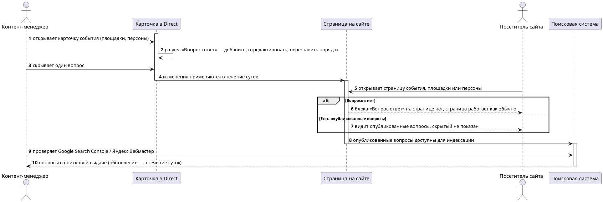

# [БФТ] direct-faq: Блок «Вопрос-ответ» на карточках Direct

> Статус проработки: ✅ Полный БФТ собран (bft-deep). Шапка выше — сутевое описание, ниже — канон MTS.

## Шапка (сутевое описание запроса)

Цель: хотим редактируемый блок «Вопрос-ответ» на карточках событий, площадок и персон в Direct, чтобы опубликованные вопросы показывались покупателю на сайте и попадали в поисковую выдачу.

### How to demo

1. Открываю в Direct карточку события (потом площадки, потом персоны) → есть раздел «Вопрос-ответ».
2. Добавляю вопрос, правлю, меняю порядок, один скрываю.
3. Захожу на страницу на сайте → вижу опубликованные вопросы; скрытый не показан.
4. На странице без вопросов блока нет, страница работает как обычно.
5. Проверяю в Google Search Console / Яндекс.Вебмастер, что вопросы попали в поиск (в течение суток обновится).

### Открытые вопросы

* Кнопка «Вернуть» на билете TicketsCloud уводит покупателя на сайт TicketsCloud, ок? (Анастасия Яковлева)
* Надписи покупателю «возврат оформляется» → «возвращён», формулировки ок? (Анастасия Яковлева)
* Если билет невозвратный, показываем надпись вместо кнопки, ок? (Анастасия Яковлева)
* Что показать покупателю, пока возврат не подтверждён с их стороны? (Анастасия Яковлева)
* Требования к метрикам кроме функционала есть? (Анастасия Яковлева)
* Технические развилки реализации блока «Вопрос-ответ»? (Дмитрий Ананьев)

### Границы

Событие, площадка, персона (заполнение от MRS и FAQ для категорий — не входят в зону БФТ).
Правки на сайте появляются в течение суток.

### Критичные требования (скелет на цитатах)

Персоны (домен знаний):

| ФИО | Роль | Департамент |
|---|---|---|
| Анастасия Яковлева | PO площадок | [не указано] |
| Дмитрий Ананьев | Разработка | [не указано] |

Роли/департаменты — из индекса стейкхолдеров или сказанного; неизвестное помечено. Вес цитаты зависит от роли.

Требования:

| ID | ASIS (сейчас) | TOBE (после) | Связанные | Источник (цитата) |
|---|---|---|---|---|
| БТ-1 | [ASIS не озвучен] | Вопросы на карточках добавляются, редактируются, переупорядочиваются и скрываются | ПТ-1 | Summary: «добавить вопрос, отредактировать, поменять порядок, скрыть отдельный вопрос» |
| ПТ-1 | [ASIS не озвучен] | Когда открываю карточку события, площадки или персоны в Direct — добавляю, правлю и скрываю вопросы | БТ-1 | Summary: «В карточке события (а также площадки и персоны) в Direct — раздел «Вопрос-ответ»» |
| ИТ-1 | [ASIS не озвучен] | Опубликованные вопросы видны на сайте; скрытый не показан; нет вопросов — блока нет | ПТ-1 | Summary: «опубликованные вопросы видны; скрытый не показывается… если вопросов нет — блока на странице нет» |
| ФТ-1 | [ASIS не озвучен] | Опубликованные вопросы попадают в поисковую выдачу | БТ-1 | Summary: «вопросы должны попадать в поиск (Google Search Console / Яндекс.Вебмастер)» |
| НФТ-1 | [ASIS не озвучен] | Правки появляются на сайте в течение суток | ФТ-1 | Summary: «Обновление на сайте — в течение суток» |

Только зафиксированное на встрече. ASIS без реплики — [ASIS не озвучен]. Обогащение — на этапе глубокой проработки.

<!-- BFT-HEAD-END · ГРАНИЦА ШАПКИ · выше bft-fast, ниже bft-deep · шапку не затирать -->

Бизнес описание
===============

На карточках события, площадки и персоны в Direct появляется редактируемый блок «Вопрос-ответ»: вопросы добавляются, редактируются, переупорядочиваются и скрываются прямо в карточке, посетитель сайта видит опубликованные ответы на странице. Область — событие, площадка, персона; заполнение из MRS и FAQ для категорий вне зоны этого БФТ [Summary, созвон 03.07.2026]. Роль того, кто ведёт блок в Direct, на встрече не названа — здесь и далее он условно «контент-менеджер Direct», `[УТОЧНИТЬ у Анастасии Яковлевой]`; отказ от релиза ради правки вопроса на встрече тоже не проговаривался.

**Образ результата:** на карточке события, площадки или персоны в Direct у контент-менеджера появляется раздел «Вопрос-ответ» — добавить вопрос, отредактировать, поменять порядок, скрыть отдельный вопрос. На соответствующей странице сайта опубликованные вопросы видны посетителю, скрытый вопрос не показан; если вопросов нет — блока на странице нет, остальное работает как обычно. Изменения на сайте — в течение суток; опубликованные вопросы попадают в поисковую выдачу (Google Search Console / Яндекс.Вебмастер) [Summary, созвон 03.07.2026].

**Зачем делать:** публикация вопросов на сайте и попадание в поисковую выдачу — заявленная на встрече цель [Summary: «попаданием в поисковую выдачу»]. Количественная метрика эффекта (SEO-трафик, снижение обращений, экономия релизов) на встрече не звучала — `[УТОЧНИТЬ у Анастасии Яковлевой]`.

<details>
<summary>Подробный контекст (полное описание для LLM)</summary>

Эпик обсуждён на созвоне 03.07.2026 (участники: Анастасия Яковлева — PO площадок, Дмитрий Ананьев — разработка) [Summary, шапка встречи]. Единственный источник фактов этого канона — `skills/bft-fast/examples/golden_summary.md`.

Тема созвона: добавить редактируемый блок «Вопрос-ответ» на карточки событий, площадок и персон в Direct с публикацией на сайте и попаданием в поисковую выдачу [Summary §Тема].

Состав функционала: раздел «Вопрос-ответ» в карточке — добавить вопрос, отредактировать, поменять порядок, скрыть отдельный вопрос; на сайте опубликованные вопросы видны, скрытый не показывается; при отсутствии вопросов блока на странице нет, страница работает как обычно; обновление на сайте — в течение суток; вопросы попадают в поиск [Summary §Что делаем].

Договорённость по границам: событие, площадка, персона; заполнение от MRS и FAQ для категорий — не входят в зону БФТ [Summary §Договорённости].

Часть вопросов на встрече не закрыта — возврат билета TicketsCloud (кнопка «Вернуть», статусные формулировки, невозвратный билет, промежуточный статус), требования к метрикам кроме функциональных, технические развилки реализации блока: см. «Вводные для разрабатываемого функционала».

В документе описываются требования к сценариям:
* Контент-менеджер управляет вопросами на карточке события, площадки, персоны в Direct.
* Посетитель сайта видит опубликованные вопросы на странице события, площадки, персоны.
* Поисковая система индексирует опубликованные вопросы.
</details>

Общая информация
================

| Поле | Значение |
| --- | --- |
| Название проекта | Блок «Вопрос-ответ» на карточках Direct (epic_slug: direct-faq) |
| Ответственный за продукт | Анастасия Яковлева (PO площадок) [Summary, созвон 03.07.2026] |
| Ответственный за документ | `[УТОЧНИТЬ]` — не названо на встрече |
| Задача/Epic Jira | `[СОЗДАТЬ эпик]` — не создан в этом прогоне |
| Статус | АНАЛИЗ |
| Системные требования | `[УТОЧНИТЬ]` — ссылка на СА/FNR не существует в этом прогоне |

Заинтересованные стороны
========================

| ФИО | Роль/должность | Контакты |
| --- | --- | --- |
| Анастасия Яковлева | PO площадок | `[УТОЧНИТЬ]` |
| Дмитрий Ананьев | Разработка | `[УТОЧНИТЬ]` |

История изменений
=================

| # | Дата | Автор | Суть изменений |
| --- | --- | --- | --- |
| 1 | 03.07.2026 | bft-fast | Сбор шапки: цель, how-to-demo, открытые вопросы, границы, критичные требования на цитатах (БТ-1, ПТ-1, ИТ-1, ФТ-1, НФТ-1). |
| 2 | 08.07.2026 | bft-deep-swarm | Обогащение шапки по 3 осям (ценность / что если / границы) + укладка в канон-структуру MTS. Стоп на валидированном черновике, `/bft-deliver` не вызывался. |

Дополнительные материалы и артефакты
====================================

| Артефакт/Файл/Ссылка | Описание |
| --- | --- |
| `skills/bft-fast/examples/golden_summary.md` (вход, созвон 03.07.2026) | Единственный источник фактов канона — участники Анастасия Яковлева (PO площадок), Дмитрий Ананьев (разработка) |

Проблема которую решаем
=======================

| Срез | Содержание |
| --- | --- |
| **ДЛЯ КОГО** | <ul><li>Контент-менеджер Direct — создаёт, редактирует, скрывает вопросы на карточках</li><li>Посетитель сайта — видит опубликованные вопросы на странице события, площадки, персоны</li></ul> |
| **ЧТО ДЕЛАЕМ** | Добавляем редактируемый блок «Вопрос-ответ» на карточки событий, площадок и персон в Direct, с публикацией на сайте и попаданием в поисковую выдачу |
| **ASIS** | `[ASIS не озвучен]` — текущее поведение карточек и страниц на встрече не обсуждалось |
| **ПРОБЛЕМА** | <ul><li>Измеримая бизнес-боль (объём обращений, потери SEO-трафика) на встрече не названа — `[УТОЧНИТЬ у Анастасии Яковлевой]`</li><li>Заявлена цель — публикация вопросов на сайте и попадание в поисковую выдачу; форма текущего ограничения (ручной процесс, отсутствие блока, отсутствие индексации) не детализирована</li></ul> |
| **TOBE** | <ul><li>Контент-менеджер добавляет, редактирует, переставляет порядок и скрывает вопросы на карточках без релиза (БТ-1)</li><li>Посетитель видит опубликованные вопросы, скрытый не показан, без вопросов — блока нет (ИТ-1)</li><li>Вопросы попадают в поисковую выдачу, изменения на сайте — в течение суток (ФТ-1, НФТ-1)</li></ul> |

Изменение в UJM
===============

| Точка демо | Было (As-Is) | Стало (To-Be) |
| --- | --- | --- |
| Карточка события / площадки / персоны в Direct | `[ASIS не озвучен]` | Контент-менеджер открывает раздел «Вопрос-ответ», добавляет, редактирует, переставляет порядок, скрывает вопрос — без релиза |
| Страница события / площадки / персоны на сайте | `[ASIS не озвучен]` | Посетитель видит опубликованные вопросы, скрытый не показан; без вопросов блока на странице нет |
| Поисковая выдача (Google Search Console / Яндекс.Вебмастер) | `[ASIS не озвучен]` | Опубликованные вопросы индексируются, изменения на сайте — в течение суток |

План демонстрации
=================

### Акторы

| Актор | Описание |
| --- | --- |
| Контент-менеджер Direct | Управляет блоком «Вопрос-ответ» на карточке события, площадки, персоны |
| Посетитель сайта | Видит опубликованные вопросы на странице события, площадки, персоны |
| Поисковая система (Google / Яндекс) | Индексирует опубликованные вопросы; статус проверяется в Search Console / Вебмастере |

### Сценарий приёмки (happy path + alt)



Атрибутивный состав сообщений (параметры и типы запросов/ответов) не входит в БФТ — зона СА / системных требований.

**Расширенный сценарий приёмки (ось «что если», стресс happy path):**

| What-if | Есть источник? | Результат |
| --- | --- | --- |
| Контент-менеджер меняет порядок вопросов после публикации | Да — Summary («поменять порядок») | Покрыто TOBE → БТ-1, ПТ-1, НФТ-1 (изменение на сайте — в течение суток) |
| На карточке скрыты все вопросы разом | Частично — по аналогии с «вопросов нет» (Summary) | Трактовка «все скрыты = блока нет» на встрече не подтверждена — `[УТОЧНИТЬ у Анастасии Яковлевой]` |
| Вопрос или ответ содержит некорректный либо вредоносный текст | Нет | `[УТОЧНИТЬ у Анастасии Яковлевой]` — модерация контента не обсуждалась (см. ФТ-2) |
| Карточка события/площадки/персоны удаляется или архивируется вместе с блоком | Нет | `[УТОЧНИТЬ у Дмитрия Ананьева]` — поведение блока при удалении/архивации карточки не обсуждалось (см. ФТ-3) |
| Поисковая система не проиндексировала вопросы за сутки | Нет | `[УТОЧНИТЬ у Дмитрия Ананьева]` — индексация сторонним поисковиком вне контроля продукта, SLA попадания в выдачу не обсуждался (см. «Риски») |
| Два контент-менеджера редактируют один блок одновременно | Нет | `[УТОЧНИТЬ у Дмитрия Ананьева]` — конкурентное редактирование не обсуждалось (см. НФТ-2) |

Бизнес-Требования
=================

## Вводные для разрабатываемого функционала*

| Информация или вопрос | Конспект | Ответ | В рамках чего был получен ответ | Кто ответил | Дата |
| --- | --- | --- | --- | --- | --- |
| Кнопка «Вернуть» на билете TicketsCloud уводит покупателя на сайт TicketsCloud, ок? | На билете TicketsCloud есть кнопка «Вернуть»; по клику покупатель уходит на сайт TicketsCloud | `[УТОЧНИТЬ]` | созвон 03.07.2026 | Анастасия Яковлева | — |
| Надписи покупателю «возврат оформляется» → «возвращён», формулировки ок? | Предложенные статусные надписи для покупателя на этапах возврата | `[УТОЧНИТЬ]` | созвон 03.07.2026 | Анастасия Яковлева | — |
| Если билет невозвратный, показываем надпись вместо кнопки, ок? | Для невозвратных билетов кнопку предлагается заменить надписью | `[УТОЧНИТЬ]` | созвон 03.07.2026 | Анастасия Яковлева | — |
| Что показать покупателю, пока возврат не подтверждён с их стороны? | Промежуточное состояние между запросом и подтверждением возврата не описано | `[УТОЧНИТЬ]` | созвон 03.07.2026 | Анастасия Яковлева | — |
| Требования к метрикам кроме функционала есть? | Состав нефункциональных/продуктовых метрик, кроме функциональных, не обсуждался | `[УТОЧНИТЬ]` | созвон 03.07.2026 | Анастасия Яковлева | — |
| Технические развилки реализации блока «Вопрос-ответ»? | Состав развилок не перечислен на встрече, нужна детализация | `[УТОЧНИТЬ]` | созвон 03.07.2026 | Дмитрий Ананьев | — |
| Нужна ли модерация текста вопроса и ответа перед публикацией? | Не обсуждалось; текст уходит на публичную страницу и в поисковую выдачу (ФТ-2) | `[УТОЧНИТЬ]` | обогащение 08.07.2026 | Анастасия Яковлева | — |
| Состав санитизации текста вопроса и ответа? | Не обсуждалось; техническая часть того же ФТ-2 | `[УТОЧНИТЬ]` | обогащение 08.07.2026 | Дмитрий Ананьев | — |
| Что происходит с блоком при удалении или архивации карточки? | Не обсуждалось (ФТ-3) | `[УТОЧНИТЬ]` | обогащение 08.07.2026 | Дмитрий Ананьев | — |
| Поведение при одновременном редактировании блока несколькими пользователями Direct? | Не обсуждалось (ФТ-4) | `[УТОЧНИТЬ]` | обогащение 08.07.2026 | Дмитрий Ананьев | — |

## Ценность разрабатываемого функционала для бизнес-заказчиков*

Заявленная на встрече ценность — публикация вопросов на сайте и их попадание в поисковую выдачу [Summary §Тема, §Что делаем]. Управление вопросами прямо в карточке Direct — из шапки (БТ-1); отказ от релиза ради такой правки на встрече не проговаривался и ценностью не заявлен. Количественная цель (прирост SEO-трафика, снижение обращений по частым вопросам, экономия релизов на правки FAQ) на встрече не прозвучала — `[УТОЧНИТЬ у Анастасии Яковлевой]`, привязка к KR/стратегии квартала не обсуждалась.

Ценностные `[УТОЧНИТЬ]`-вопросы к PO:
- Какая целевая метрика успеха (прирост SEO-трафика, доля карточек с заполненным блоком, снижение обращений по частым вопросам)?
- Есть ли KR квартала, к которому привязан этот эпик?
- Кто заказчик экономического эффекта — SEO-команда, площадки или служба поддержки?

| Идентификатор | Наименование требования | Ценность разрабатываемого функционала для бизнес-заказчиков | Краткое описание доработки из данного БФТ | Связанные требования |
| --- | --- | --- | --- | --- |
| БТ-1 | Самостоятельное управление блоком «Вопрос-ответ» | Контент-менеджер публикует и меняет вопросы без релиза; опубликованные вопросы индексируются поисковыми системами — целевая метрика эффекта `[УТОЧНИТЬ у Анастасии Яковлевой]` | Раздел «Вопрос-ответ» на карточках события, площадки, персоны в Direct: добавление, редактирование, порядок, скрытие вопроса; публикация на сайте и в поиске | ПТ-1, ПТ-2, ФТ-1, ФТ-2, ФТ-3 |

Пользовательские требования*
============================

| Идентификатор | Наименование требования | Story | Комментарий | Связанные требования |
| --- | --- | --- | --- | --- |
| ПТ-1 | Управление вопросами на карточке | **Когда** я (контент-менеджер Direct) работаю с карточкой события, площадки или персоны **Я хочу** добавить, отредактировать, переставить порядок и скрыть вопрос **Чтобы** публиковать актуальные ответы без обращения к разработке | Изменение применяется на сайте в течение суток (НФТ-1) | БТ-1 |
| ПТ-2 | Просмотр вопросов на сайте | **Когда** я (посетитель сайта) открываю страницу события, площадки или персоны **Я хочу** видеть опубликованные вопросы и не видеть скрытые **Чтобы** получить ответ на вопрос сразу на странице | Если вопросов нет — блока на странице нет, остальное работает как обычно (Summary) | БТ-1 |

Требования к интерфейсам*
=========================

Продукт: Direct (админка контент-менеджера) + витрина сайта (публичная страница события/площадки/персоны). Платформа, браузеры, разрешение на встрече не обсуждались — `[УТОЧНИТЬ]`.

| Идентификатор | Наименование требования | Требование к пользовательскому интерфейсу | Предложения по элементам UI, механике и композиции | Связанные требования |
| --- | --- | --- | --- | --- |
| ИТ-1 | Блок «Вопрос-ответ» на странице сайта | Опубликованные вопросы видны посетителю; скрытый вопрос не показан; при отсутствии вопросов блока на странице нет, остальное работает как обычно | `[УТОЧНИТЬ]` — макет не обсуждался | ПТ-2 |
| ИТ-2 | Управление вопросами в Direct | Контент-менеджер видит раздел «Вопрос-ответ» на карточке события, площадки, персоны; доступны действия: добавить, отредактировать, переставить порядок, скрыть вопрос | `[УТОЧНИТЬ]` — макет админки не обсуждался | ПТ-1 |

## Макеты интерфейса*

`[УТОЧНИТЬ — готовы ли макеты для раздела «Вопрос-ответ» в Direct и для блока на витрине сайта; дизайн на встрече не обсуждался]`.

Функциональные требования*
==========================

| Идентификатор | Наименование требования | Приоритет | Функциональные требования | Параметры, ограничения | Связанные требования |
| --- | --- | --- | --- | --- | --- |
| ФТ-1 | Индексация опубликованных вопросов | Высокий | Опубликованные вопросы попадают в поисковую выдачу (Google Search Console / Яндекс.Вебмастер фиксируют индексацию) | Доступность для индексации — в течение суток после публикации (НФТ-1) | БТ-1, ПТ-2 |
| ФТ-2 | Модерация и санитизация контента вопроса | Средний (предварительно) | Правило проверки текста вопроса и ответа перед публикацией на сайте не определено — сюда же входит санитизация текста | `[УТОЧНИТЬ у Анастасии Яковлевой]` — нужна ли модерация; `[УТОЧНИТЬ у Дмитрия Ананьева]` — состав санитизации | БТ-1, ПТ-1, ИТ-1 |
| ФТ-3 | Поведение блока при удалении/архивации карточки | Средний (предварительно) | Судьба блока «Вопрос-ответ» при удалении или архивации карточки события, площадки, персоны не обсуждалась | `[УТОЧНИТЬ у Дмитрия Ананьева]` | БТ-1, ИТ-1 |
| ФТ-4 | Конкурентное редактирование блока | Низкий (предварительно) | Поведение при одновременном редактировании блока несколькими пользователями Direct не обсуждалось на встрече | `[УТОЧНИТЬ у Дмитрия Ананьева]` | БТ-1, ПТ-1 |

Нефункциональные требования*
============================

| Идентификатор | Наименование требования | Описание | Связанные требования |
| --- | --- | --- | --- |
| НФТ-1 | Задержка публикации изменений | Изменения в блоке «Вопрос-ответ» (добавление, редактирование, порядок, скрытие) появляются на сайте в течение суток после сохранения в Direct [Summary: «Обновление на сайте — в течение суток»] | ФТ-1, ПТ-1 |

Других измеримых порогов (нагрузка, латентность, объём) на встрече не звучало — не выдумываются. Поведенческие пробелы (модерация и санитизация, конкурентное редактирование) — не НФТ: они описывают поведение системы, поэтому живут в ФТ-2 и ФТ-4.

Зависимости
===========

| Команда / система | Тип зависимости | Статус согласования |
| --- | --- | --- |
| Поисковые системы (Google Search Console, Яндекс.Вебмастер) | Индексация опубликованных вопросов | Внешняя зависимость, вне зоны БФТ; условия индексации сторонним поисковиком не согласовывались — `[УТОЧНИТЬ]` |
| Разработка (Дмитрий Ананьев) | Реализация блока «Вопрос-ответ» в Direct и на витрине сайта | Роль обозначена на встрече, технические развилки реализации не выбраны — `[УТОЧНИТЬ у Дмитрия Ананьева]` (см. «Вводные») |
| PO площадок (Анастасия Яковлева) | Согласование открытых вопросов из «Вводные для разрабатываемого функционала» | Ожидает ответа — `[УТОЧНИТЬ у Анастасии Яковлевой]` |

Риски
=====

| Риск | Вероятность | Влияние | Митигация |
| --- | --- | --- | --- |
| Поисковая система не проиндексировала вопросы в течение суток (внешняя система) | Средняя | Среднее | Индексация вне прямого контроля продукта; ожидания по срокам — `[УТОЧНИТЬ у Анастасии Яковлевой]` (см. ФТ-1) |
| Вопрос/ответ публикуется без проверки на некорректный или вредоносный контент | Средняя | Среднее | Правило модерации не определено — `[УТОЧНИТЬ у Анастасии Яковлевой]` (см. ФТ-2); санитизация текста — `[УТОЧНИТЬ у Дмитрия Ананьева]` (см. НФТ-3) |
| Два контент-менеджера одновременно редактируют один блок, правки теряются | Низкая | Среднее | Поведение при конкурентном редактировании не определено — `[УТОЧНИТЬ у Дмитрия Ананьева]` (см. НФТ-2) |

Ревью требований
================

* Продакт — Анастасия Яковлева
* Архитектор — `[УТОЧНИТЬ]`
* Аналитик (кросс-ревью) — `[УТОЧНИТЬ]`
* Разработка — Дмитрий Ананьев
* Тестирование — `[УТОЧНИТЬ]`

Якоря истины
============

| Факт в БФТ | Источник (якорь) | Ранг | Тип |
| --- | --- | --- | --- |
| Раздел «Вопрос-ответ» на карточках события/площадки/персоны: добавить, отредактировать, поменять порядок, скрыть | Summary §Что делаем, созвон 03.07.2026 (`skills/bft-fast/examples/golden_summary.md`) | R3 | Решение/утверждение на встрече |
| Опубликованные вопросы видны на сайте, скрытый не показан | Summary §Что делаем | R3 | Решение/утверждение на встрече |
| Нет вопросов — блока на странице нет, страница работает как обычно | Summary §Что делаем | R3 | Решение/утверждение на встрече |
| Обновление на сайте — в течение суток | Summary §Что делаем, §Договорённости | R3 | Решение/утверждение на встрече |
| Вопросы должны попадать в поиск (Google Search Console / Яндекс.Вебмастер) | Summary §Что делаем | R3 | Решение/утверждение на встрече |
| Границы: событие, площадка, персона; заполнение от MRS и FAQ для категорий не входят | Summary §Договорённости | R3 | Решение/утверждение на встрече |
| Кнопка «Вернуть» на билете TicketsCloud уводит на сайт TicketsCloud — требует подтверждения | Summary §Открытые точки | — | `[УТОЧНИТЬ у Анастасии Яковлевой]` |
| Формулировки статуса возврата «возврат оформляется» → «возвращён» | Summary §Открытые точки | — | `[УТОЧНИТЬ у Анастасии Яковлевой]` |
| Невозвратный билет — надпись вместо кнопки | Summary §Открытые точки | — | `[УТОЧНИТЬ у Анастасии Яковлевой]` |
| Что показывать до подтверждения возврата покупателем | Summary §Открытые точки | — | `[УТОЧНИТЬ у Анастасии Яковлевой]` |
| Требования к метрикам кроме функционала | Summary §Открытые точки | — | `[УТОЧНИТЬ у Анастасии Яковлевой]` |
| Технические развилки реализации блока | Summary §Открытые точки | — | `[УТОЧНИТЬ у Дмитрия Ананьева]` |
| Модерация контента вопроса/ответа | не обсуждалось на встрече | — | `[УТОЧНИТЬ у Анастасии Яковлевой]` |
| Поведение блока при удалении/архивации карточки | не обсуждалось на встрече | — | `[УТОЧНИТЬ у Дмитрия Ананьева]` |
| Конкурентное редактирование блока | не обсуждалось на встрече | — | `[УТОЧНИТЬ у Дмитрия Ананьева]` |
| Безопасность контента (санитизация вопроса/ответа) | не обсуждалось на встрече | — | `[УТОЧНИТЬ у Дмитрия Ананьева]` |

## Продолжить / уточнить БФТ

Канон MTS собран (bft-deep, 08.07.2026). Открытые `[УТОЧНИТЬ]`-точки — раздел «Вводные для разрабатываемого функционала» выше. Промт ниже — чтобы продолжить проработку в чистой сессии Claude Code.

<details>
<summary>▶ Уточнить и обновить БФТ — промт для Claude Code (скопируй в свою сессию)</summary>

```text
Ты — обогатитель БФТ (роль bft-deep-swarm, «Обогатитель»). Перед тобой документ БФТ:
шапка (bft-fast) заморожена, канон MTS уже собран (bft-deep). Часть фактов канона
помечена [УТОЧНИТЬ у {кого}] — закрой их по ответам PO/разработки и обнови документ,
НЕ ПЕРЕПИСЫВАЯ шапку и не перенумеровывая существующие ID канона.

ЧТО СДЕЛАТЬ:
1. Шапку и уже собранный канон ниже границы сохрани; правь только строки/ячейки,
   где стоит [УТОЧНИТЬ] или появился новый ответ.
2. Новый факт без источника — снова [УТОЧНИТЬ у {кого}], не выдумывай.
3. Новые ID добавляй в конец соответствующей типизированной таблицы канона, старые
   ID не перенумеровывай.

КОНТЕКСТ ЭТОГО БФТ:
- epic_slug: direct-faq
- Источник Summary: skills/bft-fast/examples/golden_summary.md
- Confluence: не опубликовано
- pin_commit (репо poh-bft-writer): [hash прогона]
- Открытые точки: раздел «Вводные для разрабатываемого функционала» в каноне выше.

КАК ЗАПУСТИТЬ:
- Если установлен poh-bft-writer: /bft-deep <путь-к-этому-документу>
- Иначе: скопируй ВЕСЬ этот документ в Claude Code и выполни инструкцию выше.
```

</details>
