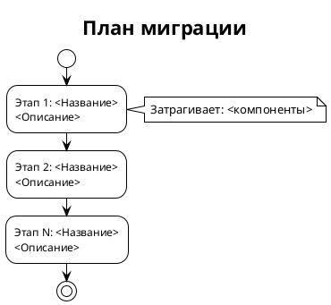

# [СТ] <PROJECT>-<NNN> <Название документа>

> **Пространство:** <Название проекта>
> **Родительская страница:** <Название родительского раздела>

---

## Содержание

1. Введение
   1.1 Общая информация
   1.2 Термины и определения
   1.3 Ссылки
   1.4 История изменений
2. Общее описание
   2.1 Описание текущего поведения (As-Is)
   2.2 Архитектурное решение
   2.3 Диаграмма компонентов
   2.4 Схема последовательности
3. План миграции
   3.1 Этапы внедрения
   3.2 Таблица этапов
   3.3 Критерии готовности
4. Функциональные требования (Backend / БД / API)
   4.1 <Название функционального блока 1>
      4.N <Название задачи N>
         4.N.1 Общее описание
         4.N.2 Обоснование
         4.N.3 Описание доработок
         4.N.4 Затрагиваемые компоненты
         4.N.5 Критерии приёмки
         4.N.6 Зависимости
   4.2 <Название API / сервиса / подсистемы>
      4.N <Название задачи N>
         4.N.1 Общее описание
         4.N.2 Обоснование
         4.N.3 Описание доработок
         4.N.4 Перечень эндпоинтов / Маршрутизация / Источники данных
         4.N.5 Формат ответа (если API)
         4.N.6 Нефункциональные требования
         4.N.7 Затрагиваемые компоненты
         4.N.8 Критерии приёмки
         4.N.9 Зависимости
5. Требования к интерфейсам (Frontend / UI)
   5.1 <Верстка интерфейса экрана "$название_экрана">
      5.N <Название задачи N>
         5.N.1 Общее описание
         5.N.2 Обоснование
         5.N.3 Описание доработок
         5.N.4 Затрагиваемые компоненты
         5.N.5 Критерии приёмки
         5.N.6 Зависимости
   5.2 <Требования к интеграциям на UI>
      5.N <Название задачи N>
         5.N.1 Описание
         5.N.2 Обоснование
         5.N.3 Описание доработок
         5.N.3 Перечень эндпоинтов / Маршрутизация / Источники данных
         5.N.4 Формат ответа (если API)
         5.N.5 Нефункциональные требования
         5.N.6 Затрагиваемые компоненты
         5.N.7 Критерии приёмки
         5.N.8 Зависимости
6. Ревью требований
7. Риски и ограничения
   7.1 Риски
   7.2 Ограничения
8. <Приложения> (опционально)

---

## 1 Введение

### 1.1 Общая информация

| Поле | Значение |
|------|----------|
| Наименование продукта | <Название продукта> |
| Ответственный за продукт | <ФИО> |
| Ответственный за тех. реализацию продукта | <ФИО> |
| Ответственный за документ | <ФИО> |
| Тип продукта и операционная система | <Тип> |
| Epic | <Jira-ссылка> — <Название эпика> |
| БФТ | <Ссылка> — <Название> |
| Аналитика | <Jira-ссылка> — <Название> |
| Статус | Ревью / Утверждён / В работе |

### 1.2 Термины и определения

| Термин | Определение |
|--------|-------------|
| <Термин 1> | <Определение> |
| <Термин 2> | <Определение> |
| <Термин 3> | <Определение> |

### 1.3 Ссылки

| Документ | Путь / URL |
|----------|------------|
| <Название документа> | `<относительный/путь/к/файлу>` или URL |
| <Архитектурное решение> | URL на Confluence |

### 1.4 История изменений

| Дата | Автор | Суть изменений |
|------|-------|---------------|
| <DD.MM.YYYY> | <ФИО> | Создано описание |
| <DD.MM.YYYY> | <ФИО> | <Описание изменений> |

---

## 2 Общее описание

### 2.1 Описание текущего поведения (As-Is)

<Подробное описание того, как система работает сейчас. Опираться исключительно на анализ кода, не на предположения.>

**Ключевые компоненты:**

| Компонент | Роль | Файл:строка |
|-----------|------|-------------|
| <Имя> | <Что делает> | `<файл>:<строка>` |

**Ограничения текущего решения:**

1. <Ограничение 1> — доказательство: `<файл>:<строка>`
2. <Ограничение 2> — доказательство: `<файл>:<строка>`

### 2.2 Архитектурное решение

<Ссылка на документ с архитектурным решением или краткое описание выбранного подхода.>

### 2.3 Диаграмма компонентов


### 2.4 Схема последовательности


---

## 3 План миграции

### 3.1 Этапы внедрения



### 3.2 Таблица этапов

| Этап | Действие | Затрагиваемые объекты | Откат |
|------|----------|----------------------|-------|
| 1 | <Описание> | <Список> | <Как откатить> |
| 2 | <Описание> | <Список> | <Как откатить> |

### 3.3 Критерии готовности

**Этап 1:** <Как проверить, что этап выполнен корректно.>

**Этап 2:** <...>

---

## 4 Функциональные требования (Backend / БД / API)

> **Содержимое раздела:** требования к серверной части, базе данных, API, фоновым процессам, интеграциям между сервисами.
>
> **Что попадает в этот раздел:**
>
> - Изменения в БД (миграции, таблицы, views, индексы)
> - Backend-логика (контроллеры, сервисы, роутинг, middleware)
> - API-эндпоинты (REST, GraphQL, RPC)
> - Фоновые процессы (cron, очереди, воркеры)
> - Интеграции между backend-сервисами
> - Поисковые движки (Sphinx, Elasticsearch и т.д.)
>
> **Что НЕ попадает в этот раздел:** верстка, UI-компоненты, клиентские интеграции — см. раздел 5.
>
> Каждый функциональный блок — логическая группа задач (подсистема, слой, домен).
> Блоки нумеруются последовательно: 4.1, 4.2, 4.3, ...
> Задачи внутри блока: 4.N.M, 4.N.M+1, ...

### 4.1 <Название функционального блока>

#### 4.N <Название задачи>

| Поле | Значение |
|------|----------|
| Ответственный за тех. реализацию | <ФИО> |
| Задача на разработку | <Jira-ссылка> — <Название> [СТАТУС] |

##### 4.N.1 Общее описание функционала

1. <Описание первого шага или аспекта>
   a. <Детализация>
   b. <Детализация>
2. <Описание второго шага или аспекта>

##### 4.N.2 Обоснование

<Почему именно так. На основе каких данных или анализа принято решение.>

##### 4.N.3 Затрагиваемые компоненты

| Компонент | Тип изменения | Файл:строка |
|-----------|--------------|-------------|
| <Имя> | <ADD / MODIFY / DELETE / ALTER> | `<файл>:<строка>` |

##### 4.N.4 Критерии приёмки

1. <Проверяемое условие 1>
2. <Проверяемое условие 2>
3. <Проверяемое условие 3>

##### 4.N.5 Зависимости

нет / после задачи <N.M>

---

### 4.2 <Название API / сервиса / подсистемы>

> Расширенный шаблон для задач, связанных с API, обработкой данных и межсервисным взаимодействием.

#### 4.N <Название задачи>

| Поле | Значение |
|------|----------|
| Ответственный за тех. реализацию | <ФИО> |
| Задача на разработку | <Jira-ссылка> — <Название> [СТАТУС] |

##### 4.N.1 Описание

<Подробное описание: что реализуется, зачем, как работает в общих чертах.>

##### 4.N.2 Обоснование

<Почему выбран этот подход, а не альтернативный.>

##### 4.N.3 Перечень эндпоинтов (для API)

| Метод | Путь | Тип / EventType | Целевой топик / Описание |
|-------|------|-----------------|--------------------------|
| POST | /api/v1/<endpoint> | <TYPE> | <топик или описание> |
| GET | /api/v1/<endpoint> | — | <описание> |

##### 4.N.4 Формат ответа (для API)

**POST — запуск (HTTP 202 Accepted):**

```json
{
  "taskId": "550e8400-e29b-41d4-a716-446655440000"
}
```

**GET — результат:**

```json
{
  "field1": "значение",
  "field2": "значение"
}
```

**Статусы:**

| Статус | Описание |
|--------|----------|
| PENDING | <Описание> |
| RUNNING | <Описание> |
| COMPLETED | <Описание> |
| FAILED | <Описание> |

##### 4.N.5 Маршрутизация (для процессов обработки)

| Сущность | Метод вызова | Отправляемые события |
|----------|-------------|---------------------|
| <Сущность 1> | `<Service.method(id)>` | <события> |
| <Сущность 2> | `<Service.method(id)>` | <события> |

##### 4.N.6 Источники данных (для запросов к БД)

| Сущность | DataSource | SQL-запрос |
|----------|-----------|------------|
| <Сущность 1> | <DS> | `SELECT id FROM mlw.<View>` |
| <Сущность 2> | <DS> | `SELECT id, name FROM dbo.<Table>` |

##### 4.N.7 Нефункциональные требования

1. <NFR 1 — конкретное измеримое требование>
2. <NFR 2 — конкретное измеримое требование>
3. <NFR 3 — конкретное измеримое требование>

##### 4.N.8 Затрагиваемые компоненты

| Компонент | Тип изменения | Файл:строка |
|-----------|--------------|-------------|
| <Имя> | <ADD / MODIFY / DELETE / ALTER> | `<файл>:<строка>` |

##### 4.N.9 Критерии приёмки

1. <Проверяемое условие 1>
2. <Проверяемое условие 2>
3. <Проверяемое условие 3>

##### 4.N.10 Зависимости

нет / после задачи <N.M>

---

## 5 Требования к интерфейсам (Frontend / UI)

> **Содержимое раздела:** требования к клиентской части — верстка экранов, UI-компоненты, клиентские интеграции с API, микроразметка, клиентский роутинг.
>
> **Что попадает в этот раздел:**
>
> - Верстка экранов и UI-компонентов
> - Изменения в SSR / CSR логике
> - Клиентские интеграции с backend API
> - Микроразметка (schema.org, Open Graph)
> - Клиентский роутинг и навигация
> - Мобайл-специфичные требования (если есть)
>
> **Что НЕ попадает в этот раздел:** backend-логика, БД, API-эндпоинты — см. раздел 4.

### 5.1 <Верстка интерфейса экрана "$название_экрана">

> Упрощённый шаблон для задач по вёрстке: экраны, страницы, компоненты.
> Если задача затрагивает и верстку, и API-интеграцию — используйте шаблон 5.2.

#### 5.N <Название задачи>

| Поле | Значение |
|------|----------|
| Ответственный за тех. реализацию | <ФИО> |
| Задача на разработку | <Jira-ссылка> — <Название> [СТАТУС] |

##### 5.N.1 Общее описание требований

1. <Описание требований к верстке / поведению UI>
   a. <Детализация: расположение элементов, адаптивность, состояния>
   b. <Детализация: анимации, переходы, интерактив>
2. <Связанные макеты / дизайн-система>
   a. <Ссылка на Figma / макет>
   b. <Ограничения по дизайну>

##### 5.N.2 Критерии приёмки

1. <Проверяемое условие 1 — как выглядит / работает UI>
2. <Проверяемое условие 2 — адаптивность / респонсив>
3. <Проверяемое условие 3 — кроссбраузерность / accessibility>

---

### 5.2 <Требования к интеграциям на UI>

> Расширенный шаблон для задач, требующих API-интеграцию на фронтенде: данные от backend, маппинг, клиентская логика.

#### 5.N <Название задачи>

| Поле | Значение |
|------|----------|
| Ответственный за тех. реализацию | <ФИО> |
| Задача на разработку | <Jira-ссылка> — <Название> [СТАТУС] |

##### 5.N.1 Описание

<Что реализуется на фронтенде, какие данные нужны от backend, как обрабатываются.>

##### 5.N.2 Обоснование

<Почему выбран этот подход на клиенте.>

##### 5.N.3 Перечень эндпоинтов / Источники данных

| Действие на UI | Метод API | Endpoint | Описание |
|----------------|-----------|----------|----------|
| <Загрузка данных> | GET | /api/v1/<endpoint> | <Что возвращает> |
| <Отправка формы> | POST | /api/v1/<endpoint> | <Что отправляет> |

##### 5.N.4 Формат ответа (если API)

```json
{
  "field1": "значение",
  "field2": "значение"
}
```

##### 5.N.5 Нефункциональные требования

1. <NFR 1 — конкретное измеримое требование (производительность рендера, время загрузки)>
2. <NFR 2 — конкретное измеримое требование>

##### 5.N.6 Затрагиваемые компоненты

| Компонент | Тип изменения | Файл:строка |
|-----------|--------------|-------------|
| <Имя> | <ADD / MODIFY / DELETE> | `<файл>:<строка>` |

##### 5.N.7 Критерии приёмки

1. <Проверяемое условие 1>
2. <Проверяемое условие 2>
3. <Проверяемое условие 3>

##### 5.N.8 Зависимости

нет / после задачи <N.M>

---

## 6 Ревью требований

| Роль | Исполнитель | Статус |
|------|------------|--------|
| Аналитик (кросс-ревью) | <ФИО> | <Статус> |
| Разработка (Backend) | <ФИО> | <Статус> |
| Разработка (Frontend) | <ФИО> | <Статус> |
| Тестирование | <ФИО> | <Статус> |

---

## 7 Риски и ограничения

### 7.1 Риски

| ID | Риск | Вероятность | Влияние | Митигация |
|----|------|------------|---------|-----------|
| R-01 | <Описание риска> | Низкая / Средняя / Высокая | Низкое / Среднее / Высокое | <Как снизить риск> |
| R-02 | <Описание риска> | <...> | <...> | <...> |

### 7.2 Ограничения

1. <Что данное решение НЕ покрывает.>
2. <Допущения, при которых требования верны.>
3. <Компоненты, которые НЕ должны быть затронуты (backward compatibility).>

---

## 8 <Приложения> (опционально)

> Приложения содержат справочные материалы: SQL-скрипты, шпаргалки, маппинги, кодировки и т.д.

### 8.1 <Название приложения>

#### 8.1.1 Описание

<Краткое описание назначения приложения.>

#### 8.1.2 Общая информация

| Поле | Значение |
|------|----------|
| Название проекта | <Название> |
| Ответственный за продукт | <ФИО> |
| Ответственный за документ | <ФИО> |
| Задача в Jira | <Ссылка> |

#### 8.1.3 <Детали>

<Содержимое: таблицы маппинга, SQL-примеры, шпаргалки, ограничения и т.д.>

**Примеры SQL:**

```sql
-- <Комментарий: что делает запрос>
UPDATE <table> SET <column> = <value> WHERE <condition>;
-- Возврат:
UPDATE <table> SET <column> = <original_value> WHERE <condition>;
```

---

## Правила заполнения

### Структура документа (обязательные разделы)

1. **Введение (раздел 1)** — метаданные, термины, ссылки, история изменений.
2. **Общее описание (раздел 2)** — As-Is с код-доказательствами + архитектура + диаграммы.
3. **План миграции (раздел 3)** — этапы внедрения, критерии готовности, откаты.
4. **Функциональные требования — Backend / БД / API (раздел 4)** — серверные задачи: БД, backend-логика, API, интеграции между сервисами, фоновые процессы.
5. **Требования к интерфейсам — Frontend / UI (раздел 5)** — клиентские задачи: верстка, UI-компоненты, клиентские API-интеграции, микроразметка, роутинг.
6. **Ревью требований (раздел 6)** — таблица согласования.
7. **Риски и ограничения (раздел 7)** — риски с митигацией + ограничения.
8. **Приложения (раздел 8, опционально)** — справочные материалы.

### Разделение Backend и Frontend

**Правило:** задача попадает в раздел 4 (Backend), если она затрагивает серверный код, БД или API. Задача попадает в раздел 5 (Frontend), если она затрагивает клиентский код, верстку или UI-логику.

**Смежные задачи:** если одна и та же фича требует изменений и на backend, и на frontend — создаются две задачи:

- Backend-задача в разделе 4 (создание API, изменение БД)
- Frontend-задача в разделе 5 (интеграция с API, верстка)
- Связь через раздел «Зависимости» (frontend-задача зависит от backend-задачи)

**Только Backend:** если документ не содержит UI-изменений — раздел 5 опускается с пометкой «Не применимо».

**Только Frontend:** если документ не содержит backend-изменений — раздел 4 опускается с пометкой «Не применимо».

### Для каждой задачи

- **Обязательно:** метаданные, описание, обоснование, затрагиваемые компоненты, критерии приёмки, зависимости.
- **Для API (раздел 4.2):** дополнительно — эндпоинты, формат ответа, статусы.
- **Для процессов обработки (раздел 4.2):** дополнительно — маршрутизация, источники данных.
- **Для верстки (раздел 5.1):** описание требований, критерии приёмки.
- **Для UI-интеграций (раздел 5.2):** дополнительно — эндпоинты, формат ответа, NFR.
- **Для всех:** нефункциональные требования (если применимы).

### Нумерация

- Разделы верхнего уровня: 1, 2, 3, 4, 5, 6, 7, 8.
- Функциональные блоки: 4.1, 4.2, ... / 5.1, 5.2, ...
- Задачи внутри блока: 4.N.M, 4.N.M+1, ... / 5.N.M, 5.N.M+1, ...
- Подсекции задачи: 4.N.M.1, 4.N.M.2, ...

### Критерии приёмки

- Каждый критерий — проверяемое условие (как QA проверит).
- Нумерованный список.
- Конкретные данные (имена топиков, форматы, значения).

### Нефункциональные требования

- Конкретные и измеримые.
- Нумерованный список.
- Указаны конкретные параметры (размер пула, таймауты, имена классов/методов).

### Ссылки

- Jira-ссылки с номером и статусом задачи.
- Ссылки на архитектурные документы Confluence.
- Ссылки на внешнюю документацию.

### Диаграммы

- Формат: PlantUML (Mermaid запрещён).
- Минимум: диаграмма компонентов + диаграмма последовательности.
- Все надписи — на русском языке, технические имена — в скобках.
