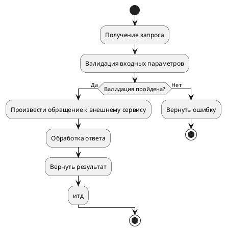
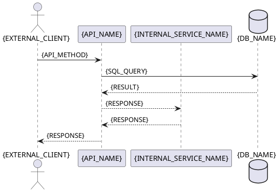

# Шаблон: Документирование интеграционного API взаимодействия

**Описание**: `{Описание метода}`
**Назначение**: `{Для чего нужен этот API}`
**URL-path**: `{URL_INTEGRATION_API}`
**Параметры**: `{Что принимает метода}`
**Ответ**: `{Что возвращает метод}`

---

## 1. Описание API метода `{METHOD TYPE: GET/POST/PUT/DELETE} {URL_INTEGRATION_API}`

### Входные параметры

**Параметры**:
| Параметр | Тип | Описание | Пример |
|----------|-----|-----------|--------|
| `{PARAM_NAME}` | `{PARAM_TYPE}` | `{PARAM_DESCRIPTION}` | `{PARAM_EXAMPLE}` |

### Алгоритм метода



### Sequence-Диаграмма 


### Выходные параметры (ответ)
| Параметр / Header | Тип | Описание | Пример | Комментарий |Мапинг (БД/Метод/Сервис/API)
|----------|-----|-----------|--------|-------------|--------------------------------------|
| `{HEADER_NAME}` | `{HEADER_TYPE}` | `{HEADER_DESCRIPTION}` | `{HEADER_EXAMPLE}` | `{HEADER_COMMENT}` | `{HEADER_MAPPING}` |
| `{PARAM_NAME}` | `{PARAM_TYPE}` | `{PARAM_DESCRIPTION}` | `{Внешнаяя интеграция/Атрибут вычисляется/Итд}` | `{PARAM_EXAMPLE}` | `{API_method + param_name} или {TABLE_NAME.FIELD_NAME} или {METHOD_NAME}` |

---

## Запросы к внешнему сервису/к БД/и тд

### Поисковый запрос к БД

```sql
{BASIS_SEARCH_SQL}
```

**Параметры**:
| Параметр | Тип | Описание | Пример |
|----------|------|-------------|---------|
| `{BASIS_SEARCH_PARAMS}` |

**Возвращает**:
| Параметр | Тип | Описание | Пример |
|----------|------|-------------|---------|
| `{BASIS_SEARCH_PARAMS}` |


###  Вызов внешнего сервиса {SERVICE_NAME} по API {API_TYPE: GET/POST/PUT/DELETE} {API_NAME}

#### Входные параметры
**Параметры**:
| Параметр | Тип | Описание | Пример |
|----------|-----|-----------|--------|
| `{PARAM_NAME}` | `{PARAM_TYPE}` | `{PARAM_DESCRIPTION}` | `{PARAM_EXAMPLE}` |

#### Выходные параметры
**Параметры**:
| Параметр | Тип | Описание | Пример | Origin (Происхождение) |
|----------|-----|-----------|--------|---------|
| `{PARAM_NAME}` | `{PARAM_TYPE}` | `{PARAM_DESCRIPTION}` | `{PARAM_EXAMPLE}` | `{TABLE_NAME.FIELD_NAME}` / `{API_NAME.JSON_PATH}` / `{METHOD_NAME}` |


## Технические Пруфы (Technical Evidence)
 *Этот раздел заполняется агентом для самопроверки и не является частью бизнес-документации.*
+ - **Source of URL:** [Ссылка на файл конфигурации] + [Ссылка на интерфейс/контроллер]
+ - **Source of Data:** [Ссылка на файл DTO/Модели]
+ - **Validation Status:** Проверено на соответствие полному списку полей (Entity Coverage Check).