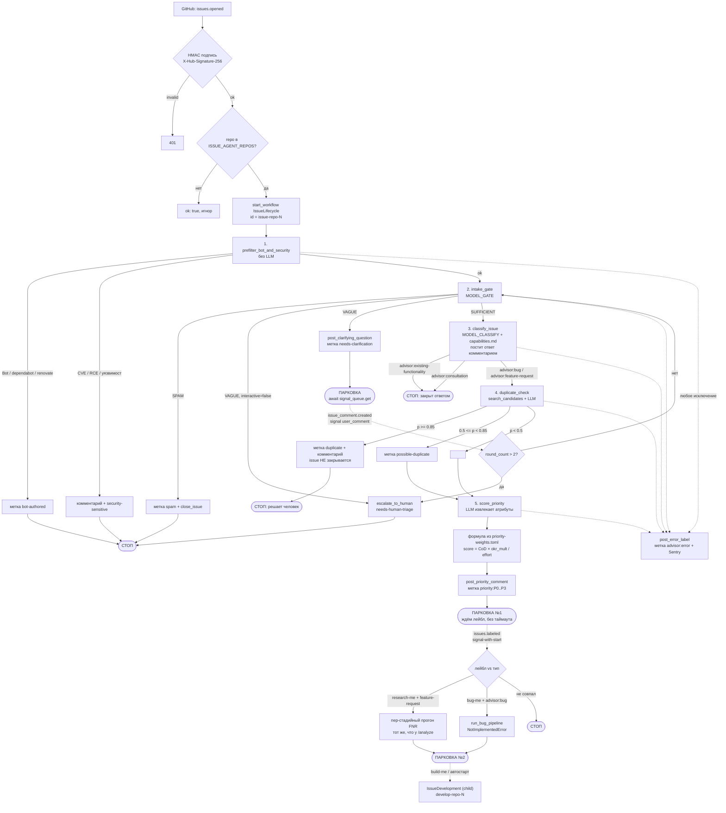
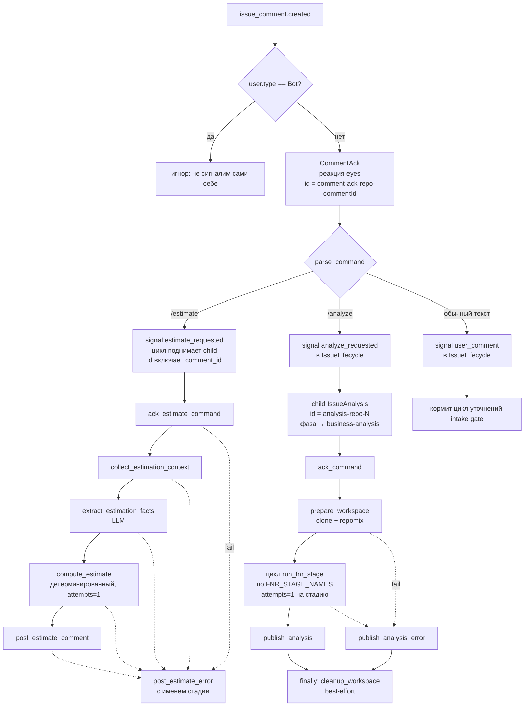

# Issue Agent Service — self-hosted, docker-compose, GLM

Обработка GitHub Issue как долгоживущие Temporal-workflow вместо набора GitHub
Actions. Два независимых сценария: **триаж каждого Issue** (Layer A) и
**консолидация бэклога в зоны поставки** (consolidation).

---

## Что умеет сейчас

| Возможность | Статус | Точка входа |
|-------------|--------|-------------|
| **Layer A — автономный триаж Issue**: предфильтры → intake-gate (с циклом уточнений) → 4-way классификация + advisor-ответ → duplicate-check (только метка) → приоритет по формуле | ✅ Работает, прогнан вживую по реальному бэклогу (64/67 Issue размечено, 0 ошибочных закрытий) | `make dry-run` / `make backfill-one issue=N` |
| **Consolidation — группировка бэклога в зоны поставки** (taxonomy-first): профиль на Issue → вывод 8–12 зон → классификация Issue в зону → нарезка зоны на инкременты (MVP/MVP+1) → объединяющий Issue на инкремент → **PR** | ✅ Работает, прогнан вживую (8 зон, 19 инкрементов, PR с 20 файлами). ⚠️ см. «Ограничения» | `make consolidate` |
| **`/estimate` — оценка трудоёмкости Issue** по методологии (тип работы → декомпозиция → FP cross-check → PERT → риски/надбавки → sanity bounds → грейды → Story Points), обоснование комментарием | ✅ Работает, прогнано вживую через webhook | комментарий `/estimate` в Issue |
| **`/analyze` — автономный анализ Issue** (Слой C): клон репозитория → repomix → цепочка FNR через `claude -p` (`task → concept → debate → sysreq → validate`) → артефакты в ветку `research/issue-<n>` + итоговый комментарий | ✅ Работает | комментарий `/analyze` в Issue либо лейбл `research-me` |
| **БФТ вместо свободного advisor-ответа**: запрос функционала получает на триаже структурированный БФТ быстрого прохода (Цель / How to demo / Открытые вопросы / Границы / таблица требований на цитатах) вместо прежнего «Ситуация — Ограничение — Варианты решения» | ✅ Работает | само, на `issues.opened`; откат — `BFT_ON_TRIAGE=0` |
| **`/bft` и `/bft-deep` — переработка и полный БФТ**: `/bft <замечания>` пересобирает письмо с учётом правок (в модель уходит вся переписка Issue), `/bft-deep <уточнения>` гоняет канонический пайплайн bft-writer семью стадиями и кладёт артефакты в ветку `bft-research/issue-<n>` | ✅ Работает | комментарий `/bft` / `/bft-deep` либо метка `run:bft*` — см. [`docs/BFT.md`](docs/BFT.md) |
| **Запуск команд метками** (`run:analyze` / `run:estimate` / `run:bft` / `run:bft-deep` → прогон → `done:*` либо `failed:*`) — управление с телефона в два тапа и индикатор состояния в списке Issue | ✅ Работает | метка `run:<команда>` на Issue |
| **Layer B — webhook-автостарт** на новых Issue (GitHub App) | ⚙️ Код есть (`webhook/`), требует регистрации App + публичного URL | см. «Установка Layer B» |
| **Доставка скиллов po-helper/SA-helper/bft-writer в воркер** (`.claude/skills` + `.claude/commands` → `/root/.claude/`, `claude-code` и `repomix` в образе) | ✅ Решено в `worker/Dockerfile` | — |
| **Установка `deb8flow`** в образ воркера | ❌ Не решено (`worker/Dockerfile:15` — TODO) | — |
| **Тяжёлая стадия по багам** `run_bug_pipeline` (перенос `bug-pipeline.yml`) | ❌ `NotImplementedError` — не реализовано | — |
| **Develop — передача задачи агенту разработки**: два режима — `local` (одноразовый контейнер на своём сервере, PR открывает воркер) и `dispatch` (`openhands-resolver.yml` в репозитории-цели, цикл ждёт события `pr-open`) | ✅ Работает, оба режима прогнаны вживую | метка `build-me` после аналитики либо `DEVELOP_AUTOSTART=1` |
| **Декомпозиция задачи на подзадачи и релизы** MVP / GROW / SUPPORT: план строится по системным требованиям, подзадачи создаются с зависимостями, сводка со ссылками уезжает в родителя | ✅ Работает, прогнано вживую (5 подзадач с порядком по зависимостям) | автоматически перед `ready-for-dev`, выключается `DECOMPOSE_ENABLED=0` |
| **Круг уточнений после аналитики**: незакрытые вопросы (`[УТОЧНИТЬ]`) задаются комментарием и ждут ответа; ответ обычным комментарием возвращает задачу в анализ | ✅ Работает | автоматически, потолок 2 круга |
| **Диалог по припаркованной задаче**: реплика человека в Issue, стоящем в ожидании (`answered`, `classified`, `ready-for-dev`, боковые состояния), получает содержательный ответ по всей переписке; фазу реплика не двигает, потолок — `FOLLOWUP_MAX_ROUNDS` | ✅ Работает | само, обычным комментарием |
| **Delivery-Agent — релиз одобренных PR** (модуль соседнего репозитория `poh-delivery-agent`): снимок состояния и открытых PR → конфликтующие уходят агенту разработки → релизная очередь → черновик релиза с планом и ссылкой во всех PR → пошагово мерж + выкатка на прод-контур + проверки живого сервиса → откат при провале → отчёт в релиз | ⚙️ Встроено, проверяется на `poh-demo-checkout` | комментарий `/release` либо метка `run:release` |
| **Круг правок по замечаниям ревью** (доведение PR): агент решает по каждому замечанию, исправлять или отклонить, публикует разбор и просит перепроверку командой `/review` | ✅ Работает, прогнано вживую до исхода «замечаний нет» | автоматически из фазы `pr-review`, потолок `PR_FIX_MAX_ROUNDS` |

Тесты: **752 теста**, покрытие держится порогом. Локально — `make test` (после `make setup`
цель зовёт `.venv/bin/pytest`), на каждый push и PR — GitHub Actions
(`.github/workflows/tests.yml`). Порог покрытия — `.coveragerc`, `fail_under = 83`:
он держит текущий уровень, чтобы тот не проседал незаметно, а не задаёт цель.

---

## Быстрый старт (Layer A — триаж)

Прогнать триаж по всем открытым Issue репозитория, без GitHub App и публичного
webhook:

```bash
make setup     # preflight (docker/uv/gh) + venv + генерация .env (интерактивно)
make up        # поднять worker (Temporal — централизованный, TEMPORAL_ADDRESS в .env)
make dry-run   # прогнать ВСЕ открытые Issue в DRY_RUN — ничего не мутируется
```

Три конфигурации compose (выбирается одна):

| Файл | Что | Temporal | Команда |
|------|-----|----------|---------|
| `docker-compose.yml` (**main**) | только приложение (`webhook`+`worker`) | внешний, `TEMPORAL_ADDRESS`/`TEMPORAL_NAMESPACE` в `.env` | `make up` |
| `docker-compose.local.yml` (**local**) | полный стек, порты 7233/8080 наружу, промпты монтируются | встроенный (`temporal:7233`, namespace `default`) | `make up-local` |
| `docker-compose.full.yml` (**full**) | полный стек, прод-hardened (Traefik, без публичных портов, `POSTGRES_PASSWORD`) | встроенный | `make up-full` / Dokploy |

`make up` (main) не поднимает ни одного лишнего контейнера — Temporal внешний.
В `local`/`full` Temporal встроенный, `.env` для него править не нужно.

`make setup` спросит целевой репозиторий, возьмёт GitHub-токен из авторизованного
`gh`, запросит `ZAI_API_KEY`, запишет `.env` с `DRY_RUN=1`. Смотри `[DRY_RUN]`-строки
в `make logs`, затем:

```bash
make go-live   # выключить DRY_RUN, перезапустить worker, прогнать по-настоящему
```

Точечно: `make backfill-one issue=<N>`. Повторный прогон идемпотентен
(`REJECT_DUPLICATE` по workflow-id); осознанный перепрогон — `scripts/backfill.py --suffix <tag>`.

Требования: Docker, [`uv`](https://astral.sh/uv), [`gh`](https://cli.github.com) (`gh auth login`).

### Что триаж делает с Issue

- Бот/security-подозрение → метка, дальше не идёт.
- Расплывчатый запрос → уточняющий вопрос (интерактивно) либо эскалация (batch).
- Классификация: `advisor:feature-request` / `advisor:bug` / `advisor:consultation` /
  `advisor:existing-functionality` + содержательный ответ комментарием.
- Дубликат: **только метка** `duplicate` / `possible-duplicate` + комментарий.
  **Issue НЕ закрывается автоматически** — решает человек (функциональный дубль ≠
  целевой, см. #111).
- Приоритет: LLM извлекает атрибуты → детерминированная формула из
  `config/priority-weights.toml` → метка `priority:*` + комментарий с разбором.
- Дальше workflow **паркуется** и ждёт лейбл `research-me` / `bug-me`.
  `research-me` запускает ту же аналитику Слоя C, что и команда `/analyze`;
  `bug-me` пока `NotImplementedError` — см. таблицу выше.

---

## Consolidation — бэклог в зоны поставки

```bash
make consolidate   # или: scripts/consolidate.py --repo <owner>/<repo>
```

Группирует открытые Issue по **оси поставки** — «что реализуется и релизится
вместе одной технической итерацией», а не по похожести темы. Пайплайн:

1. `fetch_open_issues` — список Issue **без тел** (тело тянет профиль — держит историю лёгкой).
2. `extract_solution_profile` (fan-out) — на каждый Issue: суть проблемы, механизм, цель, домен, якоря-цитаты.
3. `derive_taxonomy` — один вызов на весь бэклог → **8–12 зон поставки** (имя, граница «что закрывает одна итерация», имплементационная поверхность).
4. `assign_zone` (fan-out, пер-Issue) — классификация в primary-зону (+ secondary для сквозных, `other` если не подходит ни одна).
5. `slice_zone` — крупную зону режет на **инкременты** (MVP/MVP+1/…) по зависимостям и потолку размера (~3–6 Issue). Внутри зоны разводит по разным инкрементам одинаковый функционал с разной целью (#111).
6. `synthesize_unifying_issue` — на инкремент: объединяющий Issue (синтез проблемы + механизм + агрегат требований, каждое подписано `— from #N`).
7. `write_consolidation_pr` — ветка `consolidation/<дата>` + **PR**: `docs/consolidation/overview.md` (карта зон и инкрементов) + файл на каждый объединяющий Issue.

**Consolidation НИКОГДА не трогает Issue** — не комментирует, не метит, не закрывает.
Единственная запись — ветка+PR, и та под `DRY_RUN`. Предлагает — решает человек.

Реальный прогон дал 8 зон (`memory-core`, `jira-connector`, `process-engine`,
`llm-routing`, `router`, `po-helper`, `ui-shell`, `ops-core`) и 19 инкрементов по
3–6 Issue.

---

## Ограничения (важно)

- **Большой бэклог не дорабатывает до PR в самом workflow.** На ~75 Issue история
  превышает ~990 событий, и реплей не укладывается в workflow-task timeout на
  стадии synth. Нужен `continue-as-new` после `derive_taxonomy` (не реализовано).
  Пока обход: снять посчитанные зоны/инкременты из истории Temporal и выполнить
  synth+PR отдельно.
- **Rate-limit z.ai** — главный потолок скорости. Воркер намеренно ограничен:
  `max_concurrent_activities=3` + `ThreadPoolExecutor(3)`. Полный прогон по ~75
  Issue занимает десятки минут.
- **Таксономия не версионируется**: `derive_taxonomy` вызывается с `prior=None`,
  temperature не фиксирована → зоны могут «плыть» между прогонами.
- **LLM-стадии — синхронные `def`** (исполняются в ThreadPoolExecutor). Делать их
  `async def` нельзя, не вынеся блокирующий вызов: LLM-вызов прямо на event-loop
  замораживает воркер. Activity долгого анализа (`prepare_workspace`,
  `run_fnr_stage`, `publish_analysis`, …) — наоборот
  `async def`: им нужен heartbeat, а каждый блокирующий git/repomix/`claude -p`/REST
  внутри обёрнут в `asyncio.to_thread`, иначе heartbeat не уходит на сервер.

---

## Архитектура

```
GitHub → webhook (FastAPI) → Temporal → worker (activities: GLM / gh / claude -p)
                          (централизованный, TEMPORAL_ADDRESS/TEMPORAL_NAMESPACE)
```

Четыре workflow-типа на одной очереди `issue-lifecycle`
(`worker/worker.py`):

- **`IssueLifecycle`** — один на Issue (id `issue-<repo>-<n>`). Лейблы
  `research-me`/`bug-me` и ответы-уточнения — это Temporal **signals**: workflow
  спит и ждёт сигнал сколько угодно долго.
- **`IssueAnalysis`** — один на команду `/analyze` (id `analysis-<repo>-<n>`).
- **`IssueEstimation`** — один на команду `/estimate` (id включает `comment_id`).
- **`ConsolidationWorkflow`** — один на прогон консолидации, fan-out по бэклогу.

Агенты работают **в двух режимах** (#37): дочерним прогоном `IssueLifecycle`,
когда цикл жив, и самостоятельным — при автономном запуске (скрипты,
`make backfill-one`, прогон прежнего поколения). Код один и тот же, отличается
только родитель; id остаётся каноническим (`shared/workflow_ids.py`), поэтому
повторная команда упирается в `WorkflowAlreadyStarted` в обоих режимах.

### Путь Issue: от `issues.opened` до парковки



Ключевое: `issues.labeled` доставляется через **signal-with-start**, а не голый
signal — Issue мог быть заведён до установки App, воркфлоу триажа не существует,
и голый signal дал бы 500, после чего GitHub бросил бы доставку.

### Команды в комментариях — отдельные workflow

Триаж завершается после приоритизации (а на спаме и дубликате — раньше), поэтому
`/analyze` и `/estimate` — не сигналы в `IssueLifecycle`, а самостоятельные
воркфлоу со своими id.



**Подтверждение приёма — до разбора команды.** Реакция `eyes` заказывается
отдельным прогоном `CommentAck` на любой человеческий комментарий и ничем не
гейтится: ни правами (`AGENT_TRIGGER_ALLOWLIST`), ни наличием живого цикла, ни
разбором команды. Всё, что ниже по схеме, ветвится и может отказать молча —
поэтому человек должен отличать «не доехало» от «увидели и работаем» до того,
как включится хоть одна модель.

Реакцию ставит воркер, а не вебхук: GitHub-клиента у вебхука нет намеренно —
процесс, смотрящий наружу, не получает права писать в Issue. Ключ прогона —
id комментария, поэтому ретрай доставки не просит вторую реакцию, а сбой самого
заказа не роняет обработку комментария.

### Запуск командой из метки — `run:*` → `done:*` / `failed:*`

У каждой команды два равноправных триггера: комментарий (`/analyze`) и метка
(`run:analyze`). Метка ставится в два тапа из мобильного GitHub и не требует
ввода текста, поэтому это основной способ управления с телефона.

| Поставить | Что запускает | Чем закончится |
|---|---|---|
| `run:analyze` | `IssueAnalysis` — то же, что `/analyze` (дочерним прогоном цикла) | `done:analyze` либо `failed:analyze` |
| `run:estimate` | `IssueEstimation` — то же, что `/estimate` (дочерним прогоном цикла) | `done:estimate` либо `failed:estimate` |

Метка `run:*` снимается по завершении прогона, исход вешается своей меткой.
Неуспех получает `failed:*`, а не просто снятый `run:*`: молча снятая метка
неотличима от «никто не запускал». Заодно снимается легаси-метка `analyzing`.

Это и индикатор состояния прямо в списке Issue, без открытия каждого:

```
label:run:*    — что сейчас в работе у агента
label:done:*   — что проработано
label:failed:* — где прогон сорвался
```

Метку ставит и сам прогон, запущенный командой в комментарии, — иначе выборка
`label:run:*` врала бы. Ветка `research-me` помечается так же (`run:analyze`).

Схема имён — namespace через двоеточие, как в протоколе агентов v1
(`needs-human:*`, `origin:agent`). Метки исхода агент ставит себе сам, они
возвращаются событием `issues.labeled` и **не** совпадают ни с одним триггером —
на этом и держится защита от петли: запускает только `run:<команда>`.

Повторная постановка `run:*` на идущем прогоне упирается в
`WorkflowAlreadyStarted` и второго дорогого прогона не создаёт; после
завершённого — запускает честно новый. Прежние `research-me` / `bug-me` /
`build-me` работают как раньше.

**Авторизации пока нет:** метку может поставить любой с правами на репозиторий,
а прогон стоит токенов — allowlist по `sender.login` отслеживается в
[#7](https://github.com/po-helper-org/poh-issue-agents/issues/7).

## Живая проверка контура

Тесты замыкают сеть на заглушки и потому не отвечают на вопросы, которые ломаются
в проде: доезжает ли вебхук, входит ли репозиторий в `ISSUE_AGENT_REPOS`, отвечает
ли кластер, работает ли ключ модели. На это отвечает живой прогон — ценой реальных
токенов.

```bash
docker compose exec worker python scripts/e2e_live.py triage
docker compose exec worker python scripts/e2e_live.py label-command
```

Запускать **внутри контейнера**: скрипту нужны те же креды и та же сеть, что и
сервису. Репозиторий — `--repo`, иначе `E2E_REPO`, иначе `GITHUB_REPOSITORY`.

| Сценарий | Что проверяет | Признак успеха |
|---|---|---|
| `triage` | Воркер, активности, модель, запись в GitHub. Стартует воркфлоу напрямую в Temporal, как `backfill` | появились `advisor:*` и `priority:*` |
| `label-command` | **Доставку вебхука** целиком: метка → событие → воркфлоу → обратный ход меток | появилась `done:estimate`, снята `run:estimate` |

Скрипт заводит свой служебный Issue, наблюдает за ним и закрывает (`--keep`
оставляет открытым). Существующие задачи не трогаются. Прогон прекращается
досрочно, если появилась метка неуспеха (`failed:*`, `advisor:error`) — ответ уже
получен. Коды возврата: `0` — контур отработал, `1` — ожидания не выполнены за
таймаут, `2` — ошибка конфигурации (нет репозитория, включён `DRY_RUN`, не
отвечает Temporal).

## Диагностика: почему issue не доехал

Событие может пропасть молча — репозиторий вне `ISSUE_AGENT_REPOS` отбрасывается
до старта workflow, а `GH_TOKEN` незаметно подменяет GitHub App личным
аккаунтом. Снаружи оба случая выглядят одинаково: GitHub получает 200, в
Temporal пусто.

```bash
docker compose exec webhook python scripts/diag.py                   # весь конфиг
docker compose exec webhook python scripts/diag.py --repo owner/name # доедет или нет
```

Скрипт печатает действующий allowlist и результат его разбора, режим авторизации
(с явным предупреждением, когда PAT перебивает настроенный App), адрес и
namespace Temporal с реальной проверкой связи. **Значения секретов не печатаются
никогда** — только «задан / не задан». Код возврата: `0` — конфиг рабочий, `1` —
Temporal недостижим либо авторизация не настроена вовсе.

Запускать нужно ВНУТРИ контейнера: снаружи прочитается окружение хоста, а не
сервиса. Тот же конфиг вебхук логирует одной строкой на старте.

### Отказы, которые выглядят как исправная работа

Самый дорогой класс: шаг отработал целиком, доложил успех и не сделал ничего.
Метки и фазы при этом правильные — отличить можно только по РЕЗУЛЬТАТУ. Все
записанные ниже найдены живым прогоном; ни один не поймали 600 модульных тестов,
потому что все они живут на стыках.

| Что видно | Причина |
|---|---|
| PR открыт, диффа по существу нет | каталог задачи не передан раннеру: воркер работает от root, раннер от uid 10001. Агент об отказе не сообщает — уходит писать в `/tmp`. Проверка: `ls -ld` каталога задачи в томе должен показывать владельца 10001 |
| в PR висит заглушка «Preparing review...» | `pr-agent` вышел НУЛЁМ: на rate-limit модели он пишет `Failed to review PR` в лог и завершается успешно. Исход определяется по выводу, а не по коду возврата |
| стадия FNR: «артефакт … не создан» | `claude -p` тоже выходит нулём без артефакта. Частая причина — rate-limit z.ai |
| круг правок «внёс правки», в коммите один служебный файл | `.task.md` попал под `git add -A`; он меняется каждый круг, поэтому пуш всегда видит дифф |
| второй круг правок не начинается | доклад ревью выглядел повторной доставкой: ключ идемпотентности не различал круги. Сейчас в него входит `revision` — коммит, по которому шло ревью |
| проверки красные на зелёном коде | Node воркера разошёлся с Node CI целевого репозитория (`node --test` раскрывает glob сам, начиная с 22) |
| Issue не реагирует ни на метки, ни на команды | реплей упал по недетерминизму. `docker logs <worker> \| grep -i nondetermin` — и смотреть, какое решение воркфлоу поменяли без маркера патча |

Что ещё видно без захода в контейнер:

- **Отброшенная доставка** оставляет след в Temporal — воркфлоу
  `webhook-drop-<delivery-id>` с причиной и действовавшим allowlist. Это
  единственный молчаливый отказ, о котором иначе неоткуда узнать.
- **Стадия триажа** доступна query `stage` на `IssueLifecycle` (вкладка Queries):
  `intake` → `classify` → `duplicate-check` → `priority` →
  `awaiting-human-decision` → `analysis`/`bug` → `awaiting-build-decision` →
  `done`; ранние выходы — `skipped`, `spam`, `escalated`, `answered`,
  `duplicate`, `failed`, `agents-off`. Припаркованный прогон теперь отличим от
  зависшего.

### Отслеживание работ по Issue

Операционная история Issue восстанавливается **по идентификаторам прогонов**, а
не по дереву в Temporal UI. Причина: родитель делает continue-as-new при 800
событиях истории (`HISTORY_EVENT_THRESHOLD`), после чего меняется RunId, а
дочерние прогоны остаются привязаны к прежнему. Дерево — приятное следствие,
пока родитель не перезапустился; полноту даёт идентификатор.

| Прогон | Идентификатор | Что показывает |
|---|---|---|
| Родитель Issue | `issue-<repo>-<n>` | фаза, решения человека, сигналы, парковки |
| Аналитика (`/analyze`) | `analysis-<repo>-<n>` | цепочка FNR по стадиям |
| Оценка (`/estimate`) | `estimate-<repo>-<n>-<marker>` | расчёт трудоёмкости |
| Разработка (OpenHands) | `develop-<repo>-<n>` | клон, прогон агента, находки, тесты, публикация |
| Круг правок по ревью | `prfix-<repo>-<pr>-<round>` | одна итерация доводки PR |

Все форматы собираются в `shared/workflow_ids.py` — второго места нет намеренно,
иначе выборка по префиксу молча стала бы неполной.

```bash
docker exec <temporal-контейнер> temporal workflow list
docker exec <temporal-контейнер> temporal workflow show --workflow-id develop-<repo>-<n>
```

`show` по стадии разработки даёт шаги событиями `ActivityTaskScheduled`:
`dev_begin` → `dev_prepare` → `dev_announce` → `dev_run_agent` → `dev_followups`
→ `dev_tests` → `dev_publish` — так выглядит режим `local`. В режиме `dispatch`
шагов меньше: история обрывается на `dev_begin` → `dev_dispatch` — прогон
целиком уезжает в GitHub Actions, а `local`-шаги на этой стороне просто не
планируются. У каждого шага своя политика ретраев: агент и тесты идут в одну
попытку, остальное — в три. Ради этого стадию и разрезали: срыв публикации
повторяет публикацию, а не двадцатиминутный прогон агента.

Переключение обеих стадий на дочерние прогоны стоит под маркерами патча
(`issue-lifecycle-develop-child`, `issue-lifecycle-prfix-child`). Прогоны,
начатые до выкладки, идут прежним путём — активностью внутри родителя, без
отдельной строки в списке. Отличить их можно по `TemporalChangeVersion` в
`describe`: нет маркера — прогон прежнего поколения.

Код пишет OpenHands — одноразовым контейнером на своём сервере (режим `local`,
умолчание) либо в GitHub Actions (`dispatch`); режим и все константы —
`shared/develop.py`. Помимо Temporal прогон виден ещё на трёх поверхностях:

- **Логи воркера — вывод самого агента.** `_dev_run_agent` логирует хвост
  stdout/stderr **на любом исходе прогона, не только при ошибке** — иначе
  прогон, отработавший 20 минут и не тронувший ни одного файла, не оставляет ни
  строки при падении на следующем шаге:
  ```bash
  docker logs -f <worker-контейнер> | grep "Develop"
  ```

- **Контейнер-раннер — живой прогон агента.** Имя детерминировано:
  `develop.task_slug()` → `dev-<owner>__<repo>-<issue>`:
  ```bash
  docker logs -f dev-<owner>__<repo>-<issue>
  ```
  `--rm` только на нормальном выходе; потолок `DEVELOP_TIMEOUT_SEC` (умолчание
  2700с / 45 мин) — превышение это не «агент думает», а «агент застрял».

- **Sentry** (см. «Наблюдаемость — Sentry» ниже) — что упало молча; тег `stage`
  отличает падение на `dev:*` от прочих активностей.

Человеку в Issue видно без захода в контейнер: метка `in-development`
(`_dev_announce`, best-effort — непоставленная метка не роняет уже начавшийся
прогон) и комментарий-хендофф с веткой и способом запуска. По завершении — PR
с `Closes #issue`, либо, если агент нашёл edge-кейсы (`collect_dev_followups`,
файл `.followups.md` в рабочем каталоге), комментарий «🔍 Найдено по дороге» со
ссылками на заведённые SubIssue.

Живая проверка пути целиком, включая Develop, — `scripts/demo_e2e.py`: заводит
Issue и ждёт `in-development`/PR по каждой стадии с таймаутом, отдельно от
`e2e_live.py` выше (тот Develop не гоняет).

## Фазы жизненного цикла Issue

`shared/lifecycle.py` — единственный источник правды о состоянии Issue: перечень
фаз, таблица переходов и инициатор каждого перехода. Из него выводятся значения
query, метки `phase:*`, search attribute и строки таймлайна. Модуль чистый — ни
сети, ни Temporal, как `estimation.py`.

Основной путь: `created` → `classified` → `business-analysis` →
`system-requirements` → `groomed` → `ready-for-dev` → `in-development` →
`pr-open` → `pr-review` → `merged` → `testing` → `released`. Путь бага короче —
из `classified` сразу в `ready-for-dev`, мимо аналитики. Путь подзадачи плана —
из `classified` в `system-requirements`: требования уже есть, они в ветке анализа
родителя, но фазу «требования есть» она проходит честно, и чеклист готовности
ссылается на них.

Из `failed` есть ход обратно в `business-analysis`: сорваться могла именно
аналитика, и тогда `/analyze` — не новая стадия, а второй заход на ту же. Без
этого хода команда выполнялась «мимо пути» — артефакты появлялись, `done:analyze`
вставал, а фаза оставалась `failed`, и задача с готовыми требованиями навсегда
стояла в очереди к человеку.

Боковые состояния — `spam`, `duplicate`, `answered`, `skipped`, `escalated`,
`failed` — **не тупики**: человек возвращает Issue в работу явным переходом.
Терминальны только `released` и `cancelled`.

У каждого перехода записан инициатор: `agent`, `human` или `external` (PR-Agent,
PR-Closer, CI). «Ждём агента» и «ждём человека» — разные состояния для того, кто
смотрит на очередь. Недопустимый переход — `InvalidTransition` с перечнем того,
что было возможно, а не молчаливая перезапись.

Инвариант: одна фаза — ровно одна метка `phase:*`; при переходе предыдущая
снимается (`set_phase`). Две метки фазы означали бы противоречие, и
`phase_from_labels` отказывается угадывать.

### Цикл как владелец состояния

`IssueLifecycle` — не линейный сценарий, а цикл поверх таблицы переходов: пока
фаза не терминальна, прогон жив. Это меняет два свойства контура.

**Боковой исход перестал быть концом.** Раньше `spam`, `duplicate`, `answered`,
`skipped` и сбой стадии завершали воркфлоу — вернуть Issue в работу было не
у кого просить: сигналить некому. Теперь это фазы, из которых сигнал `reopen`
(лейбл человека) ведёт обратно в основной путь первым допустимым переходом.
Ожидание тоже ограничено сроком (`PARK_SIDE_STATE_HOURS`) — «не тупик» не
означает «вечная сессия».

**Реплика человека в парковке — вопрос к контуру.** Пока задача стоит в
ожидании, комментарий человека получает содержательный ответ по всей переписке
Issue (`FOLLOWUP_MAX_ROUNDS` кругов, потом молчание). Фазу реплика не двигает:
вопрос по задаче — не решение о ней, и ходы между фазами остаются за метками и
командами. Раньше такой комментарий отбрасывался как посторонний сигнал —
человек ждал ответа, которого никто не собирался писать.

**История обрывается по порогу.** На активном Issue цикл живёт неделями, и
Event History упёрлась бы в тот же потолок, который уже словила консолидация
(~990 событий на ~75 Issue — реплей не укладывается в workflow-task timeout).
Достигнув `HISTORY_EVENT_THRESHOLD` событий, цикл делает `continue_as_new` в
точке смены фазы — там, где состояние согласовано и незавершённой работы нет.
Переносится компактный снимок (`LifecycleState`: фаза, стадия, приоритет,
классификация), а не тред и не история. Сколько раз цикл перезапускался, видно
в query `generation`: без него по одной истории нельзя отличить новый Issue от
продолжения старого.

**Каждое изменение РЕШЕНИЯ уходит под свой `workflow.patched`.** Решением
считается и ветка перехода, и вид ожидания, и длительность таймера, и порядок
активностей: прогон держит уже выбранное в истории, и другой выбор на реплее — это
`Nondeterminism error`, после которого Issue перестаёт отвечать на сигналы вовсе.
Действующий перечень маркеров — в [`AGENTS.md`](AGENTS.md); переименование любого
из них равно отказу по недетерминизму.

**Поколения разведены `workflow.patched("issue-lifecycle-phase-loop")`.**
Прогоны, запущенные до этого изменения, припаркованы в проде; их история не
знает маркера, поэтому они доигрывают по прежнему линейному коду
(`_run_linear`). Реплей старой истории новым кодом означал бы отказ по
недетерминизму. Линейный путь удаляется только когда прогоны того поколения
закончатся — через `workflow.deprecate_patch`.

Query `phase` отдаёт фазу цикла напрямую; для прогонов прежнего поколения она
по-прежнему выводится из стадии через `STAGE_TO_PHASE`.

### Ожидание — состояние, а не его отсутствие

Фаза отвечает «где Issue». `Awaiting` (`shared/awaiting.py`) отвечает на другой
вопрос — «почему он там стоит и кто его сдвинет» (#39). До этого все ожидания
выглядели одинаково: припаркованный прогон и зависший в Temporal UI неотличимы,
на Issue висела метка приоритета, из которой не следует, что ход за человеком, а
сбой вообще не был ожиданием — он вешал метку и закрывал прогон.

Структура: `kind` (`human-decision` / `approval` / `testing` / `external-agent` /
`failure-recovery`), `who`, `reason`, `since`, `deadline`. Заполняется **до**
ухода в ожидание, в одном месте (`_park`): разнесённые «поставить таймер» и
«записать, чего ждём» разошлись бы при первой правке одной из них. Наружу
отдаётся query `awaiting` — расширение `stage` из #29.

**Метка `needs-human:*` стоит, пока ход за человеком**, а не появляется по
истечении срока: до этого выборка показывала не очередь, а её просроченный
хвост. Ожидание машины (стенд, соседний сервис) метку не ставит — задача, по
которой человеку делать нечего, в его очереди шум, из-за которого перестают
смотреть на саму выборку.

Кого ждёт фаза — **явная таблица**, а не вывод из инициаторов переходов. Вывод
соблазнителен и неверен: у `failed` есть внешний переход («работа над PR
продолжилась»), но ждёт эта фаза человека. Угадывание положило бы разбор сбоя в
очередь к машинам.

Открытый вопрос постановки «kind → действие по истечении» решён так: действие
одно для всех видов — передать человеку. Пинг, повышение приоритета и
автоотмена требуют знать, кому пинговать и чем рискует отмена; ни того, ни
другого контур не знает. Различается не действие, а **срок**: он и вынесен в
таблицу `DEFAULT_DEADLINE_HOURS`. `PARK_*_HOURS` по-прежнему сильнее таблицы —
две ручки на один таймер разъехались бы.

### Develop — задача уезжает в разработку

Второй ключевой шаг после Research. Research доводит Issue до системных
требований и метки `ready-for-dev` (точка передачи H1); Develop берёт его
оттуда и доводит до открытого PR.

Код пишет OpenHands. Где именно — вопрос не удобства, а радиуса поражения, и
отсюда два режима (`DEVELOP_MODE`, граница в `shared/develop.py`, стадия — в
дочернем воркфлоу `IssueDevelopment`, id `develop-<repo>-<n>`):

**`local` (умолчание)** — прогон идёт **одноразовым контейнером на своём же
сервере**. Контур замкнут внутри стенда: ни чужих раннеров, ни минут GitHub.
Стадия разложена на шаги-активности — клон, объявление, агент, находки, тесты,
публикация, — и у каждого своя политика ретраев: срыв публикации повторяет
публикацию, а не двадцатиминутный прогон агента. Промежуточной фазы
`in-development` у режима нет: к возврату дочернего прогона PR уже открыт.

**`dispatch`** — прогон уезжает в GitHub Actions репозитория-цели
(`.github/workflows/openhands-resolver.yml`). Остаётся для репозиториев, где
стенда нет. Цикл паркуется в `in-development` и ждёт события `pr-open`.

#### Что держит режим `local` (проверено отказами, а не рассуждением)

- **Каталог задачи передаётся раннеру.** Воркер готовит его от root, раннер
  работает от `develop.RUNNER_UID` (10001). Не передашь — агент не падает, а
  уходит писать в `/tmp` и докладывает об успехе: прогон отрабатывает целиком и
  не оставляет ни одной правки. Передача падает громко (`_handover_to_runner`),
  uid сверяется тестом с образом раннера.
- **Коммит идёт в каталоге, которым владеет раннер** — git отвечает на это
  `fatal: detected dubious ownership`. Каталог объявляется доверенным через
  `GIT_CONFIG_*` для конкретной команды, а не правкой глобального конфига.
- **Node воркера равен Node раннера и CI целевого репозитория.** Воркер прогоняет
  `DEVELOP_TEST_COMMAND` — ту же строку, что гоняет CI; разъехавшаяся мажорная
  версия означает «красные здесь, зелёные там». Сверяется тестом.
- **Контейнер получает имя задачи, остаток снимается перед новой попыткой.**
  `--rm` срабатывает только на нормальном выходе: умерший вместе с воркером
  прогон оставляет контейнер работать — с ключом модели и памятью.
- **Постановка не уезжает в коммит.** `.task.md` лежит в рабочем дереве и попадает
  под `git add -A`; однажды это дало PR из одного файла на 1721 строку и заодно
  обмануло гвард «изменений нет — открывать нечего».
- **Находки агента — файлом.** `gh` и GITHUB_TOKEN раннеру не дают: он исполняет
  код чужого репозитория. Агент пишет edge-кейсы в `.followups.md` (раздел
  `## <кратко>` на находку), Issue по ним заводит воркер своим токеном — с
  `origin:agent` и ключом цепочки, со ссылками комментарием в родителе. Потолок —
  `develop.MAX_FOLLOWUPS`.

**В режиме `dispatch` запуск — `workflow_dispatch`, а не метка-триггер.** Метка — состояние, а не
событие: повторная постановка уже висящей метки не шлёт ничего, снятая руками
метка теряет запуск молча, а два прогона по соседним Issue неразличимы в логе
Actions. Диспатч — именно событие, с явными входами (`issue_number`,
`research_branch`, `priority`). Метка `in-development` остаётся, но как
индикатор для человека, а не как транспорт.

**Цикл не ждёт результат активностью.** Прогон идёт десятки минут, и активность,
которая столько висит на heartbeat, ничего не добавляет: исход всё равно
приходит событием `pr-open` через `/agent-event`. Активность отвечает только за
«запуск состоялся», дальше цикл паркуется в `in-development` — ожидание здесь
такое же первоклассное состояние, как ожидание человека.

**Порядок внутри активности не косметический.** Сначала диспатч: он
единственный может не состояться (нет файла workflow, выключены Actions), и
тогда ни метки, ни комментария о начале работы быть не должно — соврать про
запуск хуже, чем не запустить. Метка и комментарий идут после и уже
best-effort: прогон начался, и падать из-за не поставленной метки значило бы
отправить в `failed` задачу, которая на самом деле в работе.

**Edge-кейсы агент не чинит по дороге** — они становятся отдельными SubIssue с
`root-issue: #N` и `origin:agent` в теле. Эти Issue возвращаются на вход
контура, проходят сокращённый триаж (R6) и упираются в потолок глубины (R7),
поэтому веера «каждый PR рождает Issue, каждый Issue — PR» не получается.

**Замкнутый контур — `DEVELOP_AUTOSTART=1`.** Снимает единственную парковку,
оставшуюся на основном пути после аналитики: задача уезжает в разработку сама,
без метки `build-me`. Умолчание — выключено, то есть протокол в чистом виде:
H1 отдаёт работу человеку, и его решение её начинает. Метка `ready-for-dev`
ставится в обоих режимах — она сообщает состояние задачи, а не то, кто именно
её возьмёт.

`DEVELOP_ENABLED=0` оставляет Issue в `ready-for-dev`, то есть в очереди к
живому разработчику. Это поведение до появления Develop и процедура отката.

### Декомпозиция — план исполнения до кода

Между аналитикой и разработкой лежит шаг, которого в контуре не было: у задачи
есть системные требования, но нет плана исполнения. Без него агент разработки
получал задачу целиком и сам решал, с чего начать и что считать достаточным, — а
это решение принимается ДО кода, а не в процессе. Модуль — `shared/decomposition.py`,
активности `decompose_issue` и `publish_decomposition`, шаг идёт в фазе
`system-requirements`, до `ready-for-dev`.

Три релиза, и граница между ними проверяемая, а не на глаз:

- **MVP** — прямой путь пользователя целиком. Критерий: убери подзадачу — путь
  перестаёт работать. Осталась рабочей — значит подзадача не MVP.
- **GROW** — то, без чего фича работает, но выпускать её нельзя: граничные случаи,
  устойчивость к неверному вводу, наблюдаемость.
- **SUPPORT** — баги и долги, найденные по ходу разбора.

Порядок внутри релиза задан **зависимостями**, а не номерами: агент берёт
подзадачи в порядке готовности, и «сначала пункт 1» ничего ему не говорит, если
пункт 3 нужен раньше. Циклы в зависимостях и битые ссылки отвергаются ДО первой
записи в GitHub — созданный SubIssue уже не отменить одной кнопкой.

Потолки: `MVP_SOFT_CAP` (больше — граница прямого пути проведена слишком широко,
говорим об этом человеку, но не режем молча) и `TOTAL_CAP` (декомпозиция на три
десятка задач — не план, а свалка).

**Сбой декомпозиции не отменяет передачу.** План — улучшение переданной задачи, а
не условие её существования: без него разработчик получит задачу как раньше.

#### Подзадача плана — не самостоятельная задача

Признак — `origin:agent` **вместе** с ключом цепочки `root-issue: #N`. Одного
провенанса мало: его носят и самостоятельные находки агента разработки, у которых
родителя нет и которые обязаны идти своим путём целиком.

Подзадача плана:

- **не заказывает свою аналитику** — требования по фиче уже написаны, они в ветке
  анализа РОДИТЕЛЯ, и сама подзадача выведена из них. Полная цепочка FNR по каждой
  выводила бы выведенное: на фиче из четырёх подзадач это четыре прогона по восемь
  минут, четыре ветки `research/issue-N` и счёт впятеро больше;
- **не строит свой план** — иначе цепочка идёт на второй круг, и правило R7
  отправит каждую внучатую задачу человеку;
- **не заводит свою разработку** — исполняет её родитель, одним прогоном на весь
  объём MVP. Дай автостарт каждой подзадаче, и на одном репозитории одновременно
  работают N агентов: конфликты, N PR вместо одного и N ревью, ни одно из которых
  не про целую фичу;
- **ждёт контур, а не человека** — вид ожидания `external-agent`, метка очереди к
  людям не ставится. Восемь подзадач одной фичи в `label:needs-human:*` означали
  бы, что на саму выборку перестанут смотреть.

Чеклист готовности подзадачи ссылается на требования родителя: своей ветки
анализа у неё нет, и ссылка на `research/issue-<своё>` вела бы в пустоту.

### Круг правок — доведение PR по замечаниям (H3→H4)

PR-Agent публикует ревью и останавливается: доводить код до соответствия
замечаниям — не его работа. До этого шага её делал человек, и именно здесь контур
переставал быть автономным. Модуль — `shared/pr_closing.py`, активности
`run_pr_fix_round` и `finish_pr_fixing`, круг ведёт сам цикл в фазе `pr-review`.

Отдельный сервис потребовал бы второй копии всего — клона, раннера, прогона
тестов, пуша — и ещё одного канала докладов обратно.

**Признак «замечаний нет» — ПУСТОЙ ДИФФ после прогона агента.** Разметку ревью
можно было бы разбирать и считать, какие пункты блокирующие, но тогда контур
зависел бы от формата чужого инструмента, который меняется без предупреждения.
Вместо этого агенту отдаётся текст ревью и правило «исправь то, что требует
исправления; если по существу нечего — не меняй ничего». Пустой дифф — его
вердикт, выраженный делом.

Что делает круг рабочим:

- **Агент решает по каждому замечанию, стоит ли оно правки.** Автоматический
  ревьюер находит к чему придраться всегда — это его работа. Отклоняются
  стилистические придирки, требования того, что уже сделано ВНЕ диффа (ревью видит
  только дифф и регулярно требует существующего), пожелания «на будущее» и повтор
  замечания, отклонённого на прошлом круге без новых доводов.
- **Разбор обязателен** и публикуется комментарием: молчаливое «ничего не
  изменилось» неотличимо от сломанного прогона, а отклонённое замечание должно быть
  видно человеку вместе с причиной.
- **Команда перепроверки стоит ПЕРВОЙ строкой** комментария. Ревью запускается по
  `startsWith(comment.body, '/review')` — той же конвенцией, что и команды в Issue.
  Команда в конце текста читается человеком как просьба, а автоматикой — никак.
- **Ни постановка, ни разбор не уезжают в коммит.** `.task.md` менялся на каждом
  круге, поэтому пуш всегда видел дифф и всегда докладывал «правки внесены»:
  исход «замечаний нет» был недостижим в принципе.
- **Текст ревью не содержит комментариев контура.** Он ходит в GitHub как App, то
  есть тоже бот; без фильтра по подписи агент читал собственную просьбу «внёс
  правки, прошу перепроверить» как часть замечаний и спорил сам с собой.
- **Потолок кругов** (`PR_FIX_MAX_ROUNDS`, по умолчанию 3). Агент, который третий
  раз не сходится с ревью, дальше не сойдётся — он спорит, а не исправляет; такой
  PR уходит человеку с меткой `needs-human:pr`. Итог различает «три круга не
  сошлись» и «круг сорвался»: печатать потолок вместо пройденного значит послать
  человека разбирать спор, которого не было.

### Внешние агенты докладывают в цикл

`POST /agent-event` — узкий контракт «событие агента → факт в жизни Issue»
(#38). Не общая шина и не общий код: PR-Agent, PR-Closer и CI живут своим
релизным циклом, и Temporal они не используют. Общий namespace потребовал бы
втащить в них SDK, сетевой доступ к кластеру и знание наших workflow id — ровно
та связность, ради ухода от которой контракт и заводился. HTTP с подписью —
транспорт, на котором соседние сервисы уже говорят.

Конверт: `{repo, agent, phase, status, ref, root_issue?, detail?}`. `phase` — из
общего словаря фаз, `status` — `started` / `succeeded` / `failed` / `blocked`.
Исход сильнее названной фазы: агент сообщает, ГДЕ работа, а `failed` ведёт в
`failed`, `blocked` — к человеку.

**Корреляция работы с Issue** — по убыванию надёжности: явное поле `root_issue`
→ `Closes #N` в теле → конвенция имени ветки (`research/issue-N`, `bug/issue-N`).
Первый сработавший выигрывает; смешивать их голосованием нельзя, у них разная
достоверность. Неоднозначность (тело закрывает несколько Issue) **не
разрешается догадкой** — привязать работу не к той задаче значит испортить
трассировку двум сразу. Такой случай и вовсе неопознанный уходят в
`OrphanAgentEvent`: событие уже случилось, и терять его нельзя.

**Идемпотентность** — по тройке `(ref, phase, status)`. Постановка называла
пару `(ref, status)`, но её мало: `started` сопровождает каждый шаг, и начало
ревью схлопнулось бы в повтор открытия PR.

Цикла может не быть — Issue завели до установки App либо его прогон закрылся по
сроку. Тогда он поднимается **сразу в доложенной фазе** через тот же снимок
состояния, что и continue-as-new: триажу нечего делать по задаче, которая уже в
PR, а пустые заголовок и тело дали бы уточняющий вопрос человеку и потраченные
вызовы модели.

Недопустимый переход от внешнего агента **не роняет цикл**, в отличие от нашего
собственного кода: там невозможный переход — это баг, который надо увидеть, а
здесь рассинхрон соседнего сервиса с нашей моделью должен приводить к разбору
человеком.

### Агенты как дочерние прогоны

`shared/agent_launcher.py` — единственное место, где решается, как запускать
агента. Решение не «описать воркфлоу и посмотреть статус» (лишний round-trip и
гонка между проверкой и стартом), а **всегда signal-with-start в цикл**: он
либо получает команду, либо поднимается тем же вызовом, а дальше сам решает,
поднимать ли дочерний прогон.

Остаётся один случай, который цикл обслужить не может: прогоны прежнего
поколения. Их история не знает ни фазового цикла, ни сигнала на запуск агента —
команда была бы принята и потеряна. Их отличает query `handles_agents`; для них
лаунчер стартует самостоятельный прогон, как раньше. Ветка исчезнет сама, когда
прогоны того поколения завершатся.

Дорогие прогоны запускаются с `ParentClosePolicy.ABANDON`: цепочка FNR идёт до
4500 с, и ни `continue-as-new` родителя, ни его завершение не должны обрывать её
по причине, к ней не относящейся.

Аналитика двигает фазу (`business-analysis` → `system-requirements`), если из
текущей фазы такой ход есть по таблице переходов. Если нет — задача уже у
разработчика или Issue в боковом состоянии, — команда всё равно выполняется, но
фаза не трогается: соврать про состояние хуже, чем не отразить в нём разовый
прогон. Оценка фазу не двигает никогда: это боковая команда, а не стадия пути.

Очередь у всех прогонов по-прежнему одна (`issue-lifecycle`,
`max_concurrent_activities=3`): дочерний прогон наследует очередь родителя, и по
сравнению с прежним поведением — когда цикл гонял те же стадии сам —
конкуренция не изменилась. Выделенная очередь под тяжёлые прогоны остаётся
отдельной задачей.

**Сигнал поднимает цикл.** Все командные входы идут через signal-with-start:
метки решения (`research-me`/`bug-me`/`build-me`) и `/analyze`. Команда по
Issue, у которого цикла не было — заведён до установки App, триаж прогнали мимо
Temporal, — больше не теряется молча. Обычный комментарий остаётся исключением
и работает best-effort: он не проходит гейт на дорогую стадию, и поднимать им
триаж означало бы веер LLM-прогонов на любой реплике в старом Issue.

## Протокол агентов v1

Issue-Agent — узловой сервис контура (Issue-Agent → PR-Agent → PR-Closer), и
часть словаря меток общая на всю организацию. Источник:
[AGENT-PROTOCOL.md](https://github.com/po-helper-org/.github/blob/main/AGENT-PROTOCOL.md).
Правило протокола — **одна метка, один писатель**: чужую метку агент только читает.

| Метка | Пишет | Что делает Issue-Agent |
|---|---|---|
| `agents:off` | человек | Останавливается **до первого вызова LLM**: триаж, `/analyze` и `/estimate` не стартуют (R4) |
| `origin:agent` | любой агент | Сокращённый триаж: пропускает intake gate и advisor-ответ, оставляет дедуп и приоритет (R6) |
| `needs-human:triage` | Issue-Agent | Очередь к человеку. Было `needs-human-triage` — приведено к общему префиксу |
| `ready-for-dev` | Issue-Agent | Точка передачи разработчику (H1): выборка `label:ready-for-dev` — его рабочая очередь |

**Потолок глубины (R7).** Follow-up несёт в теле строку `root-issue: #N`. Если у
родителя тоже стоит `origin:agent`, цепочка пошла на второй круг — Issue уходит
человеку без единой дорогой стадии. Иначе контур начинает кормить себя сам:
каждый PR рождает Issue, каждый Issue — PR. Родитель читается только у Issue от
агента; для обычной задачи это был бы лишний вызов GitHub на каждом прогоне.

**Дедлайн на каждой парковке (R3).** Ожидание `research-me`/`bug-me`, ответа на
уточняющий вопрос и `build-me` ограничено по времени (`PARK_*_HOURS` в `.env`).
По истечении Issue получает `needs-human:triage` с объяснением, сколько ждали и
как запустить прогон заново, и уходит в фазу `escalated`. Оттуда его возвращает
`reopen`, а если и этого не случилось за `PARK_SIDE_STATE_HOURS` — сессия
закрывается: иначе забытый Issue держал бы воркфлоу вечно, и список открытых
прогонов рос бы монотонно.

Срок отсчитывается от **входа в фазу**, а не от последнего сигнала. Посторонний
сигнал (чужая метка, комментарий) фазу не двигает, но возвращает управление в
цикл; пока таймер заводился на полный срок заново, дедлайн означал «N часов с
последнего шороха», и Issue, которому раз в трое суток что-то прилетает, не
эскалировался никогда. Момент входа переносится через continue-as-new, чтобы
перезапуск цикла не дарил ещё один полный срок.

**Свои комментарии — не сигнал.** Сервис ходит в GitHub под PAT, поэтому его
комментарии возвращаются вебхуком с `user.type == "User"` и гейт на ботов их не
ловит. Каждый отправленный комментарий подписывается невидимым маркером
(`shared/agent_comment.py`), и вебхук отбрасывает подписанные. Различаем
происхождение, а не автора: владелец токена — живой человек, и фильтр по логину
выкинул бы вместе с нашими комментариями его настоящие ответы.

**Передача разработчику (H1).** После успешной аналитики по `research-me` сервис
ставит `ready-for-dev` и публикует чеклист готовности: что известно (приоритет,
дубли, ветка с артефактами), с чего начать и **что осталось неопределённым** —
строки с маркером `[УТОЧНИТЬ]` вычитываются из самих артефактов. Незакрытые
вопросы видны до того, как задачу взяли, а не в середине реализации. На
сорвавшемся анализе метка не ставится: передавать нечего.

Всё состояние читается **одним вызовом на старте** (R2) — сервис не полагается
на порядок вебхуков и не хранит предположений о том, чего не проверил сам.

Провенанс на своих артефактах (R6): PR консолидации помечается `origin:agent`.
Issue этот сервис не создаёт, поэтому больше помечать нечего — follow-up Issue
заводит PR-Closer (точка передачи H5), он же ставит `root-issue`.

## Кто вправе запускать дорогие стадии

`AGENT_TRIGGER_ALLOWLIST` — comma-separated GitHub-логины. Пусто = разрешено
всем (поведение по умолчанию). Проверяется автор события (`sender.login`), а не
факт наличия метки: `run:analyze` может поставить любой с правами на
репозиторий, а прогон стоит токенов. Гейт закрывает метки `run:*`,
`research-me`/`bug-me`/`build-me` и команды `/analyze`, `/estimate`; **триаж
новых Issue открыт для всех** — иначе Issue от постороннего просто не
обработается. Кто запустил дорогую стадию, видно в логе вебхука.

## Модель — GLM через z.ai

- Python-стадии (gate/classify/duplicate/priority/консолидация) — Instructor поверх
  OpenAI-совместимого эндпоинта z.ai (`worker/llm.py`). Дешёвая модель `MODEL_GATE`
  (по умолчанию `glm-4.5-air`), сильная `MODEL_CLASSIFY` (по умолчанию `glm-5.2`,
  переопределяется через `.env`).
- `claude -p` для скиллов po-helper/SA-helper — Anthropic-совместимый эндпоинт z.ai
  (`ANTHROPIC_BASE_URL`). Используется стадиями FNR в `/analyze` — по одному
  вызову `claude -p` на стадию.

## Наблюдаемость — Sentry

`shared/sentry_setup.py`, включается переменной `SENTRY_DSN` (пусто — полный
no-op, это же и процедура отката). Плюс `SENTRY_ENVIRONMENT`, `SENTRY_RELEASE`,
`SENTRY_TRACES_SAMPLE_RATE`, `SENTRY_ORG` — см. `.env.example`.

Ловит не падение процесса, а главный класс сбоя этого стека — **пойманный** сбой,
который иначе виден только комментарием в Issue: триаж упал и повесил
`advisor:error`, `/analyze` не дошёл до артефактов, `/estimate` упал на стадии,
передача в разработку не состоялась. События приходят с тегами
service/repo/issue/stage.

Комментарий о сбое несёт **ссылку на само событие**: id берётся из ответа
`capture_*`, адрес собирается по `SENTRY_ORG` (слаг организации; из DSN он не
выводится — там числовой id). Без `SENTRY_ORG` в комментарии остаётся голый id
события, без `SENTRY_DSN` — ничего: обещать ссылку, за которой ничего нет, хуже,
чем не обещать. Логи контейнера человеку в Issue недоступны, поэтому ссылка —
единственный способ передать ему точку входа в отладку.

Два ограничения, которые нельзя нарушать при правках:
- модуль зовётся только из entrypoint'ов (`worker.py`, `webhook/main.py`) и из
  activity — **никогда** из workflow-кода: сетевой вызов там недетерминирован и
  ломает replay;
- скраббер `_scrub_event` вырезает значения локальных переменных по денилисту имён
  до отправки — через этот код ходят `ZAI_API_KEY`, GitHub-токен и
  `GITHUB_PRIVATE_KEY_B64`.

## Развёртывание как постоянного сервиса

`docs/DEPLOY-DOKPLOY.md` — self-hosted развёртывание на Dokploy: публичный
адрес с TLS для вебхука, туннели с ноутбука не нужны. Продакшн-compose —
`docker-compose.full.yml` (**full**, встроенный Temporal) либо
`docker-compose.yml` (**main**, внешний централизованный Temporal).

Для команды `/estimate` регистрация GitHub App не нужна: хватает вебхука
уровня репозитория и personal access token.

---

## Установка Layer B (webhook + GitHub App, мультирепо)

> Для Layer A и консолидации это НЕ нужно. App и публичный webhook требуются только
> чтобы **новые** Issue, лейблы-решения (`research-me`/`bug-me`/`build-me`) и
> команды `/analyze` и `/estimate` обрабатывались автоматически.

Модель мультирепо — как в `poh-pr-agents`: устанавливаешь App на репозитории,
задаёшь 4 переменные, указываешь **вебхук самого App** (не пер-репо hooks).
Сервис отслеживает репозитории из `ISSUE_AGENT_REPOS` (installation находится
по репозиторию автоматически, `GITHUB_INSTALLATION_ID` не нужен).

1. **Зарегистрировать GitHub App** — `github.com/settings/apps/new` (личный
   App) либо `github.com/organizations/<org>/settings/apps/new` (org-level,
   если App должен ставиться на репозитории конкретной организации).
   - Permissions: **Issues** (read/write), **Pull requests** (read/write),
     **Contents** (read/write).
   - Webhook events: **Issues**, **Issue comments**.
   - Webhook URL — публичный адрес сервиса `webhook` (локально —
     туннель `cloudflared`/`ngrok`).
   - Webhook secret — сгенерировать: `openssl rand -hex 32`. Это же значение
     пойдёт в `GITHUB_WEBHOOK_SECRET`.
2. **Установить App** на нужные репозитории (Install App → выбрать owner →
   выбрать репозитории или "All repositories").
3. **Скачать приватный ключ** App (.pem, кнопка "Generate a private key" в
   настройках App) и закодировать в base64 одной строкой:
   ```bash
   # Linux (GNU coreutils)
   base64 -w0 github-app-private-key.pem
   # macOS (BSD base64 — флага -w нет)
   base64 -i github-app-private-key.pem | tr -d '\n'
   ```
4. **`.env`** — задать 4 переменные:
   ```env
   GITHUB_APP_ID=<App ID из настроек App>
   GITHUB_PRIVATE_KEY_B64=<вывод base64 из шага 3>
   GITHUB_WEBHOOK_SECRET=<секрет из шага 1>
   ISSUE_AGENT_REPOS=owner/repo,owner2/*
   ```
   Форматы `ISSUE_AGENT_REPOS` (comma-separated): `owner/repo` — конкретный
   репозиторий; `owner/*` или голый `owner` — все репозитории owner'а; `*`
   или пусто — любой установленный. Плюс `ZAI_API_KEY`, если ещё не задан.

   > **Важно:** `github_client` предпочитает PAT (`GH_TOKEN`), если он
   > задан, — тогда блок GitHub App игнорируется целиком. Если раньше был
   > настроен Layer A (`GH_TOKEN`/`GITHUB_REPOSITORY`), очисти `GH_TOKEN=`
   > в `.env`, иначе App-путь не заработает.
5. `docker compose up --build` (или Redeploy, если сервис уже развёрнут на
   Dokploy — см. `docs/DEPLOY-DOKPLOY.md`).

> Dev-фолбэк на один репозиторий без App: `GH_TOKEN` (PAT со scope `repo`) +
> вебхук уровня репозитория. См. `docs/DEPLOY-DOKPLOY.md`.

---

## Автономный анализ — команда `/analyze` (Слой C)

Комментарий `/analyze` в Issue (или лейбл `research-me` на Issue с типом
`advisor:feature-request`) запускает воркфлоу `IssueAnalysis`. Что происходит:

1. `ack_command` — 👀 на комментарий с командой; в идущий воркфлоу триажа уходит
   сигнал, который вешает метку `analyzing`.
2. `prepare_workspace` — клон целевого репозитория во временный каталог и упаковка
   его в один файл через `repomix`.
3. Цепочка FNR через `claude -p`, каждая стадия — **отдельная activity** со своим
   таймаутом и своим шагом Event History:
   `task → concept → debate → sysreq → validate`
   (артефакты в `sa_documentation/FNR/FNR_1/`). Стадия не ретраится
   (`maximum_attempts=1`): прогон дорогой и недетерминированный, повтор инициирует
   человек.
4. `publish_analysis` — артефакты пушатся в ветку `research/issue-<n>`, в Issue
   уходит итоговый комментарий со списком файлов.
5. `cleanup_workspace` в `finally` — рабочий каталог сносится на обоих путях.

Падение любой стадии → `publish_analysis_error`: комментарий с названием стадии и
причиной, а не молчаливый обвал. Повторный `/analyze` по тому же Issue упирается в
`WorkflowAlreadyStarted` (id `analysis-<repo>-<n>`) — второго прогона не будет.

Требования: в образе воркера должны быть `claude-code`, `repomix` и `gh` — они
ставятся в `worker/Dockerfile`, скиллы SA-helper копируются в `/root/.claude/`.

---

## БФТ — команды `/bft` и `/bft-deep`

Подробное руководство: [`docs/BFT.md`](docs/BFT.md). Коротко:

- **Само, на триаже.** Issue, классифицированный как запрос функционала,
  получает БФТ быстрого прохода вместо свободного advisor-ответа: Цель (WHY
  вперёд) → How to demo → Открытые вопросы → Границы → Документация плюс
  таблица требований, каждое на дословной цитате. Внизу — приписка с
  перечислением вопросов и предложением запустить `/bft-deep`.
- **`/bft <замечания>`** пересобирает письмо. В модель уходит **вся переписка
  Issue**, включая прежние редакции БФТ, — иначе замечание «во втором пункте не
  так» не к чему отнести. Ответ приходит новым комментарием «Редакция N».
- **`/bft-deep <уточнения>`** гоняет канонический пайплайн bft-writer в клоне
  репозитория: `index → context → problem → concept → debate → draft →
  validate`, каждая стадия — отдельная activity со своим таймаутом и своим
  шагом Event History. Артефакты уезжают в ветку `bft-research/issue-<n>`,
  сводка — комментарием. Повторный вызов дорабатывает тот же документ, а не
  создаёт второй рядом.
- **Метки** `run:bft` / `run:bft-deep` — те же прогоны в два тапа с телефона;
  исход помечается `done:*` / `failed:*`.
- **Сбой всегда виден:** комментарий с причиной, автоматического повтора нет.

Фазу Issue БФТ не двигает: `business-analysis` принадлежит цепочке FNR
(`/analyze`), и это разные документы с разной судьбой.

---

## Оценка трудоёмкости — команда `/estimate`

Комментарий `/estimate` в любом Issue запускает оценку. Агент ставит 👀 на
комментарий, собирает контекст (описание, обсуждение, артефакты ветки
`research/issue-<n>` или `bug/issue-<n>`, если она есть) и публикует оценку
с обоснованием: декомпозиция по единицам работы, Function Points как
cross-check, PERT, разбивка по грейдам, каждый применённый риск и каждая
надбавка отдельной строкой.

Повторный `/estimate` — новая оценка с учётом контекста, появившегося с
прошлого раза. Прошлые прогоны остаются в Temporal UI.

Методология — `docs/methodology/task-estimation.md`. Все коэффициенты
вынесены в `config/estimation-rules.toml`: меняя их, не трогаешь ни промпт,
ни код расчёта. Модель извлекает только факты, все числа считает Python.

Прогнать оценку **без Layer B** (вебхука и GitHub App): `scripts/estimate.py`
стартует тот же воркфлоу напрямую в Temporal — нужен только поднятый `worker`.

```bash
python scripts/estimate.py --issue 83                        # DRY_RUN, реакция только в лог
python scripts/estimate.py --issue 83 --comment-id 2145678901  # реальный прогон
```

---

## Почему Temporal

Durable execution: воркер упал посреди долгого прогона — Temporal продолжит с
последнего завершённого шага, а не начнёт заново. Тот же механизм даёт «ждать
сигнал сколько угодно»: Issue может неделями висеть с приоритетом в ожидании
`research-me` — это штатное состояние workflow, не хак.

## Документация

- `sa_documentation/FNR/` — постановки задач, концепты, дебаты и системные
  требования (FNR-1 тяжёлые стадии, FNR-3 кластеризация под поставку).
- `docs/consolidation-clustering-study.md` — почему группировка по «механизму»
  вырождается в одиночки и какие практики группировки применимы (с экспериментом).
- `docs/superpowers/specs/` и `docs/superpowers/plans/` — дизайн-спеки и планы
  реализации.
- `docs/ARCHITECTURE.md`, `docs/DECISIONS.md`, `docs/ROADMAP.md`,
  `docs/diagrams/` — архитектура, журнал решений, план, диаграммы.
- `docs/BFT.md` — руководство по БФТ в контуре Issue: что происходит само,
  команды `/bft` и `/bft-deep`, ветка артефактов, метки, наблюдаемость и откат.
- `docs/demo-plan.md` — сценарий демонстрации с критериями приёмки.
