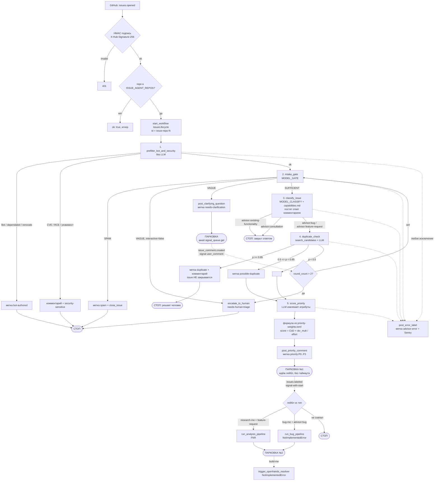
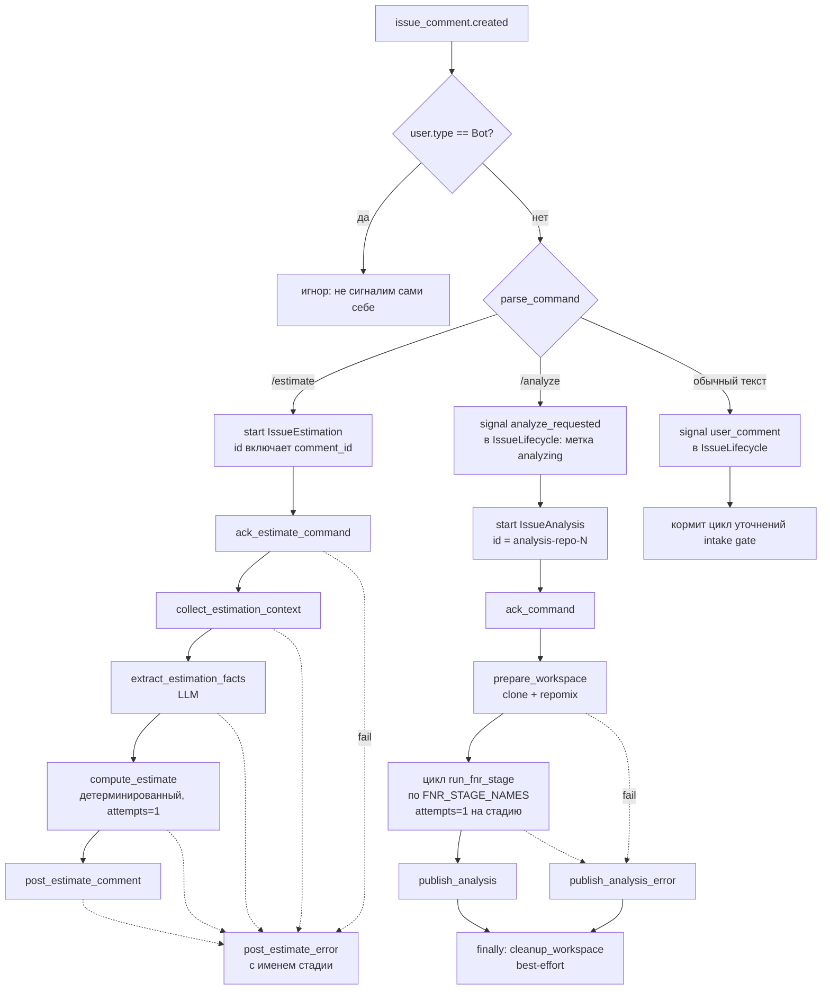

# Issue Agent Service — self-hosted, docker-compose, GLM

Обработка GitHub Issue как долгоживущие Temporal-workflow вместо набора GitHub
Actions. Два независимых сценария: **триаж каждого Issue** (Layer A) и
**консолидация бэклога в зоны поставки** (consolidation).

---

## Что умеет сейчас

| Возможность | Статус | Точка входа |
|-------------|--------|-------------|
| **Layer A — автономный триаж Issue**: предфильтры → intake-gate (с циклом уточнений) → 4-way классификация + advisor-ответ → duplicate-check (только метка) → приоритет по формуле | ✅ Работает, прогнан вживую по реальному бэклогу (64/67 Issue размечено, 0 ошибочных закрытий) | `make dry-run` / `make backfill-one issue=N` |
| **Consolidation — группировка бэклога в зоны поставки** (taxonomy-first): профиль на Issue → вывод 8–12 зон → классификация Issue в зону → нарезка зоны на инкременты (MVP/MVP+1) → объединяющий Issue на инкремент → **PR** | ✅ Работает, прогнан вживую (8 зон, 19 инкрементов, PR с 20 файлами). ⚠️ см. «Ограничения» | `make consolidate` |
| **`/estimate` — оценка трудоёмкости Issue** по методологии (тип работы → декомпозиция → FP cross-check → PERT → риски/надбавки → sanity bounds → грейды → Story Points), обоснование комментарием | ✅ Работает, прогнано вживую через webhook | комментарий `/estimate` в Issue |
| **`/analyze` — автономный анализ Issue** (Слой C): клон репозитория → repomix → цепочка FNR через `claude -p` (`task → concept → debate → sysreq → validate`) → артефакты в ветку `research/issue-<n>` + итоговый комментарий | ✅ Работает | комментарий `/analyze` в Issue либо лейбл `research-me` |
| **Layer B — webhook-автостарт** на новых Issue (GitHub App) | ⚙️ Код есть (`webhook/`), требует регистрации App + публичного URL | см. «Установка Layer B» |
| **Доставка скиллов po-helper/SA-helper в воркер** (`.claude/skills` + `.claude/commands` → `/root/.claude/`, `claude-code` и `repomix` в образе) | ✅ Решено в `worker/Dockerfile` | — |
| **Установка `deb8flow`** в образ воркера | ❌ Не решено (`worker/Dockerfile:15` — TODO) | — |
| **Тяжёлая стадия по багам** `run_bug_pipeline` (перенос `bug-pipeline.yml`) | ❌ `NotImplementedError` — не реализовано | — |
| **OpenHands resolver** | ❌ `NotImplementedError`, намеренно вне этого compose | — |

Тесты: **214 тестов**, `make test` (после `make setup` — цель зовёт `.venv/bin/pytest`).

---

## Быстрый старт (Layer A — триаж)

Прогнать триаж по всем открытым Issue репозитория, без GitHub App и публичного
webhook:

```bash
make setup     # preflight (docker/uv/gh) + venv + генерация .env (интерактивно)
make up        # поднять worker (Temporal — централизованный, TEMPORAL_ADDRESS в .env)
make dry-run   # прогнать ВСЕ открытые Issue в DRY_RUN — ничего не мутируется
```

Три конфигурации compose (выбирается одна):

| Файл | Что | Temporal | Команда |
|------|-----|----------|---------|
| `docker-compose.yml` (**main**) | только приложение (`webhook`+`worker`) | внешний, `TEMPORAL_ADDRESS`/`TEMPORAL_NAMESPACE` в `.env` | `make up` |
| `docker-compose.local.yml` (**local**) | полный стек, порты 7233/8080 наружу, промпты монтируются | встроенный (`temporal:7233`, namespace `default`) | `make up-local` |
| `docker-compose.full.yml` (**full**) | полный стек, прод-hardened (Traefik, без публичных портов, `POSTGRES_PASSWORD`) | встроенный | `make up-full` / Dokploy |

`make up` (main) не поднимает ни одного лишнего контейнера — Temporal внешний.
В `local`/`full` Temporal встроенный, `.env` для него править не нужно.

`make setup` спросит целевой репозиторий, возьмёт GitHub-токен из авторизованного
`gh`, запросит `ZAI_API_KEY`, запишет `.env` с `DRY_RUN=1`. Смотри `[DRY_RUN]`-строки
в `make logs`, затем:

```bash
make go-live   # выключить DRY_RUN, перезапустить worker, прогнать по-настоящему
```

Точечно: `make backfill-one issue=<N>`. Повторный прогон идемпотентен
(`REJECT_DUPLICATE` по workflow-id); осознанный перепрогон — `scripts/backfill.py --suffix <tag>`.

Требования: Docker, [`uv`](https://astral.sh/uv), [`gh`](https://cli.github.com) (`gh auth login`).

### Что триаж делает с Issue

- Бот/security-подозрение → метка, дальше не идёт.
- Расплывчатый запрос → уточняющий вопрос (интерактивно) либо эскалация (batch).
- Классификация: `advisor:feature-request` / `advisor:bug` / `advisor:consultation` /
  `advisor:existing-functionality` + содержательный ответ комментарием.
- Дубликат: **только метка** `duplicate` / `possible-duplicate` + комментарий.
  **Issue НЕ закрывается автоматически** — решает человек (функциональный дубль ≠
  целевой, см. #111).
- Приоритет: LLM извлекает атрибуты → детерминированная формула из
  `config/priority-weights.toml` → метка `priority:*` + комментарий с разбором.
- Дальше workflow **паркуется** и ждёт лейбл `research-me` / `bug-me`.
  `research-me` запускает ту же аналитику Слоя C, что и команда `/analyze`;
  `bug-me` пока `NotImplementedError` — см. таблицу выше.

---

## Consolidation — бэклог в зоны поставки

```bash
make consolidate   # или: scripts/consolidate.py --repo <owner>/<repo>
```

Группирует открытые Issue по **оси поставки** — «что реализуется и релизится
вместе одной технической итерацией», а не по похожести темы. Пайплайн:

1. `fetch_open_issues` — список Issue **без тел** (тело тянет профиль — держит историю лёгкой).
2. `extract_solution_profile` (fan-out) — на каждый Issue: суть проблемы, механизм, цель, домен, якоря-цитаты.
3. `derive_taxonomy` — один вызов на весь бэклог → **8–12 зон поставки** (имя, граница «что закрывает одна итерация», имплементационная поверхность).
4. `assign_zone` (fan-out, пер-Issue) — классификация в primary-зону (+ secondary для сквозных, `other` если не подходит ни одна).
5. `slice_zone` — крупную зону режет на **инкременты** (MVP/MVP+1/…) по зависимостям и потолку размера (~3–6 Issue). Внутри зоны разводит по разным инкрементам одинаковый функционал с разной целью (#111).
6. `synthesize_unifying_issue` — на инкремент: объединяющий Issue (синтез проблемы + механизм + агрегат требований, каждое подписано `— from #N`).
7. `write_consolidation_pr` — ветка `consolidation/<дата>` + **PR**: `docs/consolidation/overview.md` (карта зон и инкрементов) + файл на каждый объединяющий Issue.

**Consolidation НИКОГДА не трогает Issue** — не комментирует, не метит, не закрывает.
Единственная запись — ветка+PR, и та под `DRY_RUN`. Предлагает — решает человек.

Реальный прогон дал 8 зон (`memory-core`, `jira-connector`, `process-engine`,
`llm-routing`, `router`, `po-helper`, `ui-shell`, `ops-core`) и 19 инкрементов по
3–6 Issue.

---

## Ограничения (важно)

- **Большой бэклог не дорабатывает до PR в самом workflow.** На ~75 Issue история
  превышает ~990 событий, и реплей не укладывается в workflow-task timeout на
  стадии synth. Нужен `continue-as-new` после `derive_taxonomy` (не реализовано).
  Пока обход: снять посчитанные зоны/инкременты из истории Temporal и выполнить
  synth+PR отдельно.
- **Rate-limit z.ai** — главный потолок скорости. Воркер намеренно ограничен:
  `max_concurrent_activities=3` + `ThreadPoolExecutor(3)`. Полный прогон по ~75
  Issue занимает десятки минут.
- **Таксономия не версионируется**: `derive_taxonomy` вызывается с `prior=None`,
  temperature не фиксирована → зоны могут «плыть» между прогонами.
- **LLM-стадии — синхронные `def`** (исполняются в ThreadPoolExecutor). Делать их
  `async def` нельзя, не вынеся блокирующий вызов: LLM-вызов прямо на event-loop
  замораживает воркер. Activity долгого анализа (`prepare_workspace`,
  `run_fnr_stage`, `publish_analysis`, `run_analysis_pipeline`, …) — наоборот
  `async def`: им нужен heartbeat, а каждый блокирующий git/repomix/`claude -p`/REST
  внутри обёрнут в `asyncio.to_thread`, иначе heartbeat не уходит на сервер.

---

## Архитектура

```
GitHub → webhook (FastAPI) → Temporal → worker (activities: GLM / gh / claude -p)
                          (централизованный, TEMPORAL_ADDRESS/TEMPORAL_NAMESPACE)
```

Четыре workflow-типа на одной очереди `issue-lifecycle`
(`worker/worker.py`):

- **`IssueLifecycle`** — один на Issue (id `issue-<repo>-<n>`). Лейблы
  `research-me`/`bug-me` и ответы-уточнения — это Temporal **signals**: workflow
  спит и ждёт сигнал сколько угодно долго.
- **`IssueAnalysis`** — один на команду `/analyze` (id `analysis-<repo>-<n>`).
- **`IssueEstimation`** — один на команду `/estimate` (id включает `comment_id`).
- **`ConsolidationWorkflow`** — один на прогон консолидации, fan-out по бэклогу.

### Путь Issue: от `issues.opened` до парковки



Ключевое: `issues.labeled` доставляется через **signal-with-start**, а не голый
signal — Issue мог быть заведён до установки App, воркфлоу триажа не существует,
и голый signal дал бы 500, после чего GitHub бросил бы доставку.

### Команды в комментариях — отдельные workflow

Триаж завершается после приоритизации (а на спаме и дубликате — раньше), поэтому
`/analyze` и `/estimate` — не сигналы в `IssueLifecycle`, а самостоятельные
воркфлоу со своими id.



## Модель — GLM через z.ai

- Python-стадии (gate/classify/duplicate/priority/консолидация) — Instructor поверх
  OpenAI-совместимого эндпоинта z.ai (`worker/llm.py`). Дешёвая модель `MODEL_GATE`
  (по умолчанию `glm-4.5-air`), сильная `MODEL_CLASSIFY` (по умолчанию `glm-5.2`,
  переопределяется через `.env`).
- `claude -p` для скиллов po-helper/SA-helper — Anthropic-совместимый эндпоинт z.ai
  (`ANTHROPIC_BASE_URL`). Используется стадиями FNR в `/analyze` — по одному
  вызову `claude -p` на стадию.

## Наблюдаемость — Sentry

`shared/sentry_setup.py`, включается переменной `SENTRY_DSN` (пусто — полный
no-op, это же и процедура отката). Плюс `SENTRY_ENVIRONMENT`, `SENTRY_RELEASE`,
`SENTRY_TRACES_SAMPLE_RATE` — см. `.env.example`.

Ловит не падение процесса, а главный класс сбоя этого стека — **пойманный** сбой,
который иначе виден только комментарием в Issue: триаж упал и повесил
`advisor:error`, `/estimate` упал на стадии. События приходят с тегами
service/repo/issue/stage.

Два ограничения, которые нельзя нарушать при правках:
- модуль зовётся только из entrypoint'ов (`worker.py`, `webhook/main.py`) и из
  activity — **никогда** из workflow-кода: сетевой вызов там недетерминирован и
  ломает replay;
- скраббер `_scrub_event` вырезает значения локальных переменных по денилисту имён
  до отправки — через этот код ходят `ZAI_API_KEY`, GitHub-токен и
  `GITHUB_PRIVATE_KEY_B64`.

## Развёртывание как постоянного сервиса

`docs/DEPLOY-DOKPLOY.md` — self-hosted развёртывание на Dokploy: публичный
адрес с TLS для вебхука, туннели с ноутбука не нужны. Продакшн-compose —
`docker-compose.full.yml` (**full**, встроенный Temporal) либо
`docker-compose.yml` (**main**, внешний централизованный Temporal).

Для команды `/estimate` регистрация GitHub App не нужна: хватает вебхука
уровня репозитория и personal access token.

---

## Установка Layer B (webhook + GitHub App, мультирепо)

> Для Layer A и консолидации это НЕ нужно. App и публичный webhook требуются только
> чтобы **новые** Issue, лейблы-решения (`research-me`/`bug-me`/`build-me`) и
> команды `/analyze` и `/estimate` обрабатывались автоматически.

Модель мультирепо — как в `poh-pr-agents`: устанавливаешь App на репозитории,
задаёшь 4 переменные, указываешь **вебхук самого App** (не пер-репо hooks).
Сервис отслеживает репозитории из `ISSUE_AGENT_REPOS` (installation находится
по репозиторию автоматически, `GITHUB_INSTALLATION_ID` не нужен).

1. **Зарегистрировать GitHub App** — `github.com/settings/apps/new` (личный
   App) либо `github.com/organizations/<org>/settings/apps/new` (org-level,
   если App должен ставиться на репозитории конкретной организации).
   - Permissions: **Issues** (read/write), **Pull requests** (read/write),
     **Contents** (read/write).
   - Webhook events: **Issues**, **Issue comments**.
   - Webhook URL — публичный адрес сервиса `webhook` (локально —
     туннель `cloudflared`/`ngrok`).
   - Webhook secret — сгенерировать: `openssl rand -hex 32`. Это же значение
     пойдёт в `GITHUB_WEBHOOK_SECRET`.
2. **Установить App** на нужные репозитории (Install App → выбрать owner →
   выбрать репозитории или "All repositories").
3. **Скачать приватный ключ** App (.pem, кнопка "Generate a private key" в
   настройках App) и закодировать в base64 одной строкой:
   ```bash
   # Linux (GNU coreutils)
   base64 -w0 github-app-private-key.pem
   # macOS (BSD base64 — флага -w нет)
   base64 -i github-app-private-key.pem | tr -d '\n'
   ```
4. **`.env`** — задать 4 переменные:
   ```env
   GITHUB_APP_ID=<App ID из настроек App>
   GITHUB_PRIVATE_KEY_B64=<вывод base64 из шага 3>
   GITHUB_WEBHOOK_SECRET=<секрет из шага 1>
   ISSUE_AGENT_REPOS=owner/repo,owner2/*
   ```
   Форматы `ISSUE_AGENT_REPOS` (comma-separated): `owner/repo` — конкретный
   репозиторий; `owner/*` или голый `owner` — все репозитории owner'а; `*`
   или пусто — любой установленный. Плюс `ZAI_API_KEY`, если ещё не задан.

   > **Важно:** `github_client` предпочитает PAT (`GH_TOKEN`), если он
   > задан, — тогда блок GitHub App игнорируется целиком. Если раньше был
   > настроен Layer A (`GH_TOKEN`/`GITHUB_REPOSITORY`), очисти `GH_TOKEN=`
   > в `.env`, иначе App-путь не заработает.
5. `docker compose up --build` (или Redeploy, если сервис уже развёрнут на
   Dokploy — см. `docs/DEPLOY-DOKPLOY.md`).

> Dev-фолбэк на один репозиторий без App: `GH_TOKEN` (PAT со scope `repo`) +
> вебхук уровня репозитория. См. `docs/DEPLOY-DOKPLOY.md`.

---

## Автономный анализ — команда `/analyze` (Слой C)

Комментарий `/analyze` в Issue (или лейбл `research-me` на Issue с типом
`advisor:feature-request`) запускает воркфлоу `IssueAnalysis`. Что происходит:

1. `ack_command` — 👀 на комментарий с командой; в идущий воркфлоу триажа уходит
   сигнал, который вешает метку `analyzing`.
2. `prepare_workspace` — клон целевого репозитория во временный каталог и упаковка
   его в один файл через `repomix`.
3. Цепочка FNR через `claude -p`, каждая стадия — **отдельная activity** со своим
   таймаутом и своим шагом Event History:
   `task → concept → debate → sysreq → validate`
   (артефакты в `sa_documentation/FNR/FNR_1/`). Стадия не ретраится
   (`maximum_attempts=1`): прогон дорогой и недетерминированный, повтор инициирует
   человек.
4. `publish_analysis` — артефакты пушатся в ветку `research/issue-<n>`, в Issue
   уходит итоговый комментарий со списком файлов.
5. `cleanup_workspace` в `finally` — рабочий каталог сносится на обоих путях.

Падение любой стадии → `publish_analysis_error`: комментарий с названием стадии и
причиной, а не молчаливый обвал. Повторный `/analyze` по тому же Issue упирается в
`WorkflowAlreadyStarted` (id `analysis-<repo>-<n>`) — второго прогона не будет.

Требования: в образе воркера должны быть `claude-code`, `repomix` и `gh` — они
ставятся в `worker/Dockerfile`, скиллы SA-helper копируются в `/root/.claude/`.

---

## Оценка трудоёмкости — команда `/estimate`

Комментарий `/estimate` в любом Issue запускает оценку. Агент ставит 👀 на
комментарий, собирает контекст (описание, обсуждение, артефакты ветки
`research/issue-<n>` или `bug/issue-<n>`, если она есть) и публикует оценку
с обоснованием: декомпозиция по единицам работы, Function Points как
cross-check, PERT, разбивка по грейдам, каждый применённый риск и каждая
надбавка отдельной строкой.

Повторный `/estimate` — новая оценка с учётом контекста, появившегося с
прошлого раза. Прошлые прогоны остаются в Temporal UI.

Методология — `docs/methodology/task-estimation.md`. Все коэффициенты
вынесены в `config/estimation-rules.toml`: меняя их, не трогаешь ни промпт,
ни код расчёта. Модель извлекает только факты, все числа считает Python.

Прогнать оценку **без Layer B** (вебхука и GitHub App): `scripts/estimate.py`
стартует тот же воркфлоу напрямую в Temporal — нужен только поднятый `worker`.

```bash
python scripts/estimate.py --issue 83                        # DRY_RUN, реакция только в лог
python scripts/estimate.py --issue 83 --comment-id 2145678901  # реальный прогон
```

---

## Почему Temporal

Durable execution: воркер упал посреди долгого прогона — Temporal продолжит с
последнего завершённого шага, а не начнёт заново. Тот же механизм даёт «ждать
сигнал сколько угодно»: Issue может неделями висеть с приоритетом в ожидании
`research-me` — это штатное состояние workflow, не хак.

## Документация

- `sa_documentation/FNR/` — постановки задач, концепты, дебаты и системные
  требования (FNR-1 тяжёлые стадии, FNR-3 кластеризация под поставку).
- `docs/consolidation-clustering-study.md` — почему группировка по «механизму»
  вырождается в одиночки и какие практики группировки применимы (с экспериментом).
- `docs/superpowers/specs/` и `docs/superpowers/plans/` — дизайн-спеки и планы
  реализации.
- `docs/ARCHITECTURE.md`, `docs/DECISIONS.md`, `docs/ROADMAP.md`,
  `docs/diagrams/` — архитектура, журнал решений, план, диаграммы.
- `docs/demo-plan.md` — сценарий демонстрации с критериями приёмки.
