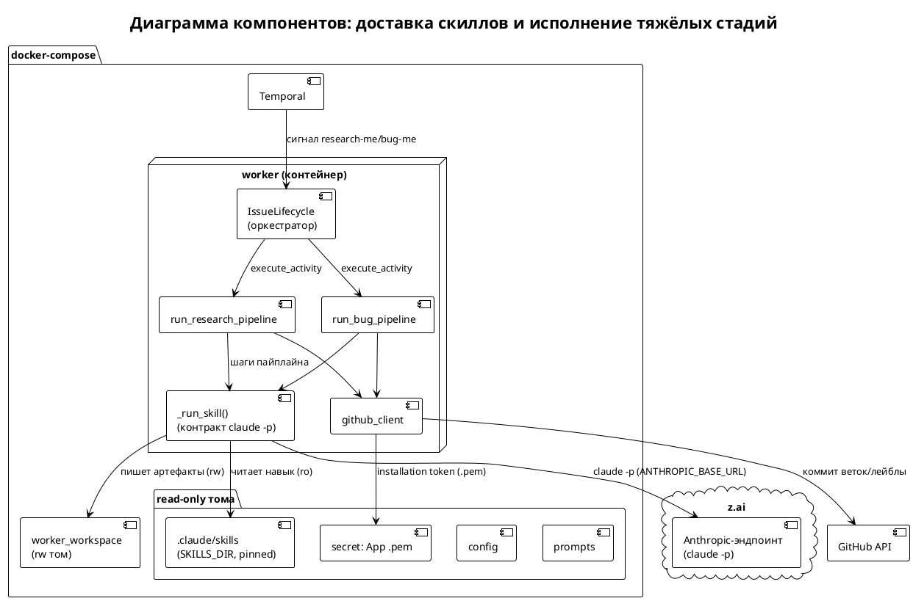
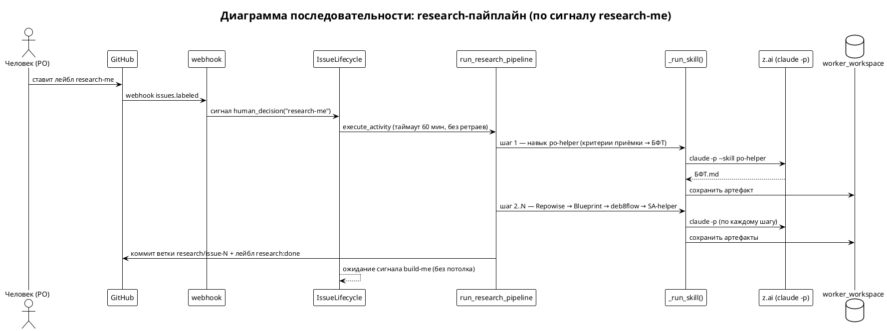
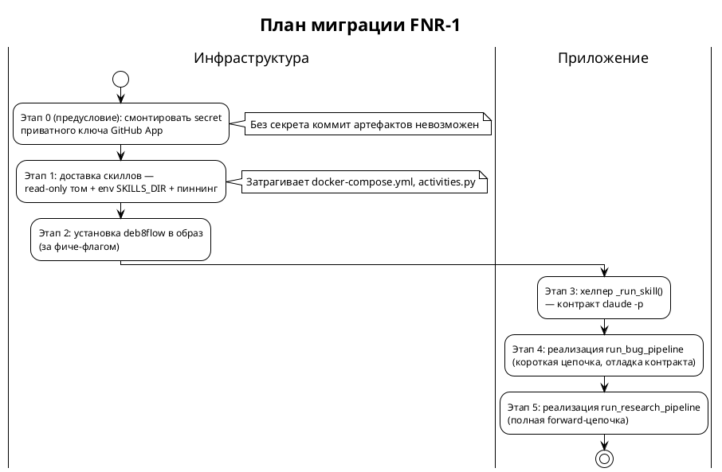

# [СТ] IAS-001 Реализация тяжёлых стадий пайплайна и доставка скиллов в воркер

> **Пространство:** Issue Agent Service
> **Родительская страница:** Обработка Issue — форвард-пайплайны

---

## Содержание

1. Введение
   1.1 Общая информация
   1.2 Термины и определения
   1.3 Ссылки
   1.4 История изменений
2. Общее описание
   2.1 Описание текущего поведения (As-Is)
   2.2 Архитектурное решение
   2.3 Диаграмма компонентов
   2.4 Схема последовательности
3. План миграции
   3.1 Этапы внедрения
   3.2 Таблица этапов
   3.3 Критерии готовности
4. Функциональные требования (Backend / БД / API)
   4.1 Доставка ресурсов в воркер (инфраструктура)
   4.2 Реализация тяжёлых стадий (фоновые процессы / activities)
5. Требования к интерфейсам (Frontend / UI) — **Не применимо**
6. Ревью требований
7. Риски и ограничения
8. Приложения

---

## 1 Введение

### 1.1 Общая информация

| Поле | Значение |
|------|----------|
| Наименование продукта | Issue Agent Service (self-hosted, docker-compose, GLM) |
| Ответственный за продукт | [УТОЧНИТЬ — PO] |
| Ответственный за тех. реализацию продукта | [УТОЧНИТЬ] |
| Ответственный за документ | Системный аналитик (SA-helper) |
| Тип продукта и операционная система | Backend-сервис, Linux/Docker |
| Epic | [УТОЧНИТЬ Jira] — Форвард-пайплайны обработки Issue |
| БФТ | `README.md` (раздел «Что перенесено 1:1, что требует доработки») |
| Аналитика | `sa_documentation/FNR/FNR_1/` (task.md, concept.md) |
| Статус | Ревью |

### 1.2 Термины и определения

| Термин | Определение |
|--------|-------------|
| Activity | Temporal-activity — Python-функция, вызываемая воркером в рамках workflow |
| Скилл (навык) | Claude Code `.claude/skills/<name>` — набор инструкций для `claude -p` |
| `claude -p` | Headless-запуск Claude Code как subprocess с бэкенд-моделью z.ai (`ANTHROPIC_BASE_URL`) |
| deb8flow | Внешний инструмент дебатов по обогащённому БФТ (шаг research-пайплайна) |
| SKILLS_DIR | Путь внутри воркера, где доступны скиллы (`/app/.claude/skills`) |
| Durable execution | Гарантия Temporal продолжить workflow с последнего завершённого шага после рестарта |
| Прочие термины | См. `sa_documentation/naming_conventions.md` |

### 1.3 Ссылки

| Документ | Путь / URL |
|----------|------------|
| Постановка задачи | `sa_documentation/FNR/FNR_1/task.md` |
| Концепты + вердикт дебатов | `sa_documentation/FNR/FNR_1/concept.md` |
| Словарь терминов | `sa_documentation/naming_conventions.md` |
| Диаграмма пайплайнов (часть 2) | `docs/diagrams/issue-workflow-part2-pipelines.mermaid` |
| Спецификация реализации | `specs/implementation-spec.md` |
| Обзор архитектуры | `docs/ARCHITECTURE.md` |

### 1.4 История изменений

| Дата | Автор | Суть изменений |
|------|-------|---------------|
| 12.07.2026 | SA-helper (System Analyst) | Создано описание на основе вердикта дебатов FNR-1 (Концепт B с модификациями) |

---

## 2 Общее описание

### 2.1 Описание текущего поведения (As-Is)

Workflow `IssueLifecycle` проводит issue через intake (предфильтры → gate →
классификация → дубликаты → приоритет) и по сигналу человека
`research-me`/`bug-me` вызывает тяжёлые activity. Эти activity **зарегистрированы
и вызываемы**, но не имеют реализации — каждая бросает `NotImplementedError`.
Окружение воркера при этом содержит CLI `claude` и `gh`, монтирует
`prompts`/`config`/`workspace`, но **не содержит** скиллов po-helper/SA-helper и
не имеет бинаря `deb8flow`.

**Ключевые компоненты:**

| Компонент | Роль | Файл:строка |
|-----------|------|-------------|
| `IssueLifecycle.run` | Оркестратор; вызывает тяжёлые стадии по сигналу | `worker/workflows.py:156-168` |
| `run_research_pipeline` | Заглушка forward-пайплайна | `worker/activities.py:265-272` |
| `run_bug_pipeline` | Заглушка bug-диагностики | `worker/activities.py:276-278` |
| `_load_prompt` / `PROMPTS_DIR` | Существующий паттерн доставки ресурсов через `/app/*` volume | `worker/activities.py:26,32` |
| Регистрация activity | Обе стадии в списке воркера | `worker/worker.py:27-28` |
| Образ воркера | claude-code есть; скиллов/deb8flow нет | `worker/Dockerfile:12,15` |
| Монтирование воркера | Только `prompts`/`config`/`workspace` | `docker-compose.yml:63-68` |

**Ограничения текущего решения:**

1. Тяжёлые стадии не исполняются — падение в рантайме — доказательство: `worker/activities.py:272,278`.
2. Скиллы физически недоступны процессу `claude -p` — доказательство: в `docker-compose.yml:64-68` нет тома со скиллами.
3. `deb8flow` не установлен — доказательство: `worker/Dockerfile:15` (только TODO-комментарий).
4. Секрет приватного ключа GitHub App не смонтирован — доказательство: в `docker-compose.yml:56-68` нет secret/volume с `.pem`; путь ожидается по `.env.example:6` (`GITHUB_PRIVATE_KEY_PATH`).

### 2.2 Архитектурное решение

Принят **Концепт B (скиллы как read-only volume) с модификациями** — см. вердикт
в `concept.md`. Ключевые решения:

1. Скиллы доставляются read-only томом из `.claude/skills` репозитория (переиспользование паттерна `prompts`/`config`, `docker-compose.yml:64-65`).
2. Версия скиллов пиннится (git-submodule / фиксированный commit) → детерминизм durable-прогонов.
3. Путь абстрагируется через env `SKILLS_DIR` (в ряд к `PROMPTS_DIR`/`WORKSPACE_DIR`, `worker/activities.py:26-28`).
4. `deb8flow` устанавливается в образ (`worker/Dockerfile`) за фиче-флагом.
5. Контракт `claude -p` инкапсулируется в единый хелпер `_run_skill(...)`.

**Отклонённые альтернативы (Explicit Rejection):** Концепт A (запечь в образ) —
медленная петля разработки при неизменяемых скиллах; Концепт C (клонирование в
entrypoint) — недетерминизм и сетевая зависимость на старте; Концепт D
(marketplace-плагин) — неподтверждённая совместимость po-helper/SA-helper;
Концепт E («не трогай») — противоречит цели сервиса. Подробности — `concept.md`.

### 2.3 Диаграмма компонентов

### 2.4 Схема последовательности

---

## 3 План миграции

### 3.1 Этапы внедрения

### 3.2 Таблица этапов

| Этап | Действие | Затрагиваемые объекты | Откат |
|------|----------|----------------------|-------|
| 0 | Смонтировать secret `.pem` GitHub App | `docker-compose.yml` (secrets/volumes), `.env` | Удалить secret-том |
| 1 | Read-only том скиллов + `SKILLS_DIR` + пиннинг версии | `docker-compose.yml:63-68`, `worker/activities.py:26-28` | Убрать строку volume и константу |
| 2 | Установка `deb8flow` за фиче-флагом | `worker/Dockerfile:15`, `.env.example:29` | Убрать шаг установки; флаг = off |
| 3 | Хелпер `_run_skill(skill, prompt, workdir)` | `worker/activities.py` (новая функция) | Функция не вызывается — no-op |
| 4 | Реализация `run_bug_pipeline` | `worker/activities.py:276-278` | Вернуть `NotImplementedError` |
| 5 | Реализация `run_research_pipeline` | `worker/activities.py:265-272` | Вернуть `NotImplementedError` |

### 3.3 Критерии готовности

**Этап 0:** контейнер воркера видит файл по пути `GITHUB_PRIVATE_KEY_PATH`; `github_client._app_jwt()` (`worker/github_client.py:24-29`) успешно читает ключ.
**Этап 1:** внутри воркера `ls $SKILLS_DIR` показывает каталоги скиллов; путь совпадает с константой в коде.
**Этап 2:** `deb8flow --version` (или эквивалент) отрабатывает в контейнере при включённом флаге.
**Этап 3:** unit-тест хелпера с мок-subprocess проходит; таймаут и захват stdout/stderr работают.
**Этап 4:** issue типа BUG по `bug-me` доходит до лейбла `bug:diagnosed`, артефакт в workspace.
**Этап 5:** issue типа FEATURE по `research-me` проходит все шаги, ветка `research/issue-N` создана.

---

## 4 Функциональные требования (Backend / БД / API)

> Все задачи — серверные (фоновые процессы, инфраструктура воркера, интеграции).
> UI-изменений нет → раздел 5 «Не применимо».

### 4.1 Доставка ресурсов в воркер (инфраструктура)

#### 4.1.1 Смонтировать скиллы как read-only volume и ввести `SKILLS_DIR`

| Поле | Значение |
|------|----------|
| Ответственный за тех. реализацию | [УТОЧНИТЬ] |
| Задача на разработку | [УТОЧНИТЬ Jira] — feat(worker): mount skills volume + SKILLS_DIR [BACKLOG] |

##### 4.1.1.1 Общее описание функционала

1. Добавить воркеру read-only том со скиллами.
   a. В `docker-compose.yml` в `volumes` сервиса `worker` — строка `- ./.claude/skills:/app/.claude/skills:ro`.
   b. Симметрично уже смонтированным `prompts`/`config` (`docker-compose.yml:64-65`).
2. Ввести константу пути в коде.
   a. В `worker/activities.py` рядом с `PROMPTS_DIR`/`WORKSPACE_DIR` добавить `SKILLS_DIR = Path(os.environ.get("SKILLS_DIR", "/app/.claude/skills"))`.
   b. Значение по умолчанию соответствует точке монтирования из п.1.

##### 4.1.1.2 Обоснование

Переиспользование доказанного volume-паттерна сервиса (`docker-compose.yml:64-65`)
и удовлетворение ограничения «скиллы сами не меняются» (`task.md` §7): скиллы —
данные, а не часть образа. env-абстракция пути повторяет уже принятый в коде
подход (`worker/activities.py:26-28`).

##### 4.1.1.3 Затрагиваемые компоненты

| Компонент | Тип изменения | Файл:строка |
|-----------|--------------|-------------|
| `docker-compose.yml` (worker.volumes) | ADD | `docker-compose.yml:63-68` |
| `worker/activities.py` (константы путей) | ADD | `worker/activities.py:26-28` |

##### 4.1.1.4 Критерии приёмки

1. Внутри контейнера воркера `ls /app/.claude/skills` возвращает каталоги скиллов (в т.ч. `problem-analyst`, `solution-designer`).
2. Том смонтирован read-only: запись в `/app/.claude/skills` внутри контейнера завершается ошибкой.
3. `SKILLS_DIR` в коде равен точке монтирования; переопределяется через env без правки кода.

##### 4.1.1.5 Зависимости

нет

#### 4.1.2 Пиннинг версии скиллов

| Поле | Значение |
|------|----------|
| Ответственный за тех. реализацию | [УТОЧНИТЬ] |
| Задача на разработку | [УТОЧНИТЬ Jira] — chore(worker): pin skills version [BACKLOG] |

##### 4.1.2.1 Общее описание функционала

1. Зафиксировать источник и версию скиллов.
   a. Оформить `.claude/skills` как git-submodule на фиксированный commit ИЛИ зафиксировать commit-хеш скиллов в CI при сборке деплой-артефакта.
   b. Обновление версии — явный шаг (bump submodule / CI-переменной), не автоматический pull.

##### 4.1.2.2 Обоснование

Снимает единственное обоснованное возражение дебатов — недетерминизм durable-прогона:
Temporal может продолжить 60-минутный workflow после рестарта (`worker/workflows.py:160`);
том со скиллами не должен «уехать» на другую версию между рестартами.

##### 4.1.2.3 Затрагиваемые компоненты

| Компонент | Тип изменения | Файл:строка |
|-----------|--------------|-------------|
| `.gitmodules` (или CI-конфиг) | ADD | новый файл |
| `.claude/skills` | ALTER (submodule pin) | `.claude/skills` |

##### 4.1.2.4 Критерии приёмки

1. Версия скиллов детерминирована: два деплоя из одного commit сервиса дают идентичное содержимое `SKILLS_DIR` (сверка по хешу дерева).
2. Обновление скиллов требует явного изменения в репозитории (виден в diff).

##### 4.1.2.5 Зависимости

после задачи 4.1.1

#### 4.1.3 Установить `deb8flow` в образ воркера за фиче-флагом

| Поле | Значение |
|------|----------|
| Ответственный за тех. реализацию | [УТОЧНИТЬ] |
| Задача на разработку | [УТОЧНИТЬ Jira] — feat(worker): install deb8flow behind flag [BACKLOG] |

##### 4.1.3.1 Общее описание функционала

1. Добавить установку `deb8flow` в `worker/Dockerfile` (заменить TODO на `worker/Dockerfile:15`).
2. Ввести фиче-флаг `ENABLE_DEB8FLOW` (env), по умолчанию `false`.
   a. При `false` шаг дебатов в research-пайплайне пропускается (см. 4.2.2).
   b. `DEB8FLOW_BIN` берётся из окружения (`.env.example:29`).

##### 4.1.3.2 Обоснование

Точный способ установки и синтаксис `deb8flow` — высокий риск (`task.md` цепочка,
шаг 6). Фиче-флаг изолирует этот риск: остальной пайплайн работоспособен даже
пока шаг дебатов отключён.

##### 4.1.3.3 Затрагиваемые компоненты

| Компонент | Тип изменения | Файл:строка |
|-----------|--------------|-------------|
| `worker/Dockerfile` (установка deb8flow) | MODIFY | `worker/Dockerfile:15` |
| `.env.example` (`ENABLE_DEB8FLOW`) | ADD | `.env.example:29` |

##### 4.1.3.4 Критерии приёмки

1. При `ENABLE_DEB8FLOW=true` бинарь `deb8flow` доступен в `PATH` контейнера.
2. При `ENABLE_DEB8FLOW=false` сборка образа и старт воркера не требуют `deb8flow`.

##### 4.1.3.5 Зависимости

нет

#### 4.1.4 Предусловие: смонтировать secret приватного ключа GitHub App

| Поле | Значение |
|------|----------|
| Ответственный за тех. реализацию | [УТОЧНИТЬ] |
| Задача на разработку | [УТОЧНИТЬ Jira] — chore(compose): mount GitHub App private key secret [BACKLOG] |

##### 4.1.4.1 Общее описание функционала

1. Смонтировать `.pem` приватного ключа App в контейнер по пути `GITHUB_PRIVATE_KEY_PATH` (`.env.example:6`).
   a. Через docker secret / volume под модель хранения секретов среды.

##### 4.1.4.2 Обоснование

Пайплайны коммитят артефакты и ставят лейблы через `github_client`, который
аутентифицируется как GitHub App и читает `.pem` (`worker/github_client.py:24-29`).
Без ключа тяжёлые стадии упадут на сетевом шаге так же, как сейчас падают на
`NotImplementedError` (Адвокат Дьявола, раунд 2).

##### 4.1.4.3 Затрагиваемые компоненты

| Компонент | Тип изменения | Файл:строка |
|-----------|--------------|-------------|
| `docker-compose.yml` (worker secrets/volumes) | ADD | `docker-compose.yml:56-68` |

##### 4.1.4.4 Критерии приёмки

1. `github_client._app_jwt()` успешно читает ключ и генерирует JWT (нет `FileNotFoundError`).
2. Ключ не попадает в образ и не логируется.

##### 4.1.4.5 Зависимости

нет (предусловие для 4.2.2 и 4.2.3)

### 4.2 Реализация тяжёлых стадий (фоновые процессы / activities)

#### 4.2.1 Хелпер `_run_skill()` — единый контракт `claude -p`

| Поле | Значение |
|------|----------|
| Ответственный за тех. реализацию | [УТОЧНИТЬ] |
| Задача на разработку | [УТОЧНИТЬ Jira] — feat(worker): _run_skill claude -p helper [BACKLOG] |

##### 4.2.1.1 Описание

Инкапсулировать вызов `claude -p` в одну функцию `_run_skill(skill: str,
prompt: str, workdir: Path) -> str`, переиспользуемую обоими пайплайнами. Функция
запускает `subprocess.run(["claude", "-p", ...])` с рабочей директорией `workdir`,
`SKILLS_DIR` в контексте, `ANTHROPIC_BASE_URL`/`ANTHROPIC_AUTH_TOKEN` из окружения
(`.env.example:20-21`), захватывает stdout и код возврата, при ненулевом коде —
поднимает исключение (Temporal ретраит на уровне activity по политике workflow).

##### 4.2.1.2 Обоснование

Контракт `claude -p` (cwd, доступ к `.claude/skills`, формат вывода) — главный
неизвестный (Адвокат, раунд 1). Единая точка отладки дешевле, чем дублирование в
двух пайплайнах; ортогональна способу доставки скиллов.

##### 4.2.1.3 Маршрутизация (внутренние вызовы)

| Сущность | Метод вызова | Отправляемые события |
|----------|-------------|---------------------|
| Навык (skill) | `_run_skill(skill, prompt, workdir)` | subprocess `claude -p`; результат — текст артефакта |

##### 4.2.1.4 Нефункциональные требования

1. Таймаут одного вызова `_run_skill` конфигурируем (env `SKILL_STEP_TIMEOUT_SEC`, по умолчанию 900) и строго меньше `start_to_close_timeout` соответствующей activity (60 мин research / 30 мин bug, `worker/workflows.py:160,167`).
2. stdout/stderr subprocess полностью захватываются и включаются в текст исключения при ненулевом коде возврата.
3. Функция не хранит секретов в аргументах командной строки (только через env), чтобы не попасть в списки процессов/логи.

##### 4.2.1.5 Затрагиваемые компоненты

| Компонент | Тип изменения | Файл:строка |
|-----------|--------------|-------------|
| `worker/activities.py` (новая функция `_run_skill`) | ADD | `worker/activities.py:26-33` (рядом с `_load_prompt`) |

##### 4.2.1.6 Критерии приёмки

1. Unit-тест с мок-subprocess: успех возвращает stdout; ненулевой код → исключение с текстом stderr.
2. Вызов с несуществующим скиллом даёт понятную ошибку (не «тихий» пустой результат).
3. Превышение `SKILL_STEP_TIMEOUT_SEC` прерывает subprocess и поднимает `TimeoutError`.

##### 4.2.1.7 Зависимости

после задач 4.1.1, 4.1.2

#### 4.2.2 Реализовать `run_bug_pipeline`

| Поле | Значение |
|------|----------|
| Ответственный за тех. реализацию | [УТОЧНИТЬ] |
| Задача на разработку | [УТОЧНИТЬ Jira] — feat(worker): implement run_bug_pipeline [BACKLOG] |

##### 4.2.2.1 Описание

Заменить `NotImplementedError` (`worker/activities.py:276-278`) реализацией:
подготовить рабочую поддиректорию issue в `WORKSPACE_DIR`, вызвать навык SA-helper
(bug-диагностика) через `_run_skill`, сохранить артефакт диагноза, поставить issue
лейбл `bug:diagnosed` через `github_client.add_label`. Короткая цепочка выбрана
первой — на ней отлаживается контракт `_run_skill` до сложного research.

##### 4.2.2.2 Обоснование

`run_bug_pipeline` короче research (один основной навык, без Repowise/deb8flow),
поэтому это дешёвый способ верифицировать доставку скиллов и контракт `claude -p`
end-to-end (План миграции, этап 4) до реализации более дорогой стадии.

##### 4.2.2.3 Маршрутизация (шаги пайплайна)

| Сущность | Метод вызова | Отправляемые события |
|----------|-------------|---------------------|
| Диагностика бага | `_run_skill("<sa-helper-bug-skill>", prompt, workdir)` | артефакт диагноза в workspace |
| Метка результата | `github_client.add_label(repo, n, "bug:diagnosed")` | лейбл на issue |

##### 4.2.2.4 Нефункциональные требования

1. Рабочая директория изолирована по issue: `WORKSPACE_DIR / f"issue-{issue.issue_number}"` — исключает конкуренцию записи разных issue (`docker-compose.yml:68` — общий том).
2. Стадия не ретраится вслепую: политика workflow `maximum_attempts=1` сохраняется (`worker/workflows.py:167`).
3. Итоговый лейбл ставится только при успешном сохранении артефакта (атомарность «диагноз есть → лейбл есть»).

##### 4.2.2.5 Затрагиваемые компоненты

| Компонент | Тип изменения | Файл:строка |
|-----------|--------------|-------------|
| `run_bug_pipeline` | MODIFY | `worker/activities.py:276-278` |
| `github_client.add_label` | (использование) | `worker/github_client.py:61` |

##### 4.2.2.6 Критерии приёмки

1. Issue типа BUG по сигналу `bug-me` завершается лейблом `bug:diagnosed` и артефактом в `WORKSPACE_DIR/issue-<N>/`.
2. Падение subprocess внутри стадии не оставляет issue с лейблом `bug:diagnosed` (лейбл — после успеха).
3. При рестарте воркера в середине стадии Temporal перезапускает activity целиком (idempotent по рабочей директории issue).

##### 4.2.2.7 Зависимости

после задач 4.1.4 (secret), 4.2.1 (`_run_skill`)

#### 4.2.3 Реализовать `run_research_pipeline`

| Поле | Значение |
|------|----------|
| Ответственный за тех. реализацию | [УТОЧНИТЬ] |
| Задача на разработку | [УТОЧНИТЬ Jira] — feat(worker): implement run_research_pipeline [BACKLOG] |

##### 4.2.3.1 Описание

Заменить `NotImplementedError` (`worker/activities.py:265-272`) полной forward-цепочкой
как последовательностью `_run_skill`-шагов: po-helper (критерии приёмки → БФТ) →
Repowise-контекст → Blueprint → deb8flow (за флагом `ENABLE_DEB8FLOW`) → SA-helper
(техспека). Каждый шаг сохраняет артефакт в рабочую директорию issue; по завершении —
коммит ветки `research/issue-N` и лейбл `research:done`.

##### 4.2.3.2 Обоснование

Реализуется после `run_bug_pipeline`, когда контракт `_run_skill` уже отлажен на
короткой цепочке. Шаг `deb8flow` изолирован фиче-флагом (4.1.3) из-за высокого
риска его синтаксиса.

##### 4.2.3.3 Маршрутизация (шаги пайплайна)

| Сущность | Метод вызова | Отправляемые события |
|----------|-------------|---------------------|
| БФТ (критерии приёмки) | `_run_skill("po-helper/...", prompt, workdir)` | `bft.md` в workspace |
| Компонентная карта | `_run_skill("<blueprint-skill>", prompt, workdir)` | `blueprint.md` |
| Дебаты (опц.) | `deb8flow` subprocess, если `ENABLE_DEB8FLOW=true` | обогащённый БФТ |
| Техспека | `_run_skill("<sa-helper-sysreq>", prompt, workdir)` | `system_requirements.md` |
| Публикация | `github_client` commit ветки + `add_label(..., "research:done")` | ветка + лейбл |

##### 4.2.3.4 Нефункциональные требования

1. Полный прогон укладывается в `start_to_close_timeout=60 мин` (`worker/workflows.py:160`); при превышении — падение стадии без ретрая (`maximum_attempts=1`).
2. Артефакты каждого шага сохраняются до перехода к следующему — durable execution продолжает с последнего сохранённого шага после рестарта.
3. При `ENABLE_DEB8FLOW=false` шаг дебатов пропускается, пайплайн остаётся валиден (деградация функциональности, не отказ).
4. Ветка `research/issue-N` именуется детерминированно — совпадает с проверкой переиспользования в `duplicate_check` (`worker/activities.py:211-216`).

##### 4.2.3.5 Затрагиваемые компоненты

| Компонент | Тип изменения | Файл:строка |
|-----------|--------------|-------------|
| `run_research_pipeline` | MODIFY | `worker/activities.py:265-272` |
| `github_client` (commit/branch) | (использование/расширение) | `worker/github_client.py:78` |

##### 4.2.3.6 Критерии приёмки

1. Issue типа FEATURE по `research-me` проходит все включённые шаги и завершается лейблом `research:done` + ветка `research/issue-N` создана.
2. Артефакты (БФТ, Blueprint, техспека) присутствуют в `WORKSPACE_DIR/issue-<N>/`.
3. Имя ветки совпадает с шаблоном, который ищет `duplicate_check` (`worker/activities.py:213`).
4. При отключённом `deb8flow` пайплайн завершается успешно без шага дебатов.

##### 4.2.3.7 Зависимости

после задач 4.1.3 (deb8flow-флаг), 4.1.4 (secret), 4.2.1 (`_run_skill`), 4.2.2 (отладка контракта)

---

## 5 Требования к интерфейсам (Frontend / UI)

**Не применимо.** Документ не содержит UI-изменений: все задачи затрагивают
серверный код, окружение воркера, фоновые процессы и межсервисные интеграции.
Взаимодействие с человеком идёт через GitHub-лейблы/комментарии
(`worker/github_client.py`) и Temporal UI (`docker-compose.yml:31-39`), которые
не разрабатываются в рамках FNR-1.

---

## 6 Ревью требований

| Роль | Исполнитель | Статус |
|------|------------|--------|
| Аналитик (кросс-ревью) | [УТОЧНИТЬ] | Ожидает |
| Разработка (Backend) | [УТОЧНИТЬ] | Ожидает |
| Разработка (Frontend) | — | Не применимо |
| Тестирование | [УТОЧНИТЬ] | Ожидает |

---

## 7 Риски и ограничения

### 7.1 Риски

| ID | Риск | Вероятность | Влияние | Митигация |
|----|------|------------|---------|-----------|
| R-01 | Точный синтаксис/установка `deb8flow` неизвестны | Высокая | Среднее | Фиче-флаг `ENABLE_DEB8FLOW` (4.1.3); шаг изолирован, пайплайн работает без него |
| R-02 | Контракт `claude -p` (cwd, доступ к `SKILLS_DIR`, формат вывода) отличается от ожидаемого | Средняя | Высокое | Единый хелпер `_run_skill` (4.2.1) + отладка на короткой bug-цепочке до research |
| R-03 | Недетерминизм durable-прогона из-за смены версии скиллов между рестартами | Средняя | Высокое | Пиннинг версии скиллов (4.1.2), том read-only |
| R-04 | Отсутствие secret GitHub App → падение коммита артефактов | Высокая | Высокое | Предусловие 4.1.4 (смонтировать `.pem`) до реализации стадий |
| R-05 | Конкурентная запись артефактов разных issue в общий том `worker_workspace` | Средняя | Среднее | Изоляция рабочей поддиректории по номеру issue (NFR 4.2.2.4 п.1) |
| R-06 | Bind-mount тома не переносится в прод-оркестратор (k8s) | Средняя | Среднее | Абстракция пути через `SKILLS_DIR`; в проде — configMap/PVC на тот же путь |
| R-07 | Долгий прогон не укладывается в таймаут 60 мин | Низкая | Среднее | NFR-таймауты шагов < таймаута activity; при превышении — контролируемое падение без ретрая |

### 7.2 Ограничения

1. Решение НЕ реализует `trigger_openhands_resolver` (`worker/activities.py:282`) — OpenHands остаётся отдельным сервисом со своим sandboxing (`task.md` §7).
2. Решение НЕ меняет сами скиллы po-helper/SA-helper — только доставляет их (ограничение «скиллы не меняются»).
3. Backward compatibility: intake-часть (`worker/activities.py:74-260`), формула приоритизации (`config/priority-weights.toml`) и контракт вебхука/сигналов (`webhook/main.py`) НЕ должны быть затронуты.
4. Допущение: скиллы, установленные в `.claude/skills`, совместимы с headless-запуском `claude -p` через z.ai Anthropic-эндпоинт (`.env.example:20-21`). Если нет — `[NEEDS_INVESTIGATION]` по фактическому синтаксису вызова.

---

## 8 Приложения

### 8.1 Якоря истины (Truth Anchors)

#### 8.1.1 Описание

Ключевые код-доказательства, на которых построен документ, — для быстрой сверки
ревьюером.

#### 8.1.2 Общая информация

| Поле | Значение |
|------|----------|
| Название проекта | Issue Agent Service |
| Ответственный за документ | SA-helper (System Analyst) |
| Задача в Jira | [УТОЧНИТЬ] |

#### 8.1.3 Таблица якорей

| Утверждение | Якорь (файл:строка) | Обоснование | Контекст |
|-------------|---------------------|-------------|----------|
| Тяжёлые стадии — заглушки | `worker/activities.py:272,278` | `raise NotImplementedError` | Любой прогон FEATURE/BUG до сигнала |
| Оркестратор уже вызывает стадии | `worker/workflows.py:156-168` | `execute_activity(run_research_pipeline/run_bug_pipeline)` | По сигналу research-me/bug-me |
| Скиллов нет в томах воркера | `docker-compose.yml:63-68` | Смонтированы только prompts/config/workspace | Развёртывание docker-compose |
| deb8flow не установлен | `worker/Dockerfile:15` | TODO-комментарий вместо установки | Сборка образа |
| Паттерн volume для ресурсов | `docker-compose.yml:64-65`, `worker/activities.py:26` | prompts монтируются ro, читаются по `PROMPTS_DIR` | Основание Концепта B |
| Аутентификация как App читает .pem | `worker/github_client.py:24-29` | `open(GITHUB_PRIVATE_KEY_PATH)` в `_app_jwt` | Предусловие 4.1.4 |
| Имя ветки для переиспользования | `worker/activities.py:213` | `f"{prefix}/issue-{best.number}"` в duplicate_check | Критерий 4.2.3.6 п.3 |
| Anthropic-эндпоинт для skills | `.env.example:20-21` | `ANTHROPIC_BASE_URL`/`ANTHROPIC_AUTH_TOKEN` | Контракт `_run_skill` |

---

> Системные требования готовы. Следующий шаг: `/validate-doc sa_documentation/FNR/FNR_1/system_requirements.md`
