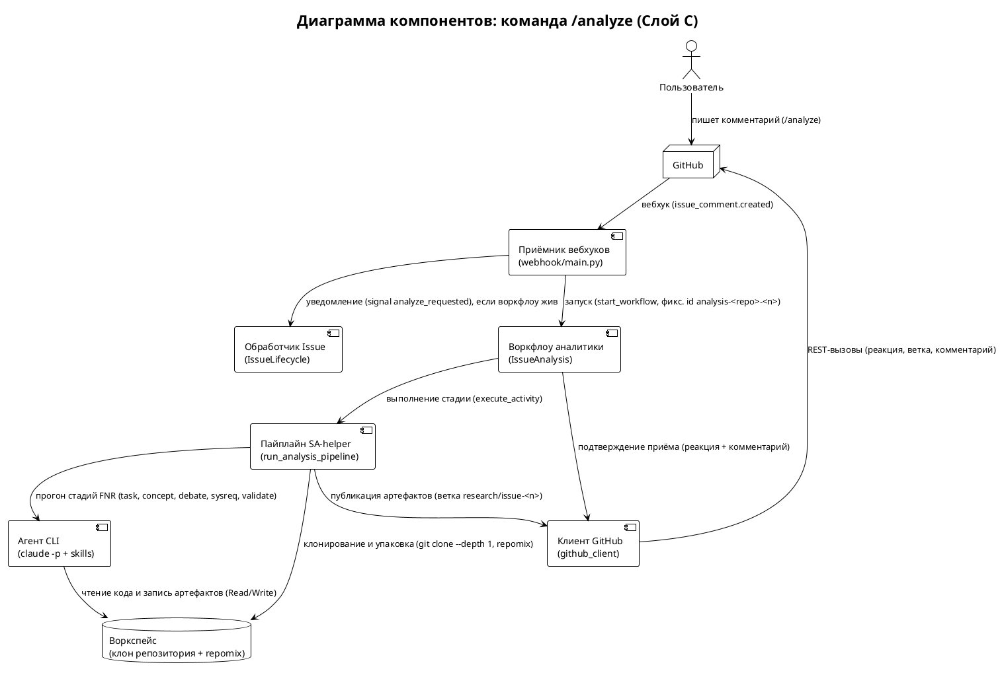
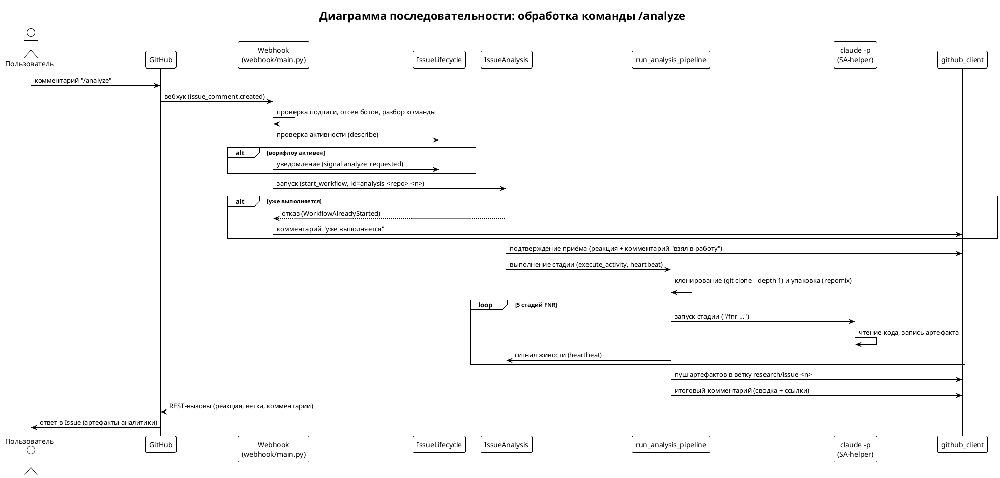
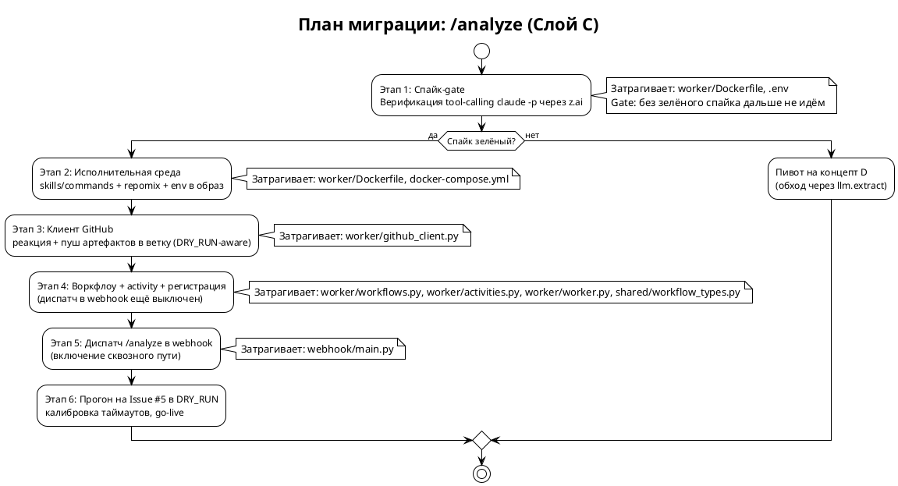

# [СТ] POH-IA-002 Автономная генерация решения по Issue командой `/analyze` (Слой C)

> **Пространство:** Issue Agent Service (poh-issue-agents)
> **Родительская страница:** Слой C — аналитика по запросу (`docs/roadmap-post-layer-a.md`)

---

## Содержание

1. Введение
   1.1 Общая информация
   1.2 Термины и определения
   1.3 Ссылки
   1.4 История изменений
2. Общее описание
   2.1 Описание текущего поведения (As-Is)
   2.2 Архитектурное решение
   2.3 Диаграмма компонентов
   2.4 Схема последовательности
3. План миграции
   3.1 Этапы внедрения
   3.2 Таблица этапов
   3.3 Критерии готовности
4. Функциональные требования (Backend / БД / API)
   4.1 Диспетчер команд (Webhook)
   4.2 Оркестрация аналитики (Temporal)
   4.3 Пайплайн SA-helper (Activity)
   4.4 Доставка артефактов (GitHub-клиент)
   4.5 Исполнительная среда (образ воркера)
5. Требования к интерфейсам (Frontend / UI) — **Не применимо**
6. Ревью требований
7. Риски и ограничения
   7.1 Риски
   7.2 Ограничения
8. Приложения

---

## 1 Введение

### 1.1 Общая информация

| Поле | Значение |
|------|----------|
| Наименование продукта | Issue Agent Service (poh-issue-agents), self-hosted, docker-compose, GLM/z.ai |
| Ответственный за продукт | Команда poh-issue-agents |
| Ответственный за тех. реализацию продукта | Команда poh-issue-agents |
| Ответственный за документ | SA-helper (автоген, FNR-2) |
| Тип продукта и операционная система | Backend-сервис, Linux-контейнеры (Temporal + worker + webhook) |
| Epic | `docs/roadmap-post-layer-a.md` — Слой C: аналитика по запросу |
| БФТ (концепт + вердикт дебатов) | `sa_documentation/FNR/FNR_2/concept.md` |
| Аналитика (постановка) | `sa_documentation/FNR/FNR_2/task.md` |
| Статус | Ревью |

### 1.2 Термины и определения

| Термин | Определение |
|--------|-------------|
| Команда `/analyze` | Триггер в комментарии Issue, запускающий автономную аналитику через SA-helper |
| Обработчик Issue | Temporal-workflow `IssueLifecycle` (`worker/workflows.py:31`), один на Issue, id = `issue-<repo>-<n>` |
| Воркфлоу аналитики | Новый Temporal-workflow `IssueAnalysis`, id = `analysis-<repo>-<n>`, исполнитель тяжёлого прогона |
| Пайплайн SA-helper (FNR) | Последовательность `claude -p`-стадий: `task → concept → debate → system_requirements → validate` |
| Стадия FNR | Один вызов `claude -p "/fnr-…"`, читающий/пишущий артефакты в общий воркспейс |
| Артефакты | Файлы `sa_documentation/FNR/FNR_1/*.md`, порождённые пайплайном в клоне целевого репозитория |
| Backend skills | Anthropic-совместимый эндпоинт z.ai для `claude -p` (`ANTHROPIC_BASE_URL`, `.env.example:20`) |
| DRY_RUN | Флаг, при котором мутации GitHub логируются, но не выполняются (`worker/github_client.py:19`) |
| Heartbeat | Периодический сигнал живости долгой activity для Temporal |
| Спайк-gate | Обязательная предварительная проверка осуществимости (tool-calling `claude -p`) до основной реализации |

### 1.3 Ссылки

| Документ | Путь / URL |
|----------|------------|
| Постановка задачи (As-Is, разрыв) | `sa_documentation/FNR/FNR_2/task.md` |
| Концепты + вердикт дебатов (To-Be) | `sa_documentation/FNR/FNR_2/concept.md` |
| Роадмап Слоя C (блокеры) | `docs/roadmap-post-layer-a.md` |
| Фазовый план и блокеры тяжёлых стадий | `docs/ROADMAP.md` |
| Словарь терминов | `sa_documentation/naming_conventions.md` |
| Дизайн Слоя A (триаж) | `docs/superpowers/specs/2026-07-12-issue-agent-layer-a-triage-design.md` |
| Целевой Issue-пример | https://github.com/po-helper-org/poh-pr-agents/issues/5 |

### 1.4 История изменений

| Дата | Автор | Суть изменений |
|------|-------|---------------|
| 22.07.2026 | SA-helper (FNR-2) | Создан документ системных требований на основе concept.md с вердиктом дебатов (концепт B с модификациями) |

---

## 2 Общее описание

### 2.1 Описание текущего поведения (As-Is)

Сервис принимает вебхуки GitHub и транслирует их в старт/сигналы Temporal-воркфлоу; вся бизнес-логика — в activities воркера. Приём комментариев — чистый транспорт: `webhook` проверяет HMAC-подпись, отсекает комментарии ботов и **безусловно** отправляет сигнал `user_comment` в Обработчик Issue, не разбирая тело на команды. Обработчик Issue кладёт текст в очередь сигналов с префиксом `__comment__:` и потребляет его **только** в цикле уточнений приёмного шлюза (`while gate.status == "VAGUE"`), либо в точках ожидания решения человека, где строка, не совпавшая с лейблом, ведёт к завершению воркфлоу. Тяжёлая стадия аналитики не реализована, а среда исполнения `claude -p` (skills/commands/repomix) в образ воркера не уложена.

**Ключевые компоненты:**

| Компонент | Роль | Файл:строка |
|-----------|------|-------------|
| Webhook | Приём событий GitHub, трансляция в Temporal; без разбора команд | `webhook/main.py:48-109` |
| Ветка `issue_comment` | Единственная обработка комментария — сигнал `user_comment` | `webhook/main.py:89-107` |
| Обработчик Issue (`IssueLifecycle`) | Один воркфлоу на Issue; сигналы `human_decision`/`user_comment` | `worker/workflows.py:31-53` |
| Цикл уточнений | Единственный потребитель `user_comment` вне точек решения | `worker/workflows.py:89-116` |
| Точка решения человека | `_wait_for_signal()`; несовпавший сигнал → `else: return` | `worker/workflows.py:174`, `worker/workflows.py:190-191` |
| Research-пайплайн | Заглушка `NotImplementedError` — целевое место тяжёлой аналитики | `worker/activities.py:280-287` |
| Bug-пайплайн | Заглушка `NotImplementedError` | `worker/activities.py:291-293` |
| Клиент GitHub | `post_comment`/`add_label`/`close_issue`/`branch_exists`; реакций и пуша в ветку нет | `worker/github_client.py:61-109` |
| Регистрация воркера | Регистрирует только `IssueLifecycle` + текущие activities | `worker/worker.py:23-55` |
| Образ воркера | Несёт `claude-code`+`gh`+`node`, но копирует только `worker/`+`shared/` | `worker/Dockerfile:3-22` |
| Переиспользование веток | `duplicate_check` ищет `research/issue-<n>` для reuse-note | `worker/activities.py:199-204` |

**Ограничения текущего решения:**

1. Тело комментария не инспектируется как команда — единственное действие на ветке `issue_comment` это `handle.signal("user_comment", …)` — доказательство: `webhook/main.py:103`.
2. `user_comment` имеет узкую семантику: читается лишь в цикле `while gate.status == "VAGUE"` — доказательство: `worker/workflows.py:107-116`.
3. Вне цикла произвольная строка-комментарий в точке решения человека приводит к завершению воркфлоу — доказательство: `worker/workflows.py:190-191`.
4. Целевая стадия аналитики не реализована — доказательство: `worker/activities.py:287` (`raise NotImplementedError`).
5. Среда `claude -p` неукомплектована: в образ копируются только `worker/`+`shared/`, `repomix` не установлен — доказательство: `worker/Dockerfile:21-22`.
6. Корректность tool-calling `claude -p` через Anthropic-эндпоинт z.ai не подтверждена; для GLM зафиксирована несовместимость OpenAI tool-calling — доказательство: `worker/llm.py:28-30`.
7. Клиент GitHub не умеет ставить реакции и пушить артефакты в ветку — доказательство: набор функций ограничен `worker/github_client.py:61-109`.

### 2.2 Архитектурное решение

Выбран **концепт B** (гибрид + одна heartbeat-activity) с модификациями по вердикту дебатов (`sa_documentation/FNR/FNR_2/concept.md`, раздел «ВЕРДИКТ»):

1. Диспатч команды `/analyze` — в `webhook`: тело, начинающееся с `/analyze`, идёт по ветке команды и **не** отправляется как `user_comment`.
2. Исполнитель тяжёлой работы — **всегда** выделенный воркфлоу `IssueAnalysis` (фикс. id `analysis-<repo>-<n>`, идемпотентность через `WorkflowAlreadyStarted`). Маршрутизация: `try signal(analyze_requested) → except start_workflow(IssueAnalysis)`; спавн из хендлера сигнала исключён.
3. Пайплайн — одна activity `run_analysis_pipeline` с heartbeat между стадиями (файловая консистентность воркспейса; закрытие известной боли таймаутов/детектора дедлоков — `worker/worker.py:44-51`).
4. Осуществимость гейтится спайком tool-calling `claude -p` через z.ai; при провале — пивот на концепт D (обход через `llm.extract`, `worker/llm.py:41-53`).
5. Доставка — коммит артефактов в ветку `research/issue-<n>` (совместимо с reuse-note `worker/activities.py:199-204`) + итоговый комментарий со ссылками.

Отклонённые альтернативы (из concept.md): A — постадийные activities (избыточный плумбинг + неявная привязка к single-node через общий воркспейс между activities); C — реюз лейбл-пути одним комментарием (работает только для живого воркфлоу в точной точке ожидания, не вмещает артефакты); D — держится как фолбэк при провале спайка; E — «не трогать» — только как исход при провале спайка.

### 2.3 Диаграмма компонентов



### 2.4 Схема последовательности



---

## 3 План миграции

### 3.1 Этапы внедрения



### 3.2 Таблица этапов

| Этап | Действие | Затрагиваемые объекты | Откат |
|------|----------|----------------------|-------|
| 1 | Спайк: `claude -p --print`, пишущий файл, против `ANTHROPIC_BASE_URL` z.ai; подтвердить tool-calling (Read/Write/Bash) | `worker/Dockerfile`, `.env` | Исследовательский этап — откат не требуется; при провале пивот на D |
| 2 | Уложить `.claude/skills`+`.claude/commands` в образ (`~/.claude`), установить `repomix`, пробросить `ANTHROPIC_*` в subprocess | `worker/Dockerfile:3-22`, `docker-compose.yml:56-77` | `git revert` изменений Dockerfile/compose; пересборка образа |
| 3 | Добавить `add_reaction` и `push_artifacts_to_branch`; обе функции соблюдают `DRY_RUN` | `worker/github_client.py:61-109` | Удалить новые функции; вызовы за флагом |
| 4 | Реализовать `IssueAnalysis`, сигнал `analyze_requested`, `run_analysis_pipeline`, `AnalyzeInput`; зарегистрировать в воркере | `worker/workflows.py`, `worker/activities.py:280-287`, `worker/worker.py:23-55`, `shared/workflow_types.py` | Снять регистрацию воркфлоу/activity (`worker/worker.py`); вернуть заглушку |
| 5 | Включить разбор `/analyze` и маршрутизацию signal-or-start в webhook | `webhook/main.py:89-107` | Убрать ветку команды; поведение возвращается к чистому `user_comment` |
| 6 | Прогон на Issue #5 в `DRY_RUN=1`, проверка `[DRY_RUN]`-логов и Temporal UI, калибровка таймаутов, `make go-live` | среда исполнения | `make` возврат `DRY_RUN=1`; остановка воркфлоу |

### 3.3 Критерии готовности

**Этап 1:** `claude -p` через z.ai Anthropic-эндпоинт успешно создаёт файл на диске (tool-call `Write` отработал), exit code 0; вывод содержит подтверждение записи.
**Этап 2:** внутри контейнера `claude -p "/fnr-new-task test"` находит команду и skills (`~/.claude/commands/fnr-new-task.md` доступен), `repomix --version` отрабатывает.
**Этап 3:** юнит-тесты github_client: `add_reaction`/`push_artifacts_to_branch` в `DRY_RUN=1` только логируют; без флага формируют корректные REST-вызовы (проверка на моках).
**Этап 4:** в Temporal UI виден воркфлоу `IssueAnalysis` с фикс. id; повторный запуск возвращает `WorkflowAlreadyStarted`; `run_analysis_pipeline` heartbeat'ит и завершает 5 стадий на тест-репозитории.
**Этап 5:** комментарий `/analyze` в тестовом Issue порождает реакцию + коммент «взял в работу», непрерывно к прогону; обычный комментарий по-прежнему идёт как `user_comment` (цикл уточнений не сломан).
**Этап 6:** на Issue #5 в `DRY_RUN` в логах видна вся цепочка (clone → repomix → 5 стадий → ветка → комментарий) без реальных мутаций.

---

## 4 Функциональные требования (Backend / БД / API)

> Изменение целиком серверное (Temporal-воркфлоу, activities, webhook, образ). Раздел 5 (Frontend/UI) — **Не применимо**.

### 4.1 Диспетчер команд (Webhook)

#### 4.1.1 Разбор `/analyze` и маршрутизация signal-or-start

| Поле | Значение |
|------|----------|
| Ответственный за тех. реализацию | Команда poh-issue-agents |
| Задача на разработку | GitHub Issue (poh-issue-agents) — «Webhook: диспатч /analyze» [OPEN] |

##### 4.1.1.1 Описание

1. На событии `issue_comment.created` после проверки подписи и отсева ботов (`webhook/main.py:89-96`) разобрать тело комментария:
   a. Если первый непустой токен равен `/analyze` — трактовать как команду и **не** отправлять `user_comment`.
   b. Иначе — сохранить текущее поведение (`handle.signal("user_comment", …)`, `webhook/main.py:103`).
2. Для команды `/analyze` выполнить маршрутизацию:
   a. Получить handle Обработчика Issue (`workflow_id_for`, `webhook/main.py:44-45`); вызвать `describe()`.
   b. Если воркфлоу в статусе RUNNING — отправить уведомляющий сигнал `analyze_requested` с `comment_id`.
   c. Независимо от (b) запустить `IssueAnalysis` с фикс. id `analysis-<repo>-<n>` через `start_workflow`; поймать `WorkflowAlreadyStartedError`.
3. При `WorkflowAlreadyStartedError` (прогон уже идёт) — короткий идемпотентный комментарий «Анализ уже выполняется».

##### 4.1.1.2 Обоснование

Диспатч в webhook — единственная точка ветвления «команда vs обычный комментарий», что снимает коллизию очереди сигналов с циклом уточнений (`worker/workflows.py:107-116`) и гонку спавна из хендлера сигнала (вердикт дебатов, модификации 2-3). Фикс. id даёт идемпотентность штатным механизмом Temporal, как уже сделано для Обработчика Issue (`webhook/main.py:44-45`).

##### 4.1.1.3 Перечень эндпоинтов

| Метод | Путь | Тип / Событие | Описание |
|-------|------|---------------|----------|
| POST | /webhook | `issue_comment.created` | Существующий вход; добавляется разбор `/analyze` |
| POST | /webhook | `issues.opened` / `issues.labeled` | Без изменений (`webhook/main.py:60-87`) |

##### 4.1.1.4 Статусы (жизненный цикл команды в Issue)

| Статус | Описание |
|--------|----------|
| ACK | Реакция + комментарий «взял в работу» опубликованы |
| RUNNING | Идёт прогон пайплайна (виден в Temporal UI) |
| COMPLETED | Артефакты в ветке + итоговый комментарий опубликованы |
| ALREADY_RUNNING | Повторный `/analyze` при активном прогоне — комментарий «уже выполняется» |
| FAILED | Терминальный сбой — комментарий об ошибке, возможен повторный `/analyze` |

##### 4.1.1.5 Затрагиваемые компоненты

| Компонент | Тип изменения | Файл:строка |
|-----------|--------------|-------------|
| Ветка `issue_comment` | MODIFY | `webhook/main.py:89-107` |
| Хелпер id воркфлоу аналитики | ADD | `webhook/main.py:44-45` |
| Импорт `AnalyzeInput` | ADD | `webhook/main.py:66-67` |

##### 4.1.1.6 Критерии приёмки

1. Комментарий с телом `/analyze` (с любым хвостом) распознаётся; `user_comment` при этом НЕ отправляется (проверка на моке Temporal-клиента).
2. Обычный комментарий по-прежнему отправляет `user_comment` (регресс цикла уточнений отсутствует).
3. При активном Обработчике Issue отправляется `analyze_requested`; при завершённом/отсутствующем — сразу `start_workflow(IssueAnalysis)`.
4. Повторный `/analyze` при идущем прогоне не создаёт второй воркфлоу и постит «уже выполняется».
5. Комментарии ботов игнорируются (`webhook/main.py:95-96` не регрессирует).

##### 4.1.1.7 Зависимости

после задачи 4.2.1 (воркфлоу `IssueAnalysis` должен существовать и быть зарегистрирован).

---

### 4.2 Оркестрация аналитики (Temporal)

#### 4.2.1 Воркфлоу `IssueAnalysis` (фикс. id, идемпотентность)

| Поле | Значение |
|------|----------|
| Ответственный за тех. реализацию | Команда poh-issue-agents |
| Задача на разработку | GitHub Issue (poh-issue-agents) — «Workflow: IssueAnalysis» [OPEN] |

##### 4.2.1.1 Описание

1. Ввести `@workflow.defn` класс `IssueAnalysis` с фикс. id `analysis-<repo>-<n>` (задаётся вызывающей стороной).
2. В `run(input: AnalyzeInput)`:
   a. Вызвать activity подтверждения приёма (реакция + коммент) — до тяжёлой работы.
   b. Вызвать `run_analysis_pipeline` (`start_to_close≈75м`, `heartbeat_timeout≈300с`, `RetryPolicy(maximum_attempts=1)`).
   c. На исключение — activity публикации ошибки (паттерн `post_error_label`, `worker/activities.py:137-142`).
3. Дочерний запуск из `IssueLifecycle` — только через явный `start_workflow`/`execute_child_workflow` вызывающей стороны, НЕ из хендлера сигнала.

##### 4.2.1.2 Обоснование

Выделенный исполнитель развязывает on-demand аналитику от состояния триажа (Обработчик Issue часто завершён или припаркован — `worker/workflows.py:174`). `maximum_attempts=1` повторяет решение для research-пайплайна (`worker/workflows.py:181`): недетерминированный `claude -p` нельзя слепо авторетраить.

##### 4.2.1.3 Затрагиваемые компоненты

| Компонент | Тип изменения | Файл:строка |
|-----------|--------------|-------------|
| Класс `IssueAnalysis` | ADD | `worker/workflows.py` (новый `@workflow.defn`) |
| `AnalyzeInput` | ADD | `shared/workflow_types.py:4-12` |

##### 4.2.1.4 Критерии приёмки

1. В Temporal UI создаётся воркфлоу с id `analysis-<repo>-<n>`.
2. Второй `start_workflow` с тем же id возвращает `WorkflowAlreadyStartedError`, а не второй прогон.
3. При исключении в пайплайне воркфлоу публикует комментарий об ошибке и завершается без падения таск-очереди.

##### 4.2.1.5 Зависимости

после задачи 4.3.2 (пайплайн) и 4.4.1 (доставка) — для полезной работы; сам класс может быть зарегистрирован раньше.

#### 4.2.2 Сигнал `analyze_requested` на `IssueLifecycle`

| Поле | Значение |
|------|----------|
| Ответственный за тех. реализацию | Команда poh-issue-agents |
| Задача на разработку | GitHub Issue (poh-issue-agents) — «Signal: analyze_requested» [OPEN] |

##### 4.2.2.1 Описание

1. Добавить `@workflow.signal async def analyze_requested(self, comment_id)` в `IssueLifecycle` (`worker/workflows.py:37-43`).
2. Хендлер — **только уведомление**: не спавнит дочерний воркфлоу, не блокирует основной `run()`; допускается запись факта в переменную/лог для наблюдаемости.
3. Основной поток `run()` не меняет семантику ожидания лейблов (`worker/workflows.py:174`).

##### 4.2.2.2 Обоснование

Спавн ребёнка из хендлера сигнала при припаркованном `run()` создаёт гонку (контраргумент дебатов, раунд 1). Уведомляющий сигнал сохраняет наблюдаемость без риска; исполнение несёт webhook через прямой `start_workflow` (модификация 2 вердикта).

##### 4.2.2.3 Затрагиваемые компоненты

| Компонент | Тип изменения | Файл:строка |
|-----------|--------------|-------------|
| Сигналы `IssueLifecycle` | ADD | `worker/workflows.py:37-43` |

##### 4.2.2.4 Критерии приёмки

1. Отправка `analyze_requested` активному воркфлоу не меняет его дальнейшее поведение (лейбл-ожидание, цикл уточнений не затронуты).
2. Отсутствие второго воркфлоу как побочного эффекта сигнала.

##### 4.2.2.5 Зависимости

нет.

#### 4.2.3 Регистрация воркфлоу и activities в воркере

| Поле | Значение |
|------|----------|
| Ответственный за тех. реализацию | Команда poh-issue-agents |
| Задача на разработку | GitHub Issue (poh-issue-agents) — «Worker registration» [OPEN] |

##### 4.2.3.1 Описание

1. Добавить `IssueAnalysis` в `workflows=[…]` воркера (`worker/worker.py:26`).
2. Добавить новые activities (`run_analysis_pipeline`, `ack_command`, `publish_analysis_error`) в `activities=[…]` (`worker/worker.py:27-41`).
3. Сохранить `debug_mode=True` и `max_concurrent_activities` (`worker/worker.py:51-54`).

##### 4.2.3.2 Обоснование

Без регистрации Temporal не знает новый воркфлоу/activities. `debug_mode=True` уже введён для долгих стадий (`worker/worker.py:44-51`) и релевантен пайплайну.

##### 4.2.3.3 Затрагиваемые компоненты

| Компонент | Тип изменения | Файл:строка |
|-----------|--------------|-------------|
| Регистрация воркера | MODIFY | `worker/worker.py:23-55` |

##### 4.2.3.4 Критерии приёмки

1. Воркер стартует без ошибок регистрации; лог «Worker started…» присутствует (`worker/worker.py:56`).
2. Новый воркфлоу и activities видны Temporal (запуск проходит).

##### 4.2.3.5 Зависимости

после задач 4.2.1, 4.3.2, 4.3.3, 4.4.1 (регистрируемые сущности должны существовать).

---

### 4.3 Пайплайн SA-helper (Activity)

#### 4.3.1 [Спайк-gate] Верификация tool-calling `claude -p` через Anthropic-эндпоинт z.ai

| Поле | Значение |
|------|----------|
| Ответственный за тех. реализацию | Команда poh-issue-agents |
| Задача на разработку | GitHub Issue (poh-issue-agents) — «Спайк: claude -p tool-calling via z.ai» [OPEN] |

##### 4.3.1.1 Описание

1. В контейнере воркера выполнить `claude -p --print` с промптом, требующим записать файл (tool-call `Write`), против `ANTHROPIC_BASE_URL=https://api.z.ai/api/anthropic` и `ANTHROPIC_AUTH_TOKEN` (`.env.example:18-21`).
2. Зафиксировать: (a) факт срабатывания tool-call, (b) exit code, (c) созданный файл.
3. Проверить минимальный набор инструментов `Read`/`Write`/`Bash`, используемых FNR-командами.

##### 4.3.1.2 Обоснование

Риск №1 (высокий): для GLM зафиксирована несовместимость OpenAI tool-calling (`worker/llm.py:28-30`). Anthropic-путь claude-code не верифицирован. Гейт до основной реализации предотвращает построение всей фичи вокруг неработающего примитива (вердикт дебатов, модификация 1).

##### 4.3.1.3 Затрагиваемые компоненты

| Компонент | Тип изменения | Файл:строка |
|-----------|--------------|-------------|
| Образ воркера (env для спайка) | MODIFY | `worker/Dockerfile:3-13` |
| Конфиг (токен) | MODIFY | `.env.example:18-21` |

##### 4.3.1.4 Критерии приёмки

1. `claude -p` создаёт файл через tool-call `Write`; exit code 0.
2. При провале — зафиксировать вывод ошибки и активировать пивот на концепт D (`worker/llm.py:41-53`).

##### 4.3.1.5 Зависимости

нет (первая задача, блокирует 4.3.2).

#### 4.3.2 `run_analysis_pipeline`: воркспейс + 5 стадий FNR + heartbeat

| Поле | Значение |
|------|----------|
| Ответственный за тех. реализацию | Команда poh-issue-agents |
| Задача на разработку | GitHub Issue (poh-issue-agents) — «Activity: run_analysis_pipeline» [OPEN] |

##### 4.3.2.1 Описание

1. Заменить заглушку `run_research_pipeline` (`worker/activities.py:280-287`) на `run_analysis_pipeline(input: AnalyzeInput)`.
2. Подготовка воркспейса:
   a. Создать временный каталог; `git clone --depth 1` целевого репозитория (токен из `github_client._auth_headers()`, `worker/github_client.py:52-58`).
   b. Выполнить `repomix` → `sa_documentation/repomix-output.xml` в клоне.
3. Последовательно выполнить 5 стадий как отдельные subprocess `claude -p` (fresh context), cwd = клон:
   a. `/fnr-new-task "<title+body Issue>"` → `sa_documentation/FNR/FNR_1/task.md`
   b. `/fnr-concept …/task.md` → `concept.md`
   c. `/fnr-debate …/concept.md` → вердикт дописан
   d. `/fnr-system-requirements …/concept.md` → `system_requirements.md`
   e. `/validate-doc …/system_requirements.md` → `validation.md`
4. После каждой стадии — `activity.heartbeat(<stage>)`; ненулевой exit или отсутствие ожидаемого файла — исключение (стадия провалена).
5. Собрать пути 5 артефактов и вернуть их (или структуру) для стадии доставки.

##### 4.3.2.2 Обоснование

Одна activity инкапсулирует жизненный цикл воркспейса на локальном диске одного процесса — файловая консистентность без общего тома между activities (контраргумент к концепту A, дебаты). Heartbeat снимает ложные срабатывания детектора дедлоков/таймаутов для долгих стадий (`worker/worker.py:44-51`). `claude -p` per-stage повторяет замысел TODO заглушки (`worker/activities.py:280-287`).

##### 4.3.2.3 Маршрутизация (стадии пайплайна)

| Сущность | Метод вызова | Отправляемые события |
|----------|-------------|---------------------|
| Стадия task | `claude -p "/fnr-new-task …"` | heartbeat("task") |
| Стадия concept | `claude -p "/fnr-concept …"` | heartbeat("concept") |
| Стадия debate | `claude -p "/fnr-debate …"` | heartbeat("debate") |
| Стадия sysreq | `claude -p "/fnr-system-requirements …"` | heartbeat("sysreq") |
| Стадия validate | `claude -p "/validate-doc …"` | heartbeat("validate") |

##### 4.3.2.4 Нефункциональные требования

1. `start_to_close_timeout = 4500с` (75 минут) на activity; `heartbeat_timeout = 300с`.
2. `heartbeat` — не реже одного раза на стадию (5 сигналов минимум за прогон).
3. `RetryPolicy(maximum_attempts=1)` — без слепого авторетрая недетерминированного прогона.
4. Клонирование — `--depth 1` (shallow) для ограничения объёма и времени.
5. Каждый `claude -p` запускается неинтерактивно с `--permission-mode acceptEdits` (запись файлов без промптов). `--dangerously-skip-permissions` **неприменим**: контейнер воркера работает от root, а claude-code запрещает этот флаг под root (`cannot be used with root/sudo privileges`) — проверено спайком, `docs/spikes/2026-07-22-claude-p-zai-tool-calling.md`.
6. Env субпроцесса: `ANTHROPIC_BASE_URL`, `ANTHROPIC_AUTH_TOKEN`, `ANTHROPIC_MODEL` (`.env.example:18-21`).
7. Временный воркспейс удаляется по завершении (успех или сбой) — без утечки диска.
8. **Токен клонирования не попадает в argv.** `subprocess.CalledProcessError`/`TimeoutExpired` рендерят `cmd` целиком, а исключение уходит в Temporal event history и логи; поэтому токен передаётся через `credential.helper` в `env` (git ≥ 2.31, `GIT_CONFIG_COUNT`), а не вклеивается в URL. Прецедент — `worker/github_client.py:92`.
9. **Блокирующие вызовы — через `asyncio.to_thread`.** Воркер держит один event loop (`worker/worker.py:44-54`); синхронный `subprocess.run` на стадии до 900с заблокировал бы его целиком, и `activity.heartbeat` (п.2) не смог бы уйти на сервер. Каждый вызов (clone/repomix/claude/push/comment) выносится в поток, чтобы heartbeat из п.1-2 был реальным.

##### 4.3.2.5 Затрагиваемые компоненты

| Компонент | Тип изменения | Файл:строка |
|-----------|--------------|-------------|
| `run_research_pipeline` → `run_analysis_pipeline` | MODIFY (замена заглушки) | `worker/activities.py:280-287` |
| Импорт `AnalyzeInput` | ADD | `worker/activities.py:19-25` |
| Хелпер запуска subprocess `claude -p` | ADD | `worker/activities.py` |

##### 4.3.2.6 Критерии приёмки

1. На тест-репозитории пайплайн создаёт все 5 артефактов в `sa_documentation/FNR/FNR_1/`.
2. Между стадиями наблюдаются heartbeat-события (Temporal UI не помечает activity как «повисшую»).
3. Провал любой стадии (ненулевой exit) поднимает исключение, воркспейс очищается.
4. Прогон укладывается в `start_to_close` на репозитории-эталоне (иначе — тюнинг таймаутов, этап 6).

##### 4.3.2.7 Зависимости

после задачи 4.3.1 (спайк зелёный) и 4.5.1 (среда: skills/repomix в образе).

#### 4.3.3 Подтверждение приёма и обработка терминального сбоя

| Поле | Значение |
|------|----------|
| Ответственный за тех. реализацию | Команда poh-issue-agents |
| Задача на разработку | GitHub Issue (poh-issue-agents) — «Activity: ack + error» [OPEN] |

##### 4.3.3.1 Описание

1. `ack_command(input)`: поставить реакцию 👀 на триггерящий комментарий (`comment_id`) и опубликовать короткий комментарий «Взял `/analyze` в работу, запускаю автономный анализ через SA-helper».
2. `publish_analysis_error(input, reason)`: на терминальный сбой опубликовать идемпотентный комментарий об ошибке и предложить повторить `/analyze` (паттерн `post_error_label`, `worker/activities.py:137-142`).

##### 4.3.3.2 Обоснование

Демо-шаг 3 требует видимой реакции «взял в работу» до тяжёлой работы. Комментарий об ошибке закрывает риск «тихого падения» долгой activity при рестарте воркера (`docker-compose.yml:71`), давая пользователю путь повтора (вердикт, модификация 4).

##### 4.3.3.3 Затрагиваемые компоненты

| Компонент | Тип изменения | Файл:строка |
|-----------|--------------|-------------|
| `ack_command` | ADD | `worker/activities.py` |
| `publish_analysis_error` | ADD | `worker/activities.py` |

##### 4.3.3.4 Критерии приёмки

1. В течение ≤10с после `/analyze` в Issue появляются реакция 👀 и комментарий «взял в работу».
2. В `DRY_RUN=1` реакция/комментарии только логируются (`worker/github_client.py:62-63`).
3. На инъецированном сбое пайплайна публикуется комментарий об ошибке; повторный `/analyze` стартует новый прогон.

##### 4.3.3.5 Зависимости

после задачи 4.4.1 (нужен `add_reaction`).

---

### 4.4 Доставка артефактов (GitHub-клиент)

#### 4.4.1 `add_reaction` + `push_artifacts_to_branch` + итоговый комментарий

| Поле | Значение |
|------|----------|
| Ответственный за тех. реализацию | Команда poh-issue-agents |
| Задача на разработку | GitHub Issue (poh-issue-agents) — «github_client: reaction + branch push» [OPEN] |

##### 4.4.1.1 Описание

1. `add_reaction(repo, comment_id, content="eyes")` — `POST /repos/{repo}/issues/comments/{comment_id}/reactions`; соблюдать `DRY_RUN`.
2. `push_artifacts_to_branch(repo, issue_number, files)`:
   a. Создать/обновить ветку `research/issue-<n>` от дефолтной (совместимо с reuse-note `worker/activities.py:199-204`).
   b. Закоммитить `sa_documentation/FNR/FNR_1/*` через git в клоне с токен-аутентифицированным remote; выполнить push.
3. Опубликовать итоговый комментарий: сводка выбранного концепта + вердикт дебатов (1 абзац) + markdown-ссылки на blob-URL каждого артефакта в ветке.

##### 4.4.1.2 Обоснование

Ветка снимает лимит комментария (65536) и проблему сырого PlantUML; выбор имени `research/issue-<n>` не вводит новую сущность и совместим с существующей логикой дублей (`worker/activities.py:199-204`). Реакция — литеральный «взял в работу» демо-шага 3.

##### 4.4.1.3 Перечень эндпоинтов

| Метод | Путь | Тип | Описание |
|-------|------|-----|----------|
| POST | /repos/{repo}/issues/comments/{comment_id}/reactions | reaction | Реакция 👀 на триггер-комментарий |
| POST | /repos/{repo}/git/refs | branch | Создать ветку `research/issue-<n>` (если нет) |
| PUT | /repos/{repo}/contents/{path} *(или git push)* | commit | Закоммитить артефакты |
| POST | /repos/{repo}/issues/{n}/comments | comment | Итоговый комментарий-сводка |

##### 4.4.1.4 Формат ответа (реакция, HTTP 200/201)

```json
{
  "id": 123456789,
  "content": "eyes"
}
```

##### 4.4.1.5 Нефункциональные требования

1. Все три операции (реакция, ветка, комментарий) соблюдают `DRY_RUN` (`worker/github_client.py:19`, `:62-63`).
2. Итоговый комментарий ≤ 65536 символов (только сводка + ссылки, не полный sysreq).
3. Права GitHub App: Contents (r/w) для ветки/коммита, Issues (r/w) для реакции/комментария (`.env.example:2-3`).
4. Таймаут REST-вызовов — 30с (консистентно с `worker/github_client.py:66`).

##### 4.4.1.6 Затрагиваемые компоненты

| Компонент | Тип изменения | Файл:строка |
|-----------|--------------|-------------|
| `add_reaction` | ADD | `worker/github_client.py:61-109` |
| `push_artifacts_to_branch` | ADD | `worker/github_client.py:61-109` |
| Существующий `post_comment` | REUSE | `worker/github_client.py:61-67` |

##### 4.4.1.7 Критерии приёмки

1. В `DRY_RUN=1` все три операции только логируют `[DRY_RUN]`.
2. Без флага: реакция появляется на комментарии; ветка `research/issue-<n>` содержит 5 артефактов; итоговый комментарий содержит рабочие ссылки на них.
3. Итоговый комментарий не превышает лимит GitHub.

##### 4.4.1.8 Зависимости

нет (базовая инфраструктура доставки); используется задачами 4.3.2/4.3.3.

---

### 4.5 Исполнительная среда (образ воркера)

#### 4.5.1 Уложить skills/commands + repomix + env в образ

| Поле | Значение |
|------|----------|
| Ответственный за тех. реализацию | Команда poh-issue-agents |
| Задача на разработку | GitHub Issue (poh-issue-agents) — «Dockerfile: skills + repomix» [OPEN] |

##### 4.5.1.1 Описание

1. В `worker/Dockerfile` скопировать `.claude/skills` и `.claude/commands` в `~/.claude/` контейнера (user-global — доступны из любого cwd, без коллизии с `.claude` целевого репозитория).
2. Установить `repomix` (`npm install -g repomix` или использовать `npx --yes repomix`).
3. Обеспечить проброс `ANTHROPIC_BASE_URL`/`ANTHROPIC_AUTH_TOKEN`/`ANTHROPIC_MODEL` в окружение subprocess (`docker-compose.yml` env_file уже подключает `.env`, `docker-compose.yml:60`).
4. Предусмотреть рабочий каталог под клоны (существующий volume `./workspace:/app/workspace`, `docker-compose.yml:75`).

##### 4.5.1.2 Обоснование

FNR-команды читают skills по имени (`/problem-analyst/SKILL.md` и т.д.) — они должны присутствовать в образе (сейчас копируются только `worker/`+`shared/`, `worker/Dockerfile:21-22`). `~/.claude` разрешает конфликт с `.claude` клонируемого репозитория. `repomix` требуется для код-упаковки (грунд-параметр форков).

##### 4.5.1.3 Затрагиваемые компоненты

| Компонент | Тип изменения | Файл:строка |
|-----------|--------------|-------------|
| Сборка образа | MODIFY | `worker/Dockerfile:3-22` |
| Оркестрация (env/volume) | MODIFY | `docker-compose.yml:56-77` |

##### 4.5.1.4 Критерии приёмки

1. Внутри контейнера `claude -p "/fnr-new-task test"` находит команду и связанные skills.
2. `repomix --version` (или `npx --yes repomix --version`) отрабатывает.
3. Переменные `ANTHROPIC_*` видны субпроцессу `claude -p`.

##### 4.5.1.5 Зависимости

после задачи 4.3.1 (спайк подтверждает работоспособность backend).

---

## 5 Требования к интерфейсам (Frontend / UI)

**Не применимо.** Изменение целиком серверное (Temporal-воркфлоу, activities, webhook-транспорт, образ воркера, GitHub REST). Пользовательский интерфейс — сам Issue GitHub; новых клиентских компонентов, верстки, микроразметки или клиентского роутинга не вводится.

---

## 6 Ревью требований

| Роль | Исполнитель | Статус |
|------|------------|--------|
| Аналитик (кросс-ревью) | SA-helper (FNR-2, self-review по чек-листу) | Пройдено |
| Разработка (Backend) | Команда poh-issue-agents | Ожидает |
| Разработка (Frontend) | — (не применимо) | Не применимо |
| Тестирование | Команда poh-issue-agents | Ожидает |

---

## 7 Риски и ограничения

### 7.1 Риски

| ID | Риск | Вероятность | Влияние | Митигация |
|----|------|------------|---------|-----------|
| R-01 | ~~tool-calling `claude -p` через Anthropic-эндпоинт z.ai не работает~~ — **СНЯТ 22.07.2026**: спайк подтвердил работу `Read`/`Write`/`Bash` через `https://api.z.ai/api/anthropic` (`docs/spikes/2026-07-22-claude-p-zai-tool-calling.md`). Единственная корректировка — флаг разрешений (см. NFR 4.3.2.4 п.5) | ~~Высокая~~ реализован | ~~Высокое~~ — | Спайк-gate (4.3.1) пройден; пивот на концепт D не требуется |
| R-02 | Рестарт воркера в середине 75-мин activity → FAILED без авторетрая (`retry=1`, `docker-compose.yml:71`) | Средняя | Среднее | Heartbeat + комментарий об ошибке (4.3.3) + чистый повтор `/analyze` по фикс. id |
| R-03 | Коллизия очереди сигналов: `/analyze` во время цикла уточнений (`worker/workflows.py:107-116`) | Средняя | Среднее | Единая точка ветвления в webhook (4.1.1): `/analyze` не отправляется как `user_comment` |
| R-04 | `repomix`-упаковка большого репозитория превышает контекст модели | Средняя | Среднее | `--depth 1`; при необходимости — усечение/сегментация; фолбэк на «живой поиск» FNR |
| R-05 | `/analyze` игнорирует `possible-duplicate`-guard (`docs/roadmap-post-layer-a.md:60`) | Низкая | Низкое | Осознанное решение: явная команда человека оверрайдит эвристику; зафиксировано в 7.2 |
| R-06 | Суммарное время 5 стадий превышает `start_to_close` | Средняя | Среднее | Калибровка таймаутов на этапе 6; отдельная task-queue/тюнинг при масштабировании |
| R-07 | Двойной прогон при гонке describe→signal→start | Низкая | Низкое | Фикс. id + `WorkflowAlreadyStartedError` (4.1.1, 4.2.1) |

### 7.2 Ограничения

1. Skills SA-helper и FNR-команды **не модифицируются** — используются как есть; меняется только backend через `ANTHROPIC_*` (`.env.example:18-21`).
2. Сохраняется одноузловая zero-infra модель (Temporal + Postgres + worker + webhook в одном `docker-compose`); фича не вводит обязательных Redis/брокеров. Долг: воркспейс инкапсулирован в `run_analysis_pipeline` — будущий переезд на общий том/объектное хранилище локализован в одной функции.
3. `/analyze` намеренно оверрайдит `possible-duplicate`-guard (явная команда человека), в отличие от автоматических тяжёлых стадий.
4. Артефакты код-обоснованы: пайплайну нужен клон целевого репозитория, а не только текст Issue.
5. Все новые мутации GitHub (реакция, ветка, коммит, комментарий) соблюдают `DRY_RUN` и права GitHub App: Issues (r/w), Pull requests (r/w), Contents (r/w).
6. **Защищённые компоненты (backward compatibility, НЕ трогать):** логика триажа Слоя A — `intake_gate`/`classify_issue`/`duplicate_check`/`score_priority` (`worker/activities.py:105-274`); механизм `DRY_RUN` (`worker/github_client.py:19`); семантика цикла уточнений (`worker/workflows.py:89-116`); идемпотентность по `workflow_id` (`webhook/main.py:44-45`).
7. Реализация инкрементальна и обратима: диспатч `/analyze` включается последним этапом; на любом этапе откат возвращает систему к текущему поведению триажа.

---

## 8 Приложения

### 8.1 Соответствие модификаций вердикта дебатов требованиям

#### 8.1.1 Описание

Трассировка пяти модификаций вердикта (`sa_documentation/FNR/FNR_2/concept.md`) на функциональные требования — контроль полноты.

#### 8.1.2 Общая информация

| Поле | Значение |
|------|----------|
| Название проекта | Issue Agent Service (poh-issue-agents) |
| Ответственный за продукт | Команда poh-issue-agents |
| Ответственный за документ | SA-helper (FNR-2) |
| Задача | `sa_documentation/FNR/FNR_2/` |

#### 8.1.3 Трассировка

| Модификация вердикта | Требование |
|----------------------|-----------|
| 1. Спайк-gate tool-calling + фолбэк D | 4.3.1, R-01 |
| 2. Исполнитель всегда выделенный (start_workflow, не хендлер) | 4.1.1, 4.2.1, 4.2.2 |
| 3. Разведение сигналов одной точкой в webhook | 4.1.1, R-03 |
| 4. Отказоустойчивость (heartbeat, retry=1, коммент об ошибке) | 4.3.2 (NFR), 4.3.3, R-02 |
| 5. Фиксация осознанных долгов (single-node, possible-duplicate) | 7.2 (п.2, п.3), R-05 |

**Якоря истины (ключевые):**

```text
- Заглушка тяжёлой стадии:            worker/activities.py:280-287  (raise NotImplementedError)
- Нет диспатча команд:                webhook/main.py:103           (безусловный signal user_comment)
- Узкая семантика user_comment:       worker/workflows.py:107-116   (чтение только в while VAGUE)
- Несовместимость tool-calling GLM:   worker/llm.py:28-30           (OpenAI tool-calling отвергается)
- Anthropic-эндпоинт уже в конфиге:   .env.example:18-21            (ANTHROPIC_BASE_URL/AUTH_TOKEN)
- Образ без skills/repomix:           worker/Dockerfile:21-22        (COPY только worker/+shared/)
- Reuse-note ищет ветку:              worker/activities.py:199-204  (research/issue-<n>)
- Рабочий Instructor-путь (фолбэк D): worker/llm.py:41-53           (llm.extract, JSON mode)
```
