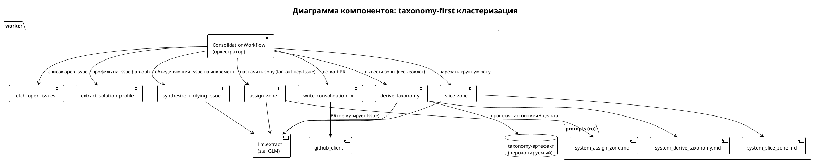
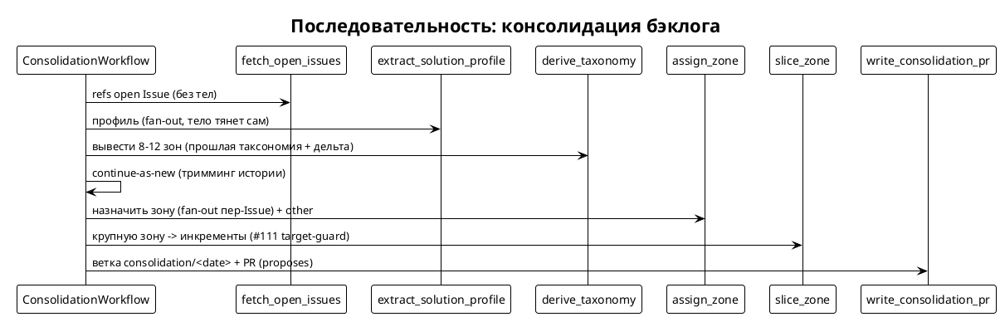
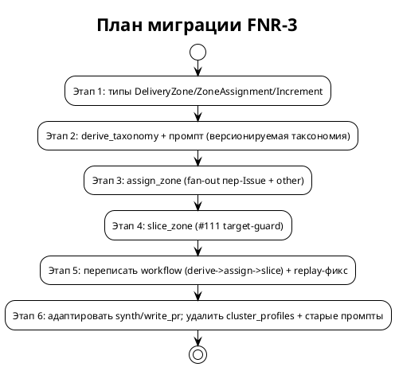

# [СТ] IAS-003 Кластеризация бэклога под поставку (taxonomy-first)

> **Пространство:** Issue Agent Service
> **Родительская страница:** Обработка Issue — консолидация бэклога

---

## Содержание

1. Введение
   1.1 Общая информация
   1.2 Термины и определения
   1.3 Ссылки
   1.4 История изменений
2. Общее описание
   2.1 Описание текущего поведения (As-Is)
   2.2 Архитектурное решение
   2.3 Диаграмма компонентов
   2.4 Схема последовательности
3. План миграции
4. Функциональные требования (Backend / фоновые процессы)
5. Требования к интерфейсам (Frontend / UI) — **Не применимо**
6. Ревью требований
7. Риски и ограничения
8. Приложения

---

## 1 Введение

### 1.1 Общая информация

| Поле | Значение |
|------|----------|
| Наименование продукта | Issue Agent Service — consolidation-этап |
| Ответственный за продукт | [УТОЧНИТЬ — PO] |
| Ответственный за тех. реализацию | [УТОЧНИТЬ] |
| Ответственный за документ | Системный аналитик (SA-helper) |
| Тип продукта / ОС | Backend-сервис, Linux/Docker |
| Epic | [УТОЧНИТЬ Jira] — Консолидация бэклога |
| Постановка задачи | `sa_documentation/FNR/FNR_3/task.md` |
| Концепт + вердикт дебатов | `sa_documentation/FNR/FNR_3/concept.md` (Концепт A с 4 модификациями) |
| Статус | Ревью |

### 1.2 Термины и определения

| Термин | Определение |
|--------|-------------|
| Зона поставки (DeliveryZone) | Единица поставки: набор Issue, закрываемых одной технической итерацией/релизом; несёт name, boundary, surface |
| boundary | Граница зоны — что закрывает одна итерация |
| surface | Имплементационная поверхность зоны (движок/модуль) |
| taxonomy-first | Сначала вывести малый словарь зон, затем классифицировать Issue в него (в противовес открытой кластеризации) |
| Инкремент (Increment) | Итерация-срез крупной зоны (MVP/MVP+1), нарезанный по зависимостям и потолку размера |
| Открытая кластеризация | «Сгруппируй N элементов» без заданного словаря — слабое место LLM (вырождается в одиночки) |
| Таксономия-артефакт | Версионируемый набор зон, переиспользуемый между прогонами (не переизобретается) |
| #111 target-guard | Инвариант: одинаковый функционал + разная цель (запуск vs перевод на архитектуру) не сливать |
| continue-as-new | Механизм Temporal: продолжить workflow с новой (обрезанной) историей |
| Прочие термины | См. `sa_documentation/naming_conventions.md`, `docs/consolidation-clustering-study.md` |

### 1.3 Ссылки

| Документ | Путь |
|----------|------|
| Постановка задачи | `sa_documentation/FNR/FNR_3/task.md` |
| Концепт + дебаты | `sa_documentation/FNR/FNR_3/concept.md` |
| Изучение практик + эксперимент | `docs/consolidation-clustering-study.md` |
| Дизайн consolidation (FNR-2) | `docs/superpowers/specs/2026-07-14-issue-consolidation-design.md` |
| Текущий код кластеризации | `worker/consolidation_activities.py` |
| Оркестратор | `worker/consolidation_workflow.py` |

### 1.4 История изменений

| Дата | Автор | Суть |
|------|-------|------|
| 15.07.2026 | SA-helper | Создано на основе вердикта дебатов FNR-3 (Концепт A + 4 модификации) |

---

## 2 Общее описание

### 2.1 Описание текущего поведения (As-Is)

Consolidation-этап (`ConsolidationWorkflow`) проводит бэклог через
profile-extract → **cluster** → synth → PR. Reduce-стадия `cluster_profiles`
кластеризует профили по строке `proposed_mechanism` через LLM. На реальном бэклоге
(75 open) выдаёт **54 кластера-одиночки** — группировки под поставку нет.

**Ключевые компоненты:**

| Компонент | Роль | Файл:строка |
|-----------|------|-------------|
| `cluster_profiles` | Reduce-кластеризация (заменяется) | `worker/consolidation_activities.py:123` |
| `_cluster_call` | Один LLM-вызов кластеризации над листингом механизмов | `worker/consolidation_activities.py:80` |
| `_merge_local` | Merge батч-локальных кластеров | `worker/consolidation_activities.py:89` |
| `ClusterExtraction`/`ClusterOut`/`MemberOut` | Схемы кластеризации | `worker/consolidation_activities.py:42-57` |
| `system_cluster.md` / `system_cluster_merge.md` | Промпты кластеризации | `prompts/` |
| `ConsolidationWorkflow.run` | Оркестратор; вызывает `cluster_profiles` как единый activity | `worker/consolidation_workflow.py` |
| `synthesize_unifying_issue` | Синтез объединяющего Issue из `Cluster` | `worker/consolidation_activities.py` |
| `write_consolidation_pr` / `_render_overview` | Рендер `ClusterSet` + PR | `worker/consolidation_activities.py` |

**Ограничения текущего решения:**

1. Кластеризация по гранулярному `proposed_mechanism` → 54 одиночки — доказательство: `docs/consolidation-clustering-study.md` §1.
2. Открытая кластеризация ненадёжна на LLM (glm) — доказательство: два прогона (single-shot и map-reduce) дали одинаковый вырожденный исход.
3. Тяжёлый replay истории (профили + `fetch` с телами) → `WorkflowTaskTimedOut` — доказательство: прогон 2026-07-15, `worker/consolidation_workflow.py`.
4. `cluster_id` из набора номеров — риск слаг-коллизии (грабли FNR-2 M5).

### 2.2 Архитектурное решение

Принят **Концепт A (taxonomy-first, 3 стадии) с 4 модификациями дебатов** —
см. `concept.md`. `cluster_profiles` заменяется на:

1. `derive_taxonomy` — 1 activity на весь бэклог → 8–12 **зон поставки**;
2. `assign_zone` — fan-out пер-Issue, классификация в primary-зону (+ secondary);
3. `slice_zone` — крупная зона → инкременты (MVP/MVP+1) по зависимостям/размеру.

**Модификации из дебатов (обязательны):**
- M1: таксономия — версионируемый артефакт (дельта-ре-деривация); `cluster_id` = `name` зоны, не набор номеров.
- M2: replay-фикс — `continue-as-new` после `derive_taxonomy` и/или `fetch` возвращает refs без тел.
- M3: `assign_zone` — пер-Issue классификация + исход `other`/«предложить новую зону».
- M4: #111 переносится на `slice_zone` (target-divergence → разные инкременты).

**Отклонённые альтернативы:** C (жёсткий энум — не адаптивен), D (эмбеддинги —
тематическая ось ≠ поставка), E (карта компонентов — отложить до полной
`capabilities.md`). Подробности — `concept.md`.

### 2.3 Диаграмма компонентов

### 2.4 Схема последовательности

---

## 3 План миграции

| Этап | Действие | Затрагиваемые объекты | Откат |
|------|----------|----------------------|-------|
| 1 | Новые dataclass'ы | `shared/workflow_types.py` | Удалить типы |
| 2 | `derive_taxonomy` + промпт | `worker/consolidation_activities.py`, `prompts/system_derive_taxonomy.md` | Убрать activity |
| 3 | `assign_zone` fan-out | `worker/consolidation_activities.py`, `prompts/system_assign_zone.md` | Убрать activity |
| 4 | `slice_zone` | `worker/consolidation_activities.py`, `prompts/system_slice_zone.md` | Убрать activity |
| 5 | Переписать workflow + replay-фикс | `worker/consolidation_workflow.py`, `scripts/consolidate.py` | Вернуть вызов `cluster_profiles` |
| 6 | Адаптировать synth/write_pr; удалить старое | `worker/consolidation_activities.py`, `prompts/system_cluster*.md` | Восстановить `cluster_profiles`/промпты |

**Критерии готовности этапов:** каждый этап — зелёный unit-тест (TDD); этап 5 —
полный прогон без `WorkflowTaskTimedOut`; этап 6 — PR с зонами/инкрементами, старые
`cluster_*` символы отсутствуют.

---

## 4 Функциональные требования (Backend / фоновые процессы)

> Все задачи серверные (Temporal-activities, workflow, промпты). UI нет → раздел 5 «Не применимо».

### 4.1 Типы данных зон поставки

| Поле | Значение |
|------|----------|
| Ответственный | [УТОЧНИТЬ] |
| Задача | [УТОЧНИТЬ Jira] — feat(consolidation): delivery-zone types [BACKLOG] |

**4.1.1 Описание.** В `shared/workflow_types.py` добавить `@dataclass`:
`DeliveryZone{name, boundary, surface}`, `ZoneAssignment{issue_number, primary_zone,
secondary_zones}`, `Increment{name, rationale, issue_numbers}`,
`Taxonomy{zones: list[DeliveryZone]}`.

**4.1.2 Обоснование.** Замена `Cluster`-ориентированной модели на зоно-ориентированную
— основа Концепта A. Стиль `@dataclass` — как существующие типы.

**4.1.3 Затрагиваемые компоненты.** `shared/workflow_types.py` (ADD).

**4.1.4 Критерии приёмки.**
1. Типы конструируются, `ZoneAssignment.secondary_zones` дефолт `[]`.
2. Unit-тест round-trip (как `tests/test_consolidation_types.py`).

**4.1.5 Зависимости.** нет.

### 4.2 Activity `derive_taxonomy`

| Поле | Значение |
|------|----------|
| Ответственный | [УТОЧНИТЬ] |
| Задача | [УТОЧНИТЬ Jira] — feat(consolidation): derive_taxonomy [BACKLOG] |

**4.2.1 Описание.** Sync `def @activity.defn` `derive_taxonomy(profiles:
list[SolutionProfile], prior: Taxonomy | None) -> Taxonomy`. Один вызов
`llm.extract(_load_prompt("system_derive_taxonomy.md"), listing, TaxonomyExtraction,
model=llm.MODEL_CLASSIFY)`. Промпт: вывести 8–12 зон поставки (name/boundary/surface);
при наличии `prior` — переиспользовать её зоны и предложить только дельту (M1).

**4.2.2 Обоснование.** Стадия 1 taxonomy-first; чинит гранулярность (малый словарь
вместо 57 механизмов). Подтверждено экспериментом (8 зон).

**4.2.3 Маршрутизация (внутренние вызовы).**

| Сущность | Метод | Событие |
|----------|-------|---------|
| Таксономия | `llm.extract(..., TaxonomyExtraction, model=MODEL_CLASSIFY)` | список зон |

**4.2.4 Нефункциональные требования.**
1. Низкая temperature (детерминизм таксономии) — M1.
2. `start_to_close_timeout` ≥ 300с (один вызов над всем бэклогом).
3. `name` каждой зоны — канонический kebab, служит `cluster_id` (M1, нет слаг-коллизии).

**4.2.5 Затрагиваемые компоненты.** `worker/consolidation_activities.py` (ADD),
`prompts/system_derive_taxonomy.md` (ADD).

**4.2.6 Критерии приёмки.**
1. Unit (mock LLM): возвращает `Taxonomy` из ≥1 зоны; поля маппятся.
2. При переданном `prior` промпт содержит прошлые зоны (проверка листинга).
3. Реальный прогон на бэклоге po-helper: 6–12 зон, не одиночки.

**4.2.7 Зависимости.** после 4.1.

### 4.3 Activity `assign_zone` (fan-out пер-Issue)

| Поле | Значение |
|------|----------|
| Ответственный | [УТОЧНИТЬ] |
| Задача | [УТОЧНИТЬ Jira] — feat(consolidation): assign_zone [BACKLOG] |

**4.3.1 Описание.** Sync `def @activity.defn` `assign_zone(profile:
SolutionProfile, taxonomy: Taxonomy) -> ZoneAssignment`. Классификация одного Issue
в `primary_zone` (строго имя из `taxonomy`) + `secondary_zones` для сквозных.
Исход `other` с флагом «предложить новую зону», если ни одна не подходит (M3).
Вызывается из workflow fan-out'ом (`asyncio.gather`), как `extract_solution_profile`.

**4.3.2 Обоснование.** Стадия 2 — надёжная классификация вместо открытой
кластеризации. Пер-Issue (не bulk) — M3; заодно облегчает replay (результат — ярлык).

**4.3.3 Нефункциональные требования.**
1. `primary_zone` ∈ имена зон `taxonomy` ∪ `{other}` (валидация).
2. `start_to_close_timeout` ~180с; retry 3 (как profile-extract).

**4.3.4 Затрагиваемые компоненты.** `worker/consolidation_activities.py` (ADD),
`prompts/system_assign_zone.md` (ADD).

**4.3.5 Критерии приёмки.**
1. Unit (mock LLM, **fan-out режим** — по одному профилю): назначает primary из словаря.
2. Issue вне всех зон → `other` + флаг.
3. Сквозной Issue получает `secondary_zones`.

**4.3.6 Зависимости.** после 4.2.

### 4.4 Activity `slice_zone` (#111 target-guard)

| Поле | Значение |
|------|----------|
| Ответственный | [УТОЧНИТЬ] |
| Задача | [УТОЧНИТЬ Jira] — feat(consolidation): slice_zone [BACKLOG] |

**4.4.1 Описание.** Sync `def @activity.defn` `slice_zone(zone: DeliveryZone,
members: list[int], profiles: list[SolutionProfile]) -> list[Increment]`. Режет
зону на инкременты (MVP/MVP+1) по зависимостям + потолку размера (~3–6 Issue).
**M4:** внутри зоны target-divergence (одинаковый функционал, разная цель — запуск
vs перевод на архитектуру, #111) разводится по РАЗНЫМ инкрементам.

**4.4.2 Обоснование.** Стадия 3 — «максимум требований за одну итерацию»; несёт
инвариант #111 (M4). Ложится на #97/#133.

**4.4.3 Критерии приёмки.**
1. Unit (mock LLM): зона из N Issue → инкременты, объединение членов = входу.
2. **#111:** фикстура «одинаковый функционал, разная цель» → РАЗНЫЕ инкременты.
3. Малая зона (≤ порога) → один инкремент (без лишнего дробления).

**4.4.4 Зависимости.** после 4.2 (зоны), 4.1.

### 4.5 Переписать `ConsolidationWorkflow` + replay-фикс

| Поле | Значение |
|------|----------|
| Ответственный | [УТОЧНИТЬ] |
| Задача | [УТОЧНИТЬ Jira] — refactor(consolidation): taxonomy workflow + replay [BACKLOG] |

**4.5.1 Описание.** `run`: `fetch_open_issues` (refs без тел — M2) → fan-out
`extract_solution_profile` → `derive_taxonomy(profiles, prior)` → **`continue-as-new`**
(тримминг истории — M2) → fan-out `assign_zone` → группировка по primary → `slice_zone`
на крупные зоны → fan-out `synthesize_unifying_issue` на инкременты → `write_consolidation_pr`.

**4.5.2 Обоснование.** Оркестрация Концепта A; `continue-as-new` устраняет
`WorkflowTaskTimedOut` (M2).

**4.5.3 Нефункциональные требования.**
1. `fetch_open_issues` не тянет тела Issue (тело — в `extract_solution_profile`), M2.
2. Launcher `scripts/consolidate.py` сохраняет `task_timeout=120с`.
3. Порядок `asyncio.gather` сохраняет соответствие профиль↔Issue.

**4.5.4 Затрагиваемые компоненты.** `worker/consolidation_workflow.py` (MODIFY),
`worker/consolidation_activities.py` (`fetch_open_issues`, MODIFY), `scripts/consolidate.py`.

**4.5.5 Критерии приёмки.**
1. Unit (WorkflowEnvironment, стаб-activity): workflow возвращает PR-url.
2. Полный прогон на бэклоге завершается **без `WorkflowTaskTimedOut`**.
3. История после `continue-as-new` не содержит тяжёлого `fetch`-результата с телами.

**4.5.6 Зависимости.** после 4.2, 4.3, 4.4.

### 4.6 Адаптировать synth/PR + удалить старую кластеризацию

| Поле | Значение |
|------|----------|
| Ответственный | [УТОЧНИТЬ] |
| Задача | [УТОЧНИТЬ Jira] — refactor(consolidation): zones in synth/pr, drop cluster_profiles [BACKLOG] |

**4.6.1 Описание.** `synthesize_unifying_issue` и `write_consolidation_pr`/
`_render_overview` работают над «зона/инкремент» (name = id, члены = issue_numbers)
вместо `Cluster`. Удалить `cluster_profiles`/`_cluster_call`/`_merge_local`, схемы
`ClusterExtraction`/`ClusterOut`/`MergeExtraction`, промпты `system_cluster*.md`.

**4.6.2 Обоснование.** Завершение перехода; убрать мёртвый код старой оси.

**4.6.3 Критерии приёмки.**
1. `synth`/`write_pr` тесты зелёные с новым входом.
2. Символы `cluster_profiles`/`_merge_local` отсутствуют (grep).
3. `write_consolidation_pr` по-прежнему только PR, DRY_RUN-guard, не мутирует Issue.

**4.6.4 Зависимости.** после 4.5.

---

## 5 Требования к интерфейсам (Frontend / UI)

**Не применимо.** Все изменения серверные (Temporal-activities, workflow, промпты).
Взаимодействие с человеком — через PR на GitHub (не разрабатывается здесь).

---

## 6 Ревью требований

| Роль | Исполнитель | Статус |
|------|------------|--------|
| Аналитик (кросс-ревью) | [УТОЧНИТЬ] | Ожидает |
| Разработка (Backend) | [УТОЧНИТЬ] | Ожидает |
| Разработка (Frontend) | — | Не применимо |
| Тестирование | [УТОЧНИТЬ] | Ожидает |

---

## 7 Риски и ограничения

### 7.1 Риски

| ID | Риск | Вероятность | Влияние | Митигация |
|----|------|------------|---------|-----------|
| R-01 | `derive_taxonomy` даёт разные зоны между прогонами (недетерминизм) | Средняя | Высокое | Версионируемая таксономия + `prior`-дельта + low temperature (M1) |
| R-02 | Replay истории снова вызывает `WorkflowTaskTimedOut` | Средняя | Высокое | `continue-as-new` после derive + `fetch` без тел (M2) |
| R-03 | Новые домены назначаются в случайную зону (мусор) | Средняя | Среднее | Исход `other` + флаг «предложить зону» (M3) |
| R-04 | #111 нарушен: функц.дубль с разной целью в одном инкременте | Низкая | Среднее | target-guard в `slice_zone` + unit-фикстура (M4) |
| R-05 | z.ai rate-limit тормозит fan-out `assign` | Средняя | Среднее | `max_concurrent_activities=3` + retry (как profile-extract) |
| R-06 | `derive_taxonomy` над очень большим бэклогом переполняет контекст | Низкая | Среднее | Компактный листинг (name/mechanism/target, без тел); при переполнении — батч-derive |

### 7.2 Ограничения

1. Кластеризация исполняется LLM (glm через z.ai) с жёстким rate-limit.
2. Ось поставки без полной `capabilities.md` опирается на предполагаемую поверхность (Концепт E — апгрейд позже).
3. PR-контракт неизменен: только PR, никаких мутаций GitHub Issue, DRY_RUN-guard.
4. `extract_solution_profile` и его тесты не ломать (профили переиспользуются).

---

## 8 Приложения

### 8.1 Якоря истины

| Утверждение | Якорь | Обоснование |
|-------------|-------|-------------|
| Кластеризация по механизму даёт одиночки | `worker/consolidation_activities.py:123`, `docs/consolidation-clustering-study.md` §1 | 75 Issue → 54 одиночки |
| Открытый reduce — один LLM-вызов | `worker/consolidation_activities.py:80` | `_cluster_call` |
| taxonomy-first даёт 8 зон | `docs/consolidation-clustering-study.md` §Приложение | эксперимент 2026-07-15 |
| Оркестратор вызывает reduce как activity | `worker/consolidation_workflow.py` | `execute_activity(cluster_profiles)` |
| fan-out паттерн уже есть | `worker/consolidation_workflow.py` | `asyncio.gather` над `extract_solution_profile` |
| PR-only, DRY_RUN-guard | `worker/consolidation_activities.py` (`write_consolidation_pr`), `worker/github_client.py` (`_dry_run`) | инвариант |

---

> Системные требования готовы. Следующий шаг: `/validate-doc sa_documentation/FNR/FNR_3/system_requirements.md`
