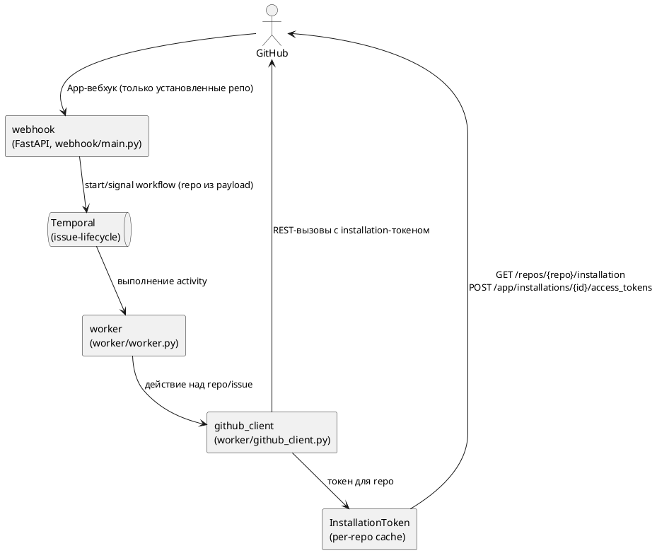
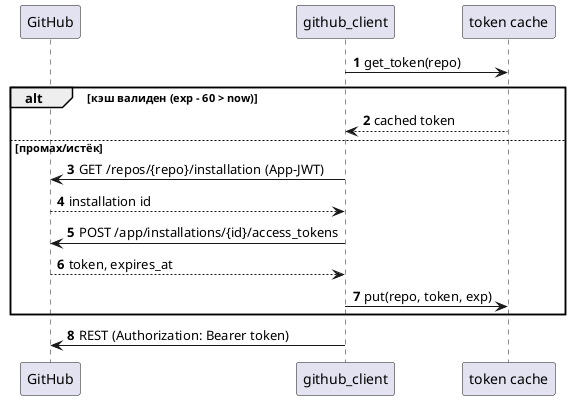
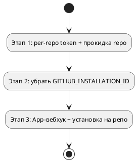

# [СТ] ISSUE-AGENTS-004 Отслеживание Issue в множестве репозиториев через GitHub App

> **Пространство:** Issue Agent Service
> **Родительская страница:** Системные требования / FNR

---

## Содержание

1. Введение
   1.1 Общая информация
   1.2 Термины и определения
   1.3 Ссылки
   1.4 История изменений
2. Общее описание
   2.1 Описание текущего поведения (As-Is)
   2.2 Архитектурное решение
   2.3 Диаграмма компонентов
   2.4 Схема последовательности
3. План миграции
   3.1 Этапы внедрения
   3.2 Таблица этапов
   3.3 Критерии готовности
4. Функциональные требования (Backend / БД / API)
   4.1 Аутентификация GitHub App (per-repo installation token)
   4.2 Конфигурация и доставка событий
5. Требования к интерфейсам (Frontend / UI)
6. Ревью требований
7. Риски и ограничения
8. Якоря истины

---

## 1 Введение

### 1.1 Общая информация

| Поле | Значение |
|------|----------|
| Наименование продукта | Issue Agent Service |
| Ответственный за продукт | — |
| Ответственный за тех. реализацию | — |
| Ответственный за документ | Системный аналитик (SA-helper) |
| Тип продукта и ОС | Self-hosted сервис (Docker, Python 3.12) |
| Epic | — |
| Статус | Ревью |

### 1.2 Термины и определения

| Термин | Определение |
|--------|-------------|
| GitHub App | Приложение GitHub с собственным идентификатором и приватным ключом; устанавливается на аккаунт/репозитории, действует от их имени по installation-токену (`worker/github_client.py:28`) |
| Installation (установка) | Факт установки App на аккаунт (организацию/пользователя); покрывает набор репозиториев; имеет числовой `id` |
| Installation token | Короткоживущий (~1 час) токен, выпускаемый под конкретную установку; даёт доступ к репозиториям этой установки |
| PAT | Personal Access Token — токен пользователя; пилотный путь аутентификации (`worker/github_client.py:56`) |
| Allowlist | Множество репозиториев, на которые сервису разрешено действовать |
| App-вебхук | Единый вебхук, настроенный в самом GitHub App; GitHub доставляет по нему события только по установленным репозиториям |
| Per-repo вебхук | Вебхук уровня отдельного репозитория (Settings → Webhooks) |
| `ISSUE_AGENT_REPOS` | Список отслеживаемых репозиториев (аналог `RELIABILITY_REPOS`): `owner/repo`, маска `owner/*`, `*`, пусто |
| `GITHUB_PRIVATE_KEY_B64` | Приватный ключ App в base64 (env), декодируется в PEM; замена монтируемого `.pem` |

### 1.3 Ссылки

| Документ | Путь / URL |
|----------|------------|
| Naming conventions | `sa_documentation/naming_conventions.md` |
| Референс-реализация (pr-agents) | `../poh-pr-agents/self-hosted/reliability/token.py` |
| Текущая аутентификация | `worker/github_client.py` |
| Транспортный слой вебхука | `webhook/main.py` |

### 1.4 История изменений

| Дата | Автор | Суть изменений |
|------|-------|---------------|
| 23.07.2026 | SA-helper | Создан документ системных требований по FNR-4 |

---

## 2 Общее описание

### 2.1 Описание текущего поведения (As-Is)

Сервис аутентифицируется в GitHub одним из двух путей (`worker/github_client.py:53`):

1. **PAT-путь** — если задан `GH_TOKEN`/`GITHUB_TOKEN`, он используется напрямую (`worker/github_client.py:56`). Токен repo-агностичен: действует на все репозитории в пределах своего scope.
2. **App-путь** — иначе выпускается installation-токен под **единственную** установку, id которой жёстко берётся из окружения: `installation_id = os.environ["GITHUB_INSTALLATION_ID"]` (`worker/github_client.py:40`). Токен кэшируется в двух модульных переменных (`_installation_token`, `_token_expires_at`) без привязки к репозиторию.

Функция `_auth_headers()` **не принимает репозиторий** (`worker/github_client.py:53`) и вызывается так во всех ~13 обёртках REST/gh (`post_comment`, `add_label`, `close_issue`, `add_reaction`, `get_issue`, `list_comments`, `get_file`, `create_pr_with_files`, `list_open_issues`, `get_issue_body`, `search_candidates`, `branch_exists`).

Транспортный слой вебхука уже репозиторно-нейтрален: репозиторий берётся из payload — `repo = payload["repository"]["full_name"]` (`webhook/main.py:75`, `webhook/main.py:111`), фильтра по репозиторию нет.

**Ключевые компоненты:**

| Компонент | Роль | Файл:строка |
|-----------|------|-------------|
| `_app_jwt` | Подпись App-JWT (RS256) приватным ключом | `worker/github_client.py:28` |
| `_installation_token_headers` | Выпуск/кэш installation-токена под фиксированный `GITHUB_INSTALLATION_ID` | `worker/github_client.py:36` |
| `_auth_headers` | Выбор пути (PAT / App), формирование заголовков; без параметра репозитория | `worker/github_client.py:53` |
| `github_webhook` | Приём события, репозиторий из payload | `webhook/main.py:61` |

**Ограничения текущего решения:**

1. App-путь привязан к одной установке — доказательство: `worker/github_client.py:40`. Репозитории вне этой установки (другая организация/аккаунт) недоступны.
2. Кэш токена глобальный, не per-repo — доказательство: `worker/github_client.py:37`. Модель «один токен на процесс» не выражает множество установок.
3. Обязательная ручная настройка `GITHUB_INSTALLATION_ID` — доказательство: `.env.example:35`. Добавление сервиса на новый аккаунт требует правки конфигурации.
4. Отсутствует явная привязка «репозиторий → токен», из-за чего невозможно корректно обслуживать несколько установок в одном процессе.

### 2.2 Архитектурное решение

Повторить модель `poh-pr-agents` (сервис `reliability`) 1:1 по трём составляющим:

**А. Приватный ключ App — из base64-переменной, а не из файла.** Ключ читается из `GITHUB_PRIVATE_KEY_B64` и декодируется `base64.b64decode(...).decode()` в PEM (референс: `../poh-pr-agents/self-hosted/reliability/analyze_adapter.py:73`). Это убирает монтирование `.pem` в контейнер (единственная переменная окружения вместо файла-секрета). Путь `GITHUB_PRIVATE_KEY_PATH` остаётся запасным для обратной совместимости.

**Б. Installation-токен по репозиторию.** По репозиторию определяется установка: `GET /repos/{repo}/installation` → `id`; под неё выпускается токен `POST /app/installations/{id}/access_tokens` (референс: `../poh-pr-agents/self-hosted/reliability/token.py:56`). Кэш по ключу-репозиторию с TTL ~55 минут; конкурентные промахи сериализуются (lock). `GITHUB_INSTALLATION_ID` больше не нужен.

**В. Явный список отслеживаемых репозиториев `ISSUE_AGENT_REPOS`** (аналог `RELIABILITY_REPOS`). Comma-separated, каждая запись — одно из (референс: `../poh-pr-agents/self-hosted/reliability/sweeper_adapter.py:67`):

| Запись | Значение |
|--------|----------|
| `owner/repo` | конкретный репозиторий |
| `owner/*` | все репозитории этого owner |
| `owner` (голый) | то же, что `owner/*` |
| `*` | любые репозитории (все установки App) |
| (пусто) | то же, что `*` — любые установленные |

`webhook` проверяет `repository.full_name` из payload (`webhook/main.py:75`, `:111`) против списка и игнорирует чужие события (200 OK без запуска workflow). Проверка **чисто строковая** (точное совпадение full_name, либо совпадение owner для маски, либо `*`/пусто → всё) — `webhook` в GitHub не ходит, приватный ключ ему не нужен.

**Итоговая поверхность конфигурации (4 переменные, задаются единожды):** `GITHUB_APP_ID`, `GITHUB_PRIVATE_KEY_B64`, `GITHUB_WEBHOOK_SECRET`, `ISSUE_AGENT_REPOS`. Плюс установить App на репозитории и указать вебхук App. PAT-путь (`GH_TOKEN`) сохраняется как dev-фолбэк.

**Отклонённые альтернативы:**

| Альтернатива | Причина отклонения | Когда пересмотреть |
|--------------|--------------------|--------------------|
| Неявный allowlist (только гарантия App-вебхука, без списка в коде) | Оператор ожидает явную переменную-список (как `RELIABILITY_REPOS`); список также защищает при доставке через per-repo вебхуки | — |
| Оставить ключ в файле (`GITHUB_PRIVATE_KEY_PATH`) как основной | Требует монтирования секрета-файла; `GITHUB_PRIVATE_KEY_B64` даёт единый env-контур, как в pr-agents | Остаётся как фолбэк |
| Оставить фиксированный `GITHUB_INSTALLATION_ID` | Не покрывает несколько установок/аккаунтов; лишний шаг конфигурации | — |

### 2.3 Диаграмма компонентов

### 2.4 Схема последовательности

---

## 3 План миграции

### 3.1 Этапы внедрения

1. **Этап 1 (код, обратно совместимо).** Реализовать per-repo installation token и прокинуть `repo` в `_auth_headers`. PAT-путь и сценарий одной установки продолжают работать.
2. **Этап 2 (конфигурация).** Убрать обязательность `GITHUB_INSTALLATION_ID` из конфигурации и документации.
3. **Этап 3 (эксплуатация).** Настроить вебхук в GitHub App, установить App на нужные репозитории.

### 3.2 Таблица этапов

| Этап | Изменение | Откат |
|------|-----------|-------|
| 1 | `worker/github_client.py`: per-repo token, `_auth_headers(repo)` | `git revert` коммита; PAT-путь не затронут |
| 2 | `.env.example`, доки: убрать `GITHUB_INSTALLATION_ID` | Вернуть переменную (код её больше не читает — откат безопасен) |
| 3 | GitHub App: webhook URL + secret, установка на репозитории | Отключить App-вебхук / вернуть per-repo вебхуки |

### 3.3 Критерии готовности

1. Комментарий `/estimate` в **двух разных** установленных репозиториях приводит к запуску пайплайна в каждом (проверяется по логам `github_client`).
2. `GITHUB_INSTALLATION_ID` не задан — App-путь работает, установка определяется по репозиторию.
3. Тесты `tests/test_github_client_auth.py` зелёные, покрывают per-repo кэш и PAT-путь.

---

## 4 Функциональные требования (Backend / БД / API)

### 4.1 Аутентификация GitHub App (per-repo installation token)

#### 4.1.1 FR-1. Выпуск installation-токена по репозиторию

| Поле | Значение |
|------|----------|
| Ответственный | Backend |
| Jira | — |
| Оценка | 1 день |

**Общее описание.**
1. Добавить функцию `_installation_token_for(repo)` в `worker/github_client.py`, которая:
   a. формирует App-JWT (переиспользовать `_app_jwt`, `worker/github_client.py:28`);
   b. выполняет `GET /repos/{repo}/installation` и извлекает `id`;
   c. выполняет `POST /app/installations/{id}/access_tokens` и извлекает `token`, `expires_at`;
   d. кэширует результат по ключу `repo` с запасом 60 c до истечения;
   e. сериализует выпуск токена (lock), чтобы конкурентный промах не породил дублирующие обмены.

**Обоснование.** Модель `GITHUB_INSTALLATION_ID` (`worker/github_client.py:40`) обслуживает одну установку. Определение установки по репозиторию (`../poh-pr-agents/self-hosted/reliability/token.py:56`) снимает это ограничение и убирает ручной шаг конфигурации.

**Затрагиваемые компоненты.**

| Компонент | Тип изменения | Файл:строка |
|-----------|---------------|-------------|
| `_installation_token_headers` | Заменить на per-repo вариант | `worker/github_client.py:36` |
| Модульный кэш токена | Из двух скаляров → словарь `{repo: (token, exp)}` | `worker/github_client.py:24` |

**Критерии приёмки.**
1. Для двух разных репозиториев выпускаются независимые токены; повторный вызов в пределах TTL не порождает новый сетевой обмен.
2. `GITHUB_INSTALLATION_ID` в окружении отсутствует — токен всё равно выпускается.
3. Ошибка `GET /repos/{repo}/installation` (404 — App не установлен) поднимается как исключение и логируется.

**Зависимости.** Нет.

#### 4.1.2 FR-2. Прокидывание репозитория в выбор аутентификации

| Поле | Значение |
|------|----------|
| Ответственный | Backend |
| Jira | — |
| Оценка | 0.5 дня |

**Общее описание.**
1. Изменить сигнатуру `_auth_headers()` → `_auth_headers(repo)` (`worker/github_client.py:53`).
2. PAT-путь (`worker/github_client.py:56`) остаётся без изменений (аргумент игнорируется).
3. App-путь вызывает `_installation_token_for(repo)`.
4. Прокинуть `repo` во все вызовы `_auth_headers()` в обёртках (все они уже имеют `repo` в области видимости).

**Обоснование.** Токен теперь зависит от репозитория; вызывающий обязан его передать.

**Затрагиваемые компоненты.**

| Компонент | Тип изменения | Файл:строка |
|-----------|---------------|-------------|
| `_auth_headers` | Добавить параметр `repo` | `worker/github_client.py:53` |
| Обёртки REST/gh (~13) | Передать `repo` | `worker/github_client.py:62,71,80,89,107,113,125,132,141,156,183,202` |

**Критерии приёмки.**
1. Все обёртки собирают заголовки под свой `repo`.
2. Поведение PAT-пути не изменилось.

**Зависимости.** После FR-1.

#### 4.1.3 FR-3. Поверхность конфигурации из 4 переменных

| Поле | Значение |
|------|----------|
| Ответственный | Backend |
| Jira | — |
| Оценка | 0.5 дня |

**Общее описание.**
1. Привести `.env.example` к набору: `GITHUB_APP_ID`, `GITHUB_PRIVATE_KEY_B64`, `GITHUB_WEBHOOK_SECRET`, `ISSUE_AGENT_REPOS` (+ `GH_TOKEN` как dev-фолбэк). Удалить `GITHUB_INSTALLATION_ID` (`.env.example:35`).
2. Обновить `docs/DEPLOY-DOKPLOY.md` и `README.md`: «установил App → задал 4 переменные → указал вебхук App → готово».

**Обоснование.** Оператор настраивает сервис единожды теми же переменными, что и `poh-pr-agents`.

**Затрагиваемые компоненты.**

| Компонент | Тип изменения | Файл:строка |
|-----------|---------------|-------------|
| `.env.example` | Удалить `GITHUB_INSTALLATION_ID`, добавить `GITHUB_PRIVATE_KEY_B64`, `ISSUE_AGENT_REPOS` | `.env.example:35` |
| Документация деплоя | Актуализировать | `docs/DEPLOY-DOKPLOY.md` |

**Критерии приёмки.**
1. В репозитории нет ссылок на `GITHUB_INSTALLATION_ID` вне истории изменений.
2. `.env.example` содержит ровно 4 переменные конфигурации App + список.

**Зависимости.** После FR-1, FR-6, FR-7.

#### 4.1.4 FR-4. Тесты аутентификации

| Поле | Значение |
|------|----------|
| Ответственный | Backend |
| Jira | — |
| Оценка | 0.5 дня |

**Общее описание.**
1. Адаптировать `tests/test_github_client_auth.py` под per-repo (мок `requests`): кэш-хит/промах по репозиторию, последовательность `installation` → `access_tokens`, сохранность PAT-пути.

**Нефункциональные требования.**
- В пределах TTL на репозиторий выполняется не более одного обмена токена; конкурентные вызовы не порождают дубли (lock).

**Критерии приёмки.**
1. `pytest` зелёный; новые кейсы падают на «старой» реализации и проходят на новой.

**Зависимости.** После FR-1, FR-2.

#### 4.1.5 FR-6. Приватный ключ App из base64

| Поле | Значение |
|------|----------|
| Ответственный | Backend |
| Jira | — |
| Оценка | 0.5 дня |

**Общее описание.**
1. В `_app_jwt` (`worker/github_client.py:28`) читать ключ из `GITHUB_PRIVATE_KEY_B64`: `base64.b64decode(env).decode()` → PEM (референс `../poh-pr-agents/self-hosted/reliability/analyze_adapter.py:73`).
2. Если `GITHUB_PRIVATE_KEY_B64` не задан — фолбэк на чтение файла `GITHUB_PRIVATE_KEY_PATH` (текущее поведение, `worker/github_client.py:29`).

**Обоснование.** Единый env-контур секрета вместо монтирования `.pem`; паритет с pr-agents.

**Затрагиваемые компоненты.**

| Компонент | Тип изменения | Файл:строка |
|-----------|---------------|-------------|
| `_app_jwt` | Источник ключа: env-b64, фолбэк на файл | `worker/github_client.py:28` |

**Критерии приёмки.**
1. При заданном `GITHUB_PRIVATE_KEY_B64` подпись JWT проходит без файла на диске.
2. При незаданном — прежнее поведение с `GITHUB_PRIVATE_KEY_PATH`.

**Зависимости.** Нет.

### 4.2 Конфигурация и доставка событий

#### 4.2.1 FR-5. Доставка через вебхук GitHub App (эксплуатация)

| Поле | Значение |
|------|----------|
| Ответственный | DevOps |
| Jira | — |
| Оценка | 0.5 дня |

**Общее описание.**
1. Настроить в GitHub App единый вебхук: URL сервиса `webhook`, секрет = `GITHUB_WEBHOOK_SECRET` (`.env.example:33`), события Issues + Issue comments.
2. Установить App на отслеживаемые репозитории.

**Маршрутизация / источники данных.** Репозиторий берётся из payload (`webhook/main.py:75`, `webhook/main.py:111`); код `webhook` не меняется.

**Нефункциональные требования.**
- Событие по репозиторию, где App не установлен, не доставляется (гарантия GitHub) — сервис на него не тратит ресурсов.

**Критерии приёмки.**
1. Установка App на новый репозиторий (входящий в `ISSUE_AGENT_REPOS` или под маску) делает его отслеживаемым без изменения кода.

**Зависимости.** После FR-1, FR-7.

#### 4.2.2 FR-7. Список ISSUE_AGENT_REPOS и фильтр в webhook

| Поле | Значение |
|------|----------|
| Ответственный | Backend |
| Jira | — |
| Оценка | 1 день |

**Общее описание.**
1. Добавить `shared/repos.py`:
   a. `parse_repo_specs(specs)` — делит записи на `concrete` (`owner/repo`) и `mask_owners` (`owner/*`, голый `owner`, `*`); порт чистой функции `../poh-pr-agents/self-hosted/reliability/sweeper_adapter.py:67`.
   b. `is_allowed(repo, specs)` — `True`, если список пуст, содержит `*`, содержит `repo` (регистронезависимо) или owner репозитория есть в `mask_owners`.
2. В `webhook/main.py` для событий `issues` и `issue_comment` после извлечения `repo` (`webhook/main.py:75`, `:111`): если `not is_allowed(repo, ISSUE_AGENT_REPOS)` → залогировать `ignored repo <x>` и `return {"ok": True}` (без старта/сигнала workflow).

**Обоснование.** Явный оператор-контроль набора репозиториев (паритет с `RELIABILITY_REPOS`); строковая проверка не требует доступа webhook к GitHub.

**Маршрутизация / источники данных.** `repository.full_name` из payload; список — `os.environ.get("ISSUE_AGENT_REPOS","")`.

**Нефункциональные требования.**
- Проверка O(n) по числу записей списка, без сетевых вызовов.

**Затрагиваемые компоненты.**

| Компонент | Тип изменения | Файл:строка |
|-----------|---------------|-------------|
| `shared/repos.py` | Новый модуль | — |
| `github_webhook` | Фильтр по allowlist в начале обработки | `webhook/main.py:73,102` |

**Критерии приёмки.**
1. Событие по репозиторию из списка → workflow стартует; по репозиторию вне списка → игнор (200, без workflow).
2. Маска `owner/*` пропускает любой репозиторий этого owner; `*`/пусто — любой.
3. Юнит-тесты `parse_repo_specs` и `is_allowed` (точное/маска/`*`/пусто/регистр).

**Зависимости.** Нет.

---

## 5 Требования к интерфейсам (Frontend / UI)

**Не применимо.** UI-компонентов у сервиса нет.

---

## 6 Ревью требований

| Роль | ФИО | Статус | Дата |
|------|-----|--------|------|
| Системный аналитик | SA-helper | Подготовлено | 23.07.2026 |
| Разработка Backend | — | Ожидает | — |
| Тестирование | — | Ожидает | — |

---

## 7 Риски и ограничения

### 7.1 Риски

| ID | Риск | Вероятность | Влияние | Митигация |
|----|------|-------------|---------|-----------|
| R1 | Событие пришло по репозиторию без установки App → `GET /repos/{repo}/installation` 404 → activity падает | Низкая (при App-вебхуке GitHub не доставит) | Средн. | При App-вебхуке исключено; логировать и не действовать при прочих схемах доставки |
| R2 | Всплеск обменов токенов → rate-limit GitHub | Низкая | Средн. | Кэш per-repo (TTL ~55 мин) + lock на выпуск |
| R3 | PAT-путь маскирует контроль по репозиториям (PAT ходит в пределах scope) | Средн. | Низк. | Для мультирепо-контроля использовать App, не PAT; зафиксировать в документации |
| R4 | Приватный ключ App недоступен worker-контейнеру | Низкая | Высок. | `GITHUB_PRIVATE_KEY_PATH` уже монтируется; проверка на старте |

### 7.2 Ограничения

1. Мультирепо-модель требует App-аутентификации; PAT-путь остаётся односценарным (dev / один репозиторий).
2. `webhook` в мультирепо-модели не проверяет репозиторий самостоятельно — доверие делегировано гарантии App-вебхука и HMAC-подписи (`webhook/main.py:46`).
3. Новый репозиторий становится отслеживаемым после установки App и в пределах TTL кэша (первый обмен токена — при первом событии).

---

## 8 Якоря истины

| # | Утверждение | Код-доказательство | Обоснование | Контекст |
|---|-------------|--------------------|-------------|----------|
| 1 | App-путь привязан к одной установке через env | `worker/github_client.py:40` | `installation_id` берётся из `os.environ["GITHUB_INSTALLATION_ID"]` | As-Is, ограничение мультирепо |
| 2 | `_auth_headers` не знает репозитория | `worker/github_client.py:53` | Сигнатура без параметров, глобальный кэш | Причина правки FR-2 |
| 3 | PAT-путь repo-агностичен | `worker/github_client.py:56` | Токен берётся из env и применяется как есть | Сохраняется как dev-фолбэк |
| 4 | Транспорт вебхука уже репозиторно-нейтрален | `webhook/main.py:75`, `webhook/main.py:111` | Репозиторий из `payload["repository"]["full_name"]` | Код `webhook` не меняется |
| 5 | Референс per-repo токена существует и проверен | `../poh-pr-agents/self-hosted/reliability/token.py:56` | `GET /repos/{repo}/installation` → `access_tokens` | Основа решения §2.2-Б |
| 6 | `GITHUB_INSTALLATION_ID` — обязательный шаг конфигурации сегодня | `.env.example:35` | Переменная присутствует в примере окружения | Снимается в FR-3 |
| 7 | Референс списка репо с масками | `../poh-pr-agents/self-hosted/reliability/sweeper_adapter.py:67` | `parse_repo_specs`: `owner/repo`/`owner/*`/`owner`/`*` | Основа `ISSUE_AGENT_REPOS`, FR-7 |
| 8 | Референс ключа из base64 | `../poh-pr-agents/self-hosted/reliability/analyze_adapter.py:73` | `base64.b64decode(pem_b64).decode()` | Основа FR-6 |
