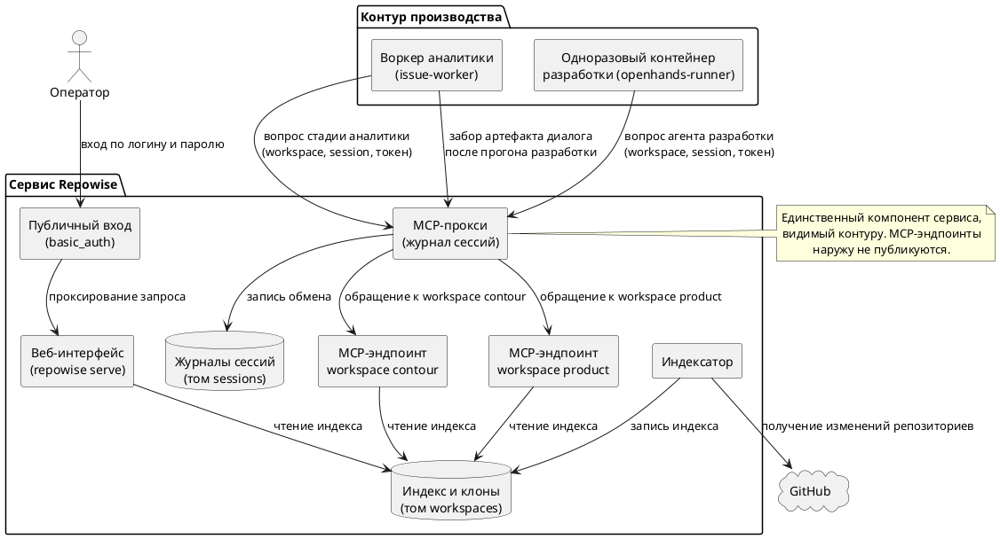
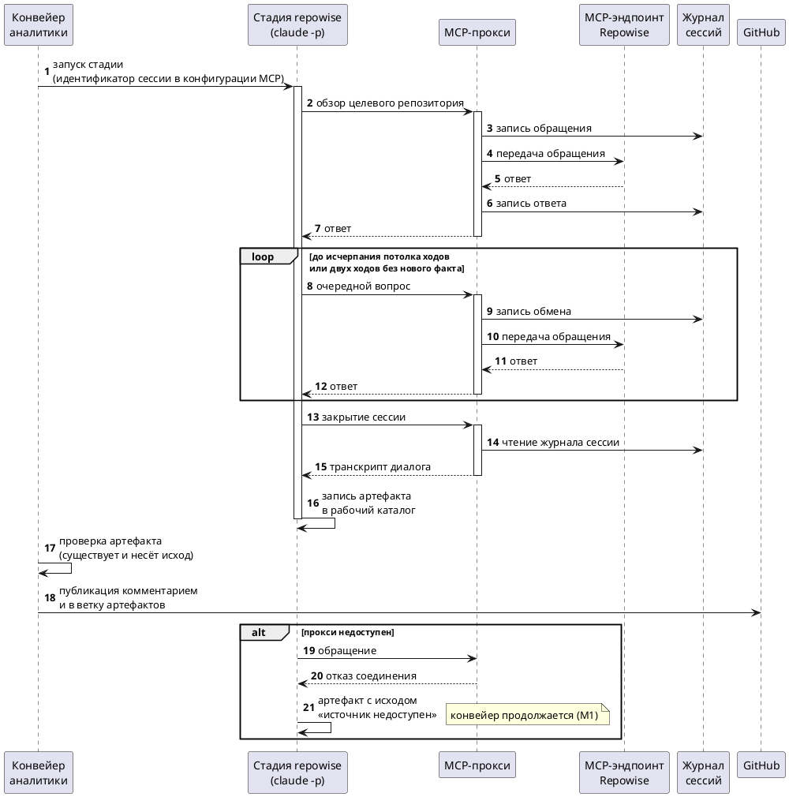
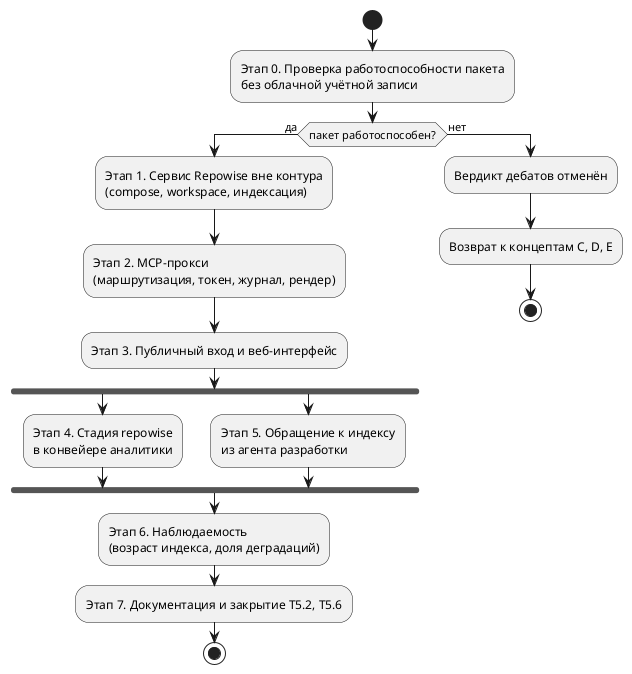

# [СТ] ISSUE-AGENTS-005 Постоянный индекс кода (Repowise) как источник контекста для агентов

> **Пространство:** Issue Agent Service
> **Родительская страница:** Системные требования / FNR

---

## Содержание

1. Введение
2. Общее описание
3. План миграции
4. Функциональные требования (Backend / БД / API)
5. Требования к интерфейсам (Frontend / UI)
6. Ревью требований
7. Риски и ограничения
8. Якоря истины

---

## 1 Введение

### 1.1 Общая информация

| Поле | Значение |
|------|----------|
| Наименование продукта | Issue Agent Service |
| Ответственный за продукт | — |
| Ответственный за тех. реализацию | — |
| Ответственный за документ | Системный аналитик (SA-helper) |
| Тип продукта и ОС | Self-hosted сервис (Docker, Python 3.12) |
| Epic | — |
| Задача (сервис) | po-helper-org/poh-infra#1 |
| Задача (агенты) | po-helper-org/poh-issue-agents#72 |
| Статус | Ревью |

### 1.2 Термины и определения

| Термин | Определение |
|--------|-------------|
| Индекс кода | Постоянное хранилище знаний о репозитории, поддерживаемое пакетом `repowise`: граф символов, история git, дед-код, страницы вики, векторный поиск |
| Workspace | Единица группировки репозиториев в `repowise`: один корневой каталог, один репозиторий по умолчанию, один MCP-эндпоинт |
| Alias | Короткое имя репозитория внутри workspace; фигурирует в каждом ответе MCP как указание на источник |
| Сервис Repowise | Совокупность контейнеров, обслуживающих индекс: MCP-эндпоинты, веб-интерфейс, индексатор, прокси, публичный вход |
| MCP-прокси | Собственный компонент между агентами и MCP-эндпоинтами Repowise; маршрутизирует по workspace, требует токен и идентификатор сессии, ведёт журнал обмена |
| Сессия диалога | Последовательность обращений одного прогона агента к индексу, объединённая общим идентификатором |
| Артефакт диалога | Файл `repowise-dialog.md` — транскрипт сессии, отрендеренный прокси из журнала |
| Индексатор | Компонент, поддерживающий актуальность индекса: получает изменения репозиториев и запускает инкрементальное обновление |
| Возраст индекса | Разница между текущим моментом и временем последнего успешного обновления индекса репозитория |
| Деградация стадии | Исход, при котором стадия завершается успешно и создаёт артефакт, но фиксирует в нём недоступность источника |
| Стадия FNR | Один шаг конвейера аналитики, исполняемый отдельным процессом `claude -p` (`worker/activities.py:977`) |
| Выгрузка repomix | Плоский XML-дамп репозитория, единственная форма контекста в текущей реализации (`worker/activities.py:750`) |

### 1.3 Ссылки

| Документ | Путь / URL |
|----------|------------|
| Постановка задачи | `sa_documentation/FNR/FNR_5/task.md` |
| Концепты и дебаты | `sa_documentation/FNR/FNR_5/concept.md` |
| Naming conventions | `sa_documentation/naming_conventions.md` |
| Архитектура сервиса | `docs/ARCHITECTURE.md` |
| Дорожная карта | `docs/ROADMAP.md` |
| План работ | `specs/implementation-spec.md` |
| Дизайн сервиса (инфраструктура) | `../poh-infra/docs/superpowers/specs/2026-08-19-repowise-mcp-service-design.md` |
| Текущий образ Repowise | `../poh-infra/mcp/poh-org/servers/repowise.yaml` |
| Compose контура | `../poh-infra/harness/docker-compose.yml` |

### 1.4 История изменений

| Дата | Автор | Суть изменений |
|------|-------|---------------|
| 19.08.2026 | SA-helper | Создан документ системных требований по FNR-5 |

---

## 2 Общее описание

### 2.1 Описание текущего поведения (As-Is)

Контекст о коде строится заново в каждом прогоне и не переживает его.

Аналитика по `/analyze` начинается со стадии `prepare_workspace` (`worker/activities.py:970`), вызывающей `_build_workspace` (`worker/activities.py:697`). Та безусловно сносит каталог прошлого прогона (`worker/activities.py:699`), клонирует репозиторий и запускает выгрузку `repomix` с потолком 600 секунд (`worker/activities.py:750-759`, `worker/activities.py:637`). Каждая стадия FNR требует наличия выгрузки и без неё не стартует (`worker/activities.py:706-712`).

Стадий пять — `task`, `concept`, `debate`, `sysreq`, `validate` (`worker/activities.py:648-660`, `worker/activities.py:664`); шага обращения к индексу кода среди них нет. Каждая стадия исполняется отдельным процессом `claude -p` с чистым контекстом (`worker/activities.py:977-994`), поэтому знание переходит между стадиями только через файлы-артефакты (`worker/activities.py:635`).

Разработка получает контекст тем же приёмом: `_dev_prepare` (`worker/activities.py:1056`) сносит каталог задачи, клонирует репозиторий заново и собирает постановку из тела Issue и артефактов аналитики. Собственного источника знаний о коде у агента разработки нет.

**Ключевые компоненты.**

| Компонент | Роль | Файл:строка |
|-----------|------|-------------|
| `_build_workspace` | Снос каталога, клон, выгрузка repomix | `worker/activities.py:697` |
| `_run_repomix` | Выгрузка репозитория в `sa_documentation/repomix-output.xml` | `worker/activities.py:750` |
| `_require_workspace` | Guard стадии: без выгрузки стадия не стартует | `worker/activities.py:706` |
| `_fnr_stages` | Состав и порядок стадий FNR | `worker/activities.py:648` |
| `_FNR_STAGE_REQUIRES` | Входные условия стадий | `worker/activities.py:668` |
| `FNR_STAGE_NAMES` | Перечень имён стадий | `worker/activities.py:664` |
| `ARTIFACT_FILES` | Набор собираемых артефактов FNR | `worker/activities.py:635` |
| `run_fnr_stage` | Исполнение одной стадии и проверка её артефакта | `worker/activities.py:977` |
| `_claude_anthropic_creds` | Приведение ключа z.ai к протоколу Anthropic для `claude -p` | `worker/activities.py:762` |
| `_dev_prepare` | Подготовка каталога и постановки для агента разработки | `worker/activities.py:1056` |
| `ARTIFACT_PATHS` | Пути артефактов, собираемых оценкой | `worker/activities.py:1634` |

**Ограничения текущего решения.**

1. Контекст неадресуем: стадия получает выгрузку целиком либо не стартует (`worker/activities.py:706-712`). Формы «задать вопрос части» не существует.
2. Стоимость линейна по числу прогонов, а не по числу изменений: выгрузка повторяется при каждом запуске, включая повторные по одному Issue (`worker/activities.py:699-702`).
3. Знание не накапливается: каталог сносится в начале следующего прогона (`worker/activities.py:699`), стадии изолированы по контексту (`worker/activities.py:977-994`).
4. Связи между репозиториями организации недоступны в принципе: выгрузка охватывает один клон (`worker/activities.py:750-759`).
5. Шаг Repowise числится нереализованным в трёх документах одновременно: `specs/implementation-spec.md:184,188`, `docs/ROADMAP.md:139,157,200`, `docs/ARCHITECTURE.md:84,140`.
6. Потребитель уже заложен в модели данных: кандидаты проверки дублей помечены как «переиспользуются Repowise» (`docs/diagrams/issue-workflow-part1-intake.mermaid:45`), но потребителя нет.

### 2.2 Архитектурное решение

Принят **Концепт A** — Repowise отдельным сервисом с MCP-прокси и журналом сессий. Вердикт дебатов: «Принят с модификациями» (`sa_documentation/FNR/FNR_5/concept.md`, раздел «Раунд 3: Вердикт»).

Обязательные модификации вердикта, отражённые в требованиях ниже:

| | Модификация | Требование |
|---|---|---|
| M1 | Недоступность Repowise деградирует стадию, а не останавливает конвейер | FR-14 |
| M2 | Проверка работоспособности пакета без облачной учётной записи — блокирующая | FR-1 |
| M3 | Возраст индекса и SHA видимы в шапке артефакта, стадия предупреждает при отставании | FR-5, FR-7 |
| M4 | Отладка и первичная индексация — вне контура; выкладка отдельной задачей | Раздел 3, этап 0 |
| M5 | Прокси журналирует на уровне транспорта, семантику инструментов не разбирает | FR-6, FR-7 |
| M6 | Возраст индекса и доля деградировавших прогонов — наблюдаемые величины | FR-9 |

Контекст перестаёт быть производной прогона и становится объектом с собственным жизненным циклом: индекс поддерживается индексатором независимо от прогонов, а агенты обращаются к нему вопросами через прокси, который ведёт журнал обмена и рендерит из него артефакт.

Выгрузка `repomix` **сохраняется** и остаётся входным условием стадий (`worker/activities.py:706-712`). Индекс её дополняет, а не заменяет: замена потребовала бы переписать guard и все пять существующих стадий, что выходит за рамки задачи.

### 2.3 Диаграмма компонентов

### 2.4 Схема последовательности

---

## 3 План миграции

### 3.1 Этапы внедрения

### 3.2 Таблица этапов

| Этап | Действие | Затрагиваемые объекты | Откат |
|------|----------|----------------------|-------|
| 0 | Проверка работоспособности пакета без облачной учётной записи | — | Не требуется: изменений нет |
| 1 | Поднять сервис Repowise вне контура, провести первичную индексацию | `../poh-infra/repowise/` | Погасить compose, удалить тома |
| 2 | Реализовать MCP-прокси | `../poh-infra/repowise/` | Погасить сервис прокси; агентов на нём ещё нет |
| 3 | Публичный вход и веб-интерфейс | `../poh-infra/repowise/` | Снять маршрут входа; сервис остаётся доступен внутри |
| 4 | Ввести стадию `repowise` в конвейер аналитики | `worker/activities.py`, `prompts/` | Убрать стадию из `_fnr_stages`, вернуть вход стадии `task` |
| 5 | Дать агенту разработки доступ к индексу | `shared/develop.py`, `worker/activities.py` | Снять сеть и конфигурацию MCP у одноразового контейнера |
| 6 | Наблюдаемость возраста индекса и доли деградаций | `../poh-infra/repowise/`, `worker/activities.py` | Снять публикацию величин |
| 7 | Документация и закрытие задач плана работ | `docs/`, `specs/` | Вернуть прежние формулировки |

### 3.3 Критерии готовности

| Этап | Критерий готовности |
|------|--------------------|
| 0 | Команды `repowise mcp` и `repowise serve` отработали на тестовом репозитории без выполнения `repowise login`; результат зафиксирован письменно |
| 1 | `repowise workspace list` показывает все репозитории из списков состава обоих workspace; поиск по индексу возвращает непустой результат по известному символу |
| 2 | Обращение без токена отвергается кодом `401`; обращение без идентификатора сессии — кодом `400`; после серии обращений запрос транскрипта возвращает непустой markdown с числом ходов, равным числу обращений |
| 3 | Веб-интерфейс открывается по выделенному домену и требует логин и пароль; обращение к порту MCP-эндпоинта с хоста вне сети сервиса даёт отказ соединения |
| 4 | Прогон `/analyze` на живом Issue создаёт непустой `repowise-dialog.md`; стадия `task` не стартует при отсутствии этого артефакта |
| 5 | Прогон разработки создаёт артефакт диалога; артефакт публикуется и при аварийном завершении одноразового контейнера |
| 6 | Возраст индекса и доля деградировавших прогонов доступны без чтения логов контейнеров |
| 7 | `T5.2` и `T5.6` в `specs/implementation-spec.md` закрыты либо переформулированы; `docs/ROADMAP.md` и `docs/ARCHITECTURE.md` не противоречат коду |

---

## 4 Функциональные требования (Backend / БД / API)

> **Содержимое раздела:** серверные задачи — сервис индекса, сетевой прокси, фоновая индексация, интеграция сервиса с конвейером аналитики и с агентом разработки.

### 4.1 Сервис Repowise (репозиторий poh-infra)

#### 4.1.1 FR-1. Проверка работоспособности пакета без облачной учётной записи

| Поле | Значение |
|------|----------|
| Ответственный | Backend |
| Задача | po-helper-org/poh-infra#1 |
| Оценка | 0.5 дня |

**Общее описание.**
1. На тестовом репозитории с историей git выполнить последовательно, не выполняя `repowise login`:
   a. `repowise init --no-prose` — построение структурного индекса;
   b. `repowise mcp --transport streamable-http` — запуск MCP-эндпоинта и обращение к нему клиентом;
   c. `repowise serve --no-ui` — запуск API;
   d. `repowise generate --unwritten --dry-run` — план генерации страниц моделью.
2. Зафиксировать письменно, какие команды потребовали учётной записи, а какие отработали.
3. Отдельно зафиксировать, какой провайдер модели и какой эмбеддер приняты пакетом при ключе z.ai (`worker/activities.py:762`).

**Обоснование.** Модификация M2 вердикта дебатов делает эту проверку блокирующей: концепты A и B стоят на допущении, что пакет работоспособен без облачной учётной записи, а команды `login`, `logout` и `whoami` в CLI присутствуют. Отрицательный результат отменяет вердикт целиком и возвращает выбор к концептам C, D и E.

**Затрагиваемые компоненты.**

| Компонент | Тип изменения | Файл:строка |
|-----------|---------------|-------------|
| — | Изменений в коде нет; результат — письменная фиксация | `../poh-infra/docs/repowise/` |

**Критерии приёмки.**
1. По каждой из четырёх команд зафиксировано, потребовала ли она учётной записи.
2. Зафиксировано, принят ли ключ z.ai как провайдер модели и какой эмбеддер доступен.
3. При отрицательном результате открыта запись об отмене вердикта дебатов.

**Зависимости.** Нет. **Блокирует все остальные требования настоящего документа.**

**Нефункциональные требования.**
1. Проверка выполняется вне контура производства и не затрагивает ни один его контейнер.

#### 4.1.2 FR-2. Compose сервиса Repowise

| Поле | Значение |
|------|----------|
| Ответственный | Backend |
| Задача | po-helper-org/poh-infra#1 |
| Оценка | 1 день |

**Общее описание.**
1. Создать каталог `../poh-infra/repowise/` с отдельным compose, не входящим в compose контура (`../poh-infra/harness/docker-compose.yml`).
2. Описать сервисы:
   a. MCP-эндпоинт workspace `contour` — `repowise mcp --transport streamable-http`, порт наружу не публикуется;
   b. MCP-эндпоинт workspace `product` — то же;
   c. веб-интерфейс — `repowise serve`, порт наружу не публикуется;
   d. индексатор (FR-4, FR-5);
   e. MCP-прокси (FR-6, FR-7);
   f. публичный вход (FR-8).
3. Описать тома: индекс и клоны репозиториев; журналы сессий; кэш тарбола веб-интерфейса.
4. Описать сети: внутренняя сеть сервиса; внешняя сеть, разделяемая с контуром, в которой виден **только** прокси.
5. Собрать образ на базе `python:3.11-slim` с пакетами `repowise` и `git`, взяв за основу `../poh-infra/mcp/poh-org/images/Dockerfile.repowise`.

**Обоснование.** Отдельный compose, а не расширение compose контура: сервис имеет собственный жизненный цикл, собственное расписание и, по модификации M4 вердикта, отлаживается вне контура. Непубликация портов MCP — механизм выполнения требования «доступ только из внутреннего контура»: ограничение обеспечивается сетью, а не соглашением.

**Затрагиваемые компоненты.**

| Компонент | Тип изменения | Файл:строка |
|-----------|---------------|-------------|
| Каталог сервиса | Создать | `../poh-infra/repowise/docker-compose.yml` |
| Образ сервиса | Создать на основе существующего | `../poh-infra/repowise/Dockerfile` |
| Существующий образ MCP Toolkit | Оставить без изменений | `../poh-infra/mcp/poh-org/images/Dockerfile.repowise` |

**Критерии приёмки.**
1. `docker compose up -d` поднимает все сервисы; `docker compose ps` показывает их в состоянии `running`.
2. `docker port` для контейнеров MCP-эндпоинтов и веб-интерфейса не возвращает ни одной публикации на хост.
3. Обращение к порту MCP-эндпоинта с хоста даёт отказ соединения.
4. Кэш тарбола веб-интерфейса переживает перезапуск: повторный старт не скачивает его заново.

**Зависимости.** После FR-1.

**Нефункциональные требования.**
1. Потребление памяти сервисом в покое (без идущей индексации) — не более 1 ГБ суммарно по всем контейнерам.
2. Образ сервиса собирается не более 10 минут при холодном кэше.

#### 4.1.3 FR-3. Конфигурация состава workspace

| Поле | Значение |
|------|----------|
| Ответственный | Backend |
| Задача | po-helper-org/poh-infra#1 |
| Оценка | 1 день |

**Общее описание.**
1. Завести файлы состава: `workspaces/contour.yml` и `workspaces/product.yml`, каждый — список репозиториев с полями «полное имя на GitHub» и «alias».
2. Зафиксировать правила отнесения репозитория к workspace:
   a. `contour` — репозитории, отвечающие на вопрос «как устроены сами агенты»; `product` — репозитории, которые агенты изменяют;
   b. репозиторий состоит ровно в одном workspace;
   c. alias равен имени репозитория на GitHub без владельца и не сокращается;
   d. репозиторий включается при наличии истории git и более чем 10 файлов;
   e. репозиторий по умолчанию: `contour` — `poh-issue-agents`, `product` — текущий целевой репозиторий разработки.
3. Зафиксировать общие исключения индексации: каталоги виртуальных окружений, каталоги зависимостей, каталоги кэша интерпретатора и **каталог рабочих копий `.claude/worktrees/`**.
4. Зафиксировать запрет на попадание файлов окружения (`.env`) в индекс.

**Обоснование.** Разделение на два workspace обосновано качеством ответов: вопрос о целевом репозитории не должен притягивать ответ об устройстве агентов. Исключение `.claude/worktrees/` обязательно: в репозитории лежат рабочие копии его самого, и без исключения индекс кратно вырастет, а поиск начнёт возвращать устаревшие копии как самостоятельные файлы. Запрет на `.env` — прямое следствие того, что в рабочих копиях лежат действующие ключи.

**Затрагиваемые компоненты.**

| Компонент | Тип изменения | Файл:строка |
|-----------|---------------|-------------|
| Списки состава | Создать | `../poh-infra/repowise/workspaces/contour.yml`, `../poh-infra/repowise/workspaces/product.yml` |
| Правила структурирования | Создать | `../poh-infra/docs/repowise/workspaces.md` |

**Критерии приёмки.**
1. Каждый репозиторий из обоих списков присутствует ровно в одном списке — проверяется автоматически при старте индексатора.
2. Репозиторий с числом файлов 10 и менее в списках отсутствует.
3. Поиск по готовому индексу по строке из каталога `.claude/worktrees/` не возвращает ни одного результата.
4. Поиск по готовому индексу по имени переменной из файла `.env` не возвращает ни одного результата.

**Зависимости.** После FR-2.

**Нефункциональные требования.**
1. Добавление репозитория в workspace — изменение одной строки в файле состава, без изменения compose и без изменения кода.

#### 4.1.4 FR-4. Первичная индексация

| Поле | Значение |
|------|----------|
| Ответственный | Backend |
| Задача | po-helper-org/poh-infra#1 |
| Оценка | 1 день |

**Общее описание.**
1. Реализовать в индексаторе режим первичной индексации, выполняющий по каждому workspace:
   a. клонирование каждого репозитория из файла состава с сохранением истории и без загрузки содержимого файлов прошлых ревизий;
   b. построение структурного индекса первого репозитория без обращения к модели;
   c. добавление остальных репозиториев в workspace с указанием alias;
   d. отдельным шагом — генерацию страниц моделью.
2. Шаг генерации моделью выполняется **после** и **независимо**: его отказ не отменяет результат шагов a–c.

**Обоснование.** Структурный индекс строится без модели и без расходов, поэтому проходит гарантированно. Генерация страниц моделью — отдельная стоимость и отдельный источник отказов (провайдер, эмбеддер, лимиты). Разделение даёт работоспособный индекс даже при неудаче второго шага, а не половину результата.

**Затрагиваемые компоненты.**

| Компонент | Тип изменения | Файл:строка |
|-----------|---------------|-------------|
| Индексатор | Создать режим первичной индексации | `../poh-infra/repowise/` |
| Том индекса | Наполнение | `../poh-infra/repowise/docker-compose.yml` |

**Критерии приёмки.**
1. После прогона `repowise workspace list` перечисляет все репозитории из файла состава соответствующего workspace.
2. Поиск по индексу по имени функции, существующей в проиндексированном репозитории, возвращает её файл.
3. Принудительный отказ шага генерации моделью не приводит к пустому индексу: проверки 1 и 2 по-прежнему проходят.
4. Повторный запуск первичной индексации не дублирует записи о репозиториях.

**Зависимости.** После FR-3.

**Нефункциональные требования.**
1. Первичная индексация выполняется вне контура производства (модификация M4 вердикта).
2. Занимаемый индексом и клонами объём диска зафиксирован письменно по завершении и не превышает 20 ГБ.

#### 4.1.5 FR-5. Цикл обновления индекса и учёт его возраста

| Поле | Значение |
|------|----------|
| Ответственный | Backend |
| Задача | po-helper-org/poh-infra#1 |
| Оценка | 1 день |

**Общее описание.**
1. Реализовать периодический цикл индексатора с интервалом, задаваемым переменной окружения (значение по умолчанию — 3600 секунд):
   a. получение изменений каждого репозитория и приведение рабочей копии к состоянию основной ветки;
   b. обнаружение репозиториев, появившихся в корне workspace и ещё не зарегистрированных;
   c. инкрементальное обновление индекса по всем устаревшим репозиториям.
2. По каждому репозиторию сохранять после успешного обновления: момент времени и SHA коммита, на котором собран индекс.
3. Предоставить эти сведения по запросу: отдельная точка сервиса возвращает по каждому репозиторию его alias, момент последнего обновления, SHA и возраст индекса.

**Обоснование.** Модификация M3 вердикта дебатов: устаревший индекс опаснее отсутствующего, потому что агент отвечает уверенно и про код, которого нет. Опасность создаёт не устаревание само по себе, а его невидимость, поэтому момент, SHA и возраст обязаны быть доступны потребителю, а не только присутствовать в логах.

**Затрагиваемые компоненты.**

| Компонент | Тип изменения | Файл:строка |
|-----------|---------------|-------------|
| Индексатор | Создать периодический цикл | `../poh-infra/repowise/` |
| Прокси | Точка выдачи сведений о возрасте индекса | `../poh-infra/repowise/` |

**Критерии приёмки.**
1. Коммит, отправленный в отслеживаемый репозиторий, отражается в индексе не позднее чем через два интервала синхронизации.
2. Репозиторий, склонированный в корень workspace вручную, регистрируется на ближайшем цикле без иных действий.
3. Точка выдачи сведений возвращает по каждому репозиторию непустые alias, момент, SHA и возраст.
4. Отказ обновления одного репозитория не прекращает обновление остальных.

**Зависимости.** После FR-4.

**Нефункциональные требования.**
1. Возраст индекса любого репозитория при исправном индексаторе не превышает двух интервалов синхронизации.
2. Один цикл обновления при отсутствии изменений в репозиториях завершается не более чем за 5 минут.

#### 4.1.6 FR-6. MCP-прокси: маршрутизация и разграничение доступа

| Поле | Значение |
|------|----------|
| Ответственный | Backend |
| Задача | po-helper-org/poh-infra#1 |
| Оценка | 1.5 дня |

**Общее описание.**
1. Реализовать сервис, принимающий обращения агентов и передающий их MCP-эндпоинту, выбранному по параметру workspace.
2. Обязательные параметры обращения:
   a. workspace — одно из значений `contour`, `product`; иное значение отвергается кодом `400`;
   b. идентификатор сессии — непустая строка; отсутствие отвергается кодом `400`;
   c. токен предъявителя в заголовке; отсутствие или несовпадение отвергается кодом `401`.
3. Прокси **не разбирает** содержимое обращения: он не знает имён инструментов, их аргументов и формата ответов, а передаёт полезную нагрузку в неизменном виде.
4. Прокси — единственный сервис, включённый во внешнюю сеть, разделяемую с контуром.

**Обоснование.** Модификация M5 вердикта дебатов: журналирование на уровне транспорта снимает привязку к именам и сигнатурам инструментов чужого пакета, которые меняются между его версиями. Обязательность идентификатора сессии — механизм, исключающий безымянный журнал: артефакт диалога рендерится из журнала, и обмен, не отнесённый к сессии, восстановить нельзя.

**Затрагиваемые компоненты.**

| Компонент | Тип изменения | Файл:строка |
|-----------|---------------|-------------|
| Прокси | Создать | `../poh-infra/repowise/` |
| Compose сервиса | Включить прокси во внешнюю сеть | `../poh-infra/repowise/docker-compose.yml` |
| Документация протокола | Создать | `../poh-infra/docs/repowise/mcp-protocol.md` |

**Критерии приёмки.**
1. Обращение без токена возвращает `401`, с неверным токеном — `401`.
2. Обращение без идентификатора сессии возвращает `400`.
3. Обращение с неизвестным workspace возвращает `400`.
4. Корректное обращение возвращает тот же ответ, что и прямое обращение к MCP-эндпоинту.
5. Введение в MCP-эндпоинт инструмента с ранее неизвестным именем не требует изменений в прокси.

**Зависимости.** После FR-2.

**Нефункциональные требования.**
1. Накладные расходы прокси на одно обращение — не более 50 мс сверх времени ответа MCP-эндпоинта.
2. Прокси не хранит токен в журнале и не выводит его в диагностические сообщения.

#### 4.1.7 FR-7. MCP-прокси: журнал сессий и рендер артефакта

| Поле | Значение |
|------|----------|
| Ответственный | Backend |
| Задача | po-helper-org/poh-infra#1 |
| Оценка | 1 день |

**Общее описание.**
1. По каждому обращению записывать в журнал сессии: момент времени, полезную нагрузку обращения, полезную нагрузку ответа, объём ответа.
2. Предоставить точку получения транскрипта сессии, возвращающую markdown следующего состава:
   a. шапка с идентификатором сессии, workspace, перечнем затронутых репозиториев, числом ходов, моментами начала и завершения;
   b. **возраст индекса и SHA по каждому затронутому репозиторию** (модификация M3);
   c. сводка источников — таблица «репозиторий, затронутые файлы и символы, число ходов»;
   d. полный транскрипт обмена по ходам.
3. Предоставить точку закрытия сессии, фиксирующую её и возвращающую транскрипт.
4. Удалять журналы сессий старше срока, задаваемого переменной окружения.

**Обоснование.** Транскрипт, получаемый из журнала, полон по построению. Транскрипт, записываемый моделью, полон только при её добросовестности, а существующий guard `run_fnr_stage` (`worker/activities.py:994-1000`) умеет проверить лишь факт создания файла и его размер — отличить полный транскрипт от правдоподобного пересказа он не может. Возраст индекса помещается в шапку транскрипта, поскольку именно там его увидит и человек, и следующая стадия конвейера.

**Затрагиваемые компоненты.**

| Компонент | Тип изменения | Файл:строка |
|-----------|---------------|-------------|
| Прокси | Журнал, рендер, закрытие сессии, уборка | `../poh-infra/repowise/` |
| Том журналов | Создать | `../poh-infra/repowise/docker-compose.yml` |
| Формат артефакта | Описать | `../poh-infra/docs/repowise/dialog-artifact.md` |

**Критерии приёмки.**
1. После серии из N обращений транскрипт сессии содержит ровно N ходов, и это число совпадает со значением в шапке.
2. Шапка транскрипта содержит непустые возраст индекса и SHA по каждому затронутому репозиторию.
3. Запрос транскрипта несуществующей сессии возвращает `404`.
4. Журнал сессии старше установленного срока удаляется; транскрипт по ней более недоступен.
5. Обращение, завершившееся ошибкой MCP-эндпоинта, попадает в транскрипт как ход с зафиксированной ошибкой, а не пропускается.

**Зависимости.** После FR-6.

**Нефункциональные требования.**
1. Объём журнала одной сессии при 12 ходах — не более 2 МБ.
2. Рендер транскрипта сессии из 12 ходов выполняется не более 1 секунды.

#### 4.1.8 FR-8. Публичный вход и веб-интерфейс

| Поле | Значение |
|------|----------|
| Ответственный | Backend |
| Задача | po-helper-org/poh-infra#1 |
| Оценка | 0.5 дня |

**Общее описание.**
1. Поднять обратный прокси как единственный публикуемый наружу сервис, обслуживающий выделенный домен.
2. Закрыть весь домен базовой аутентификацией; учётные данные хранить хешем пароля, не открытым значением.
3. Хеш пароля хранить отдельным файлом вне общего файла окружения; символы `$` в хеше удваивать.
4. При отсутствии переменных учётной записи вход **не поднимается**.
5. Пароль входа не совпадает с паролем любого другого веб-интерфейса контура.

**Обоснование.** Пункт 3 — следствие двух свойств среды: панель развёртывания перезаписывает общий файл окружения при каждом развёртывании, а `docker compose` подставляет значения переменных, из-за чего хеш без удвоенных `$` доезжает до контейнера усечённым и отвергает верный пароль при внешне исправном контейнере. Пункт 4 намеренно превращает отсутствие учётной записи в отказ входа, а не в открытый доступ: молча открытый интерфейс хуже упавшего. Пункт 5 — следствие того, что за этим паролем находятся клоны всех репозиториев организации и ключ модели.

**Затрагиваемые компоненты.**

| Компонент | Тип изменения | Файл:строка |
|-----------|---------------|-------------|
| Конфигурация входа | Создать | `../poh-infra/repowise/Caddyfile` |
| Compose сервиса | Публикация порта входа, маршруты домена | `../poh-infra/repowise/docker-compose.yml` |
| Инструкция по развёртыванию | Создать | `../poh-infra/docs/repowise/deploy.md` |

**Критерии приёмки.**
1. Обращение к домену без учётных данных возвращает `401`.
2. Обращение с верными учётными данными открывает веб-интерфейс.
3. При удалении файла с учётными данными сервис входа не стартует, а веб-интерфейс остаётся недоступен снаружи.
4. Длина хеша пароля внутри контейнера равна 60 символам.
5. Обращение к путям MCP-эндпоинтов через публичный домен возвращает `404`.

**Зависимости.** После FR-2.

**Нефункциональные требования.**
1. Порт веб-интерфейса не публикуется на хост; единственный публикуемый порт принадлежит входу.

#### 4.1.9 FR-9. Наблюдаемость возраста индекса и доли деградаций

| Поле | Значение |
|------|----------|
| Ответственный | Backend |
| Задача | po-helper-org/poh-infra#1 |
| Оценка | 1 день |

**Общее описание.**
1. Публиковать по каждому репозиторию: момент последнего успешного обновления индекса, SHA и возраст.
2. Публиковать по конвейеру аналитики: число прогонов стадии `repowise` и число прогонов, завершившихся деградацией (FR-14).
3. Величины доступны без чтения логов контейнеров.

**Обоснование.** Поверка второго раунда дебатов: мягкая деградация (M1) создаёт риск стадии, которая проходит всегда и при этом впустую — артефакт есть, конвейер зелёный, диалога нет. Риск снимается не возвратом жёсткой остановки, а подсчётом. Тот же подсчёт закрывает сценарий роста числа репозиториев: индексатор перестаёт успевать, возраст растёт, и это видно до того, как ответы разойдутся с кодом.

**Затрагиваемые компоненты.**

| Компонент | Тип изменения | Файл:строка |
|-----------|---------------|-------------|
| Прокси | Точка выдачи величин | `../poh-infra/repowise/` |
| Отчёт стадии | Пополнить исходом стадии | `worker/activities.py:994-1002` |

**Критерии приёмки.**
1. Возраст индекса по каждому репозиторию доступен одним обращением.
2. Число деградировавших прогонов стадии `repowise` доступно без чтения логов.
3. Остановка индексатора на время, превышающее два интервала синхронизации, отражается ростом возраста.

**Зависимости.** После FR-5, FR-14.

**Нефункциональные требования.**
1. Величины обновляются с задержкой не более одного интервала синхронизации.

#### 4.1.10 FR-10. Документация сервиса

| Поле | Значение |
|------|----------|
| Ответственный | Backend |
| Задача | po-helper-org/poh-infra#1 |
| Оценка | 1.5 дня |

**Общее описание.**
1. Создать раздел `../poh-infra/docs/repowise/` в составе:
   a. общее описание сервиса и схема компонентов;
   b. инструкция по развёртыванию: первичная индексация, переменные окружения, проверочный список;
   c. правила структурирования по workspace и порядок добавления репозитория;
   d. протокол обращения к прокси: параметры, токен, коды отказов, перечень инструментов;
   e. формат артефакта диалога;
   f. руководство по разбору отказов: индекс отстал, прокси недоступен, вход не отвечает, стоимость генерации.
2. Каждый документ содержит проверочные команды, а не только описание.

**Обоснование.** Сервис обслуживает агентов и обращаться к нему будет не только автор. Требование инструкции по развёртыванию и правил структурирования поставлено явно при постановке задачи.

**Затрагиваемые компоненты.**

| Компонент | Тип изменения | Файл:строка |
|-----------|---------------|-------------|
| Раздел документации | Создать | `../poh-infra/docs/repowise/` |

**Критерии приёмки.**
1. Все шесть документов раздела существуют и не содержат незаполненных мест.
2. Инструкция по развёртыванию проверена прогоном с нуля на чистом окружении.
3. Руководство по разбору отказов покрывает каждый отказ из раздела 7 настоящего документа.

**Зависимости.** После FR-8.

### 4.2 Интеграция в конвейер аналитики (репозиторий poh-issue-agents)

#### 4.2.1 FR-11. Клиент MCP-прокси

| Поле | Значение |
|------|----------|
| Ответственный | Backend |
| Задача | po-helper-org/poh-issue-agents#72 |
| Оценка | 1 день |

**Общее описание.**
1. Добавить в `shared/` модуль, отвечающий за:
   a. построение идентификатора сессии по репозиторию, номеру Issue и виду агента, детерминированно — по образцу `shared/workflow_ids.py`;
   b. формирование файла конфигурации MCP для рабочего каталога прогона с адресом прокси, workspace, идентификатором сессии и токеном;
   c. получение транскрипта сессии и её закрытие;
   d. определение доступности прокси до запуска стадии.
2. Модуль остаётся чистым: без обращений к Temporal и без обращений к GitHub — по образцу `shared/develop.py` и `shared/agent_events.py`.
3. Адрес прокси, токен и имя workspace задаются переменными окружения.

**Обоснование.** Идентификатор сессии строится детерминированно по той же причине, по которой детерминированы идентификаторы прогонов (`shared/workflow_ids.py`): повторный запуск по тому же Issue должен попадать в ту же сессию, а не плодить осиротевшие журналы. Чистота модуля повторяет сложившееся разделение: контракт отдельно, обращения к внешним системам отдельно.

**Затрагиваемые компоненты.**

| Компонент | Тип изменения | Файл:строка |
|-----------|---------------|-------------|
| Новый модуль | Создать | `shared/repowise.py` |
| Переменные окружения | Пополнить | `.env.example` |
| Compose контура | Пробросить переменные в воркер | `../poh-infra/harness/docker-compose.yml` |

**Критерии приёмки.**
1. Идентификатор сессии для одной пары «репозиторий, номер Issue» и одного вида агента воспроизводим между вызовами.
2. Идентификаторы сессий аналитики и разработки по одному Issue различаются.
3. При недоступном прокси проверка доступности возвращает отрицательный результат не более чем за 5 секунд и не поднимает исключение.
4. Модуль не импортирует ни `temporalio`, ни клиент GitHub — проверяется тестом.

**Зависимости.** После FR-6.

**Нефункциональные требования.**
1. Проверка доступности прокси выполняется не более 5 секунд.

#### 4.2.2 FR-12. Стадия `repowise` в конвейере аналитики

| Поле | Значение |
|------|----------|
| Ответственный | Backend |
| Задача | po-helper-org/poh-issue-agents#72 |
| Оценка | 1 день |

**Общее описание.**
1. Добавить стадию `repowise` **первой** в цепочку `_fnr_stages` (`worker/activities.py:648-660`), с ожидаемым артефактом `sa_documentation/FNR/FNR_1/repowise-dialog.md`.
2. Пополнить `FNR_STAGE_NAMES` (`worker/activities.py:664`) именем новой стадии.
3. Задать входное условие стадии `task` в `_FNR_STAGE_REQUIRES` (`worker/activities.py:668`) — артефакт диалога.
4. Пополнить `ARTIFACT_FILES` (`worker/activities.py:635`) именем артефакта диалога.
5. В `run_fnr_stage` (`worker/activities.py:977`) перед запуском процесса стадии размещать в рабочем каталоге конфигурацию MCP, полученную от модуля FR-11.
6. Пополнить `ARTIFACT_PATHS` (`worker/activities.py:1634`) путём артефакта диалога, чтобы он попадал в сборку оценки.

**Обоснование.** Стадия ставится первой, потому что её результат — вход для постановки задачи: обращаться к индексу после написания `task.md` поздно. Входное условие стадии `task` делает пропуск диалога невозможным незаметно — существующий guard `_require_workspace` (`worker/activities.py:706`) уже реализует ровно этот приём для выгрузки repomix, и новая стадия использует его без изменений механизма.

**Затрагиваемые компоненты.**

| Компонент | Тип изменения | Файл:строка |
|-----------|---------------|-------------|
| `_fnr_stages` | Добавить стадию первой | `worker/activities.py:648` |
| `FNR_STAGE_NAMES` | Пополнить | `worker/activities.py:664` |
| `_FNR_STAGE_REQUIRES` | Задать вход стадии `task` | `worker/activities.py:668` |
| `ARTIFACT_FILES` | Пополнить | `worker/activities.py:635` |
| `run_fnr_stage` | Размещение конфигурации MCP | `worker/activities.py:977` |
| `ARTIFACT_PATHS` | Пополнить | `worker/activities.py:1634` |
| Тесты конвейера | Обновить ожидаемый состав стадий | `tests/` |

**Критерии приёмки.**
1. Прогон `/analyze` на живом Issue создаёт непустой файл `repowise-dialog.md` в каталоге FNR.
2. При отсутствии артефакта диалога стадия `task` не стартует и сообщает об этом явно.
3. Артефакт диалога попадает в ветку артефактов вместе с остальными файлами набора.
4. Прогон, начатый до внесения изменений, доигрывается по прежнему составу стадий.

**Зависимости.** После FR-11.

**Нефункциональные требования.**
1. Стадия укладывается в существующий потолок времени стадии — 900 секунд (`worker/activities.py:636`).

#### 4.2.3 FR-13. Правила ведения автономного диалога

| Поле | Значение |
|------|----------|
| Ответственный | Backend |
| Задача | po-helper-org/poh-issue-agents#72 |
| Оценка | 1 день |

**Общее описание.**
1. Создать системную подсказку стадии в каталоге `prompts/`, задающую порядок ведения диалога:
   a. первое обращение — обзор целевого репозитория;
   b. далее от 3 до 7 исходных вопросов, выведенных из тела Issue, задаваемых по одному;
   c. каждый следующий вопрос опирается на полученный ответ;
   d. при ответе «сведения отсутствуют» или встречном вопросе — одна переформулировка, затем отступление и фиксация вопроса как открытого;
   e. вопрос к репозиторию, отличному от целевого, задаётся отдельным ходом с явным указанием alias;
   f. потолок числа ходов задаётся переменной окружения (значение по умолчанию — 12);
   g. останов при двух ходах подряд, не давших нового факта.
2. Создать слэш-команду, вызывающую эти правила, в репозитории `po-helper-org/poh-core` рядом с существующими командами конвейера.

**Обоснование.** Потолок числа ходов обязателен: стадия исполняется внутри активности с потолком времени 900 секунд (`worker/activities.py:636`), и неограниченный цикл вопросов означает и расход средств, и зависший прогон. Обзор первым ходом задаёт рамку дешевле, чем серия точечных вопросов вслепую.

**Затрагиваемые компоненты.**

| Компонент | Тип изменения | Файл:строка |
|-----------|---------------|-------------|
| Системная подсказка стадии | Создать | `prompts/system_repowise_dialog.md` |
| Слэш-команда конвейера | Создать | репозиторий `po-helper-org/poh-core` |
| Переменные окружения | Пополнить потолком ходов | `.env.example` |

**Критерии приёмки.**
1. Прогон стадии на Issue с достаточным описанием даёт не менее 3 и не более установленного потолка ходов.
2. Превышение потолка ходов невозможно: транскрипт не содержит ходов сверх установленного значения.
3. Вопрос, оставшийся без ответа, присутствует в артефакте как открытый, а не отсутствует.

**Зависимости.** После FR-12.

**Нефункциональные требования.**
1. Значение потолка ходов изменяется переменной окружения, без изменения кода и без пересборки образа.

#### 4.2.4 FR-14. Деградация при недоступности источника

| Поле | Значение |
|------|----------|
| Ответственный | Backend |
| Задача | po-helper-org/poh-issue-agents#72 |
| Оценка | 0.5 дня |

**Общее описание.**
1. При отрицательном результате проверки доступности прокси (FR-11) стадия `repowise`:
   a. **не запускает** процесс диалога;
   b. создаёт артефакт диалога с исходом «источник недоступен», указанием причины и перечнем вопросов, которые предполагалось задать;
   c. завершается успешно.
2. Тот же исход применяется при отказе прокси в середине диалога: артефакт содержит состоявшиеся ходы и отметку о прерывании.
3. Исход стадии фиксируется в её отчёте (`worker/activities.py:994-1002`) отдельным значением.

**Обоснование.** Модификация M1 вердикта дебатов. Без неё прокси становится новой обязательной зависимостью на пути, который сегодня остановить нечему: `_build_workspace` (`worker/activities.py:697-703`) зависит только от `git` и выгрузки внутри того же контейнера. Артефакт создаётся и при деградации, поэтому guard стадии `task` сохраняется без изменений и по-прежнему ловит молчаливый пропуск.

**Затрагиваемые компоненты.**

| Компонент | Тип изменения | Файл:строка |
|-----------|---------------|-------------|
| Стадия `repowise` | Ветвь деградации | `worker/activities.py:977` |
| Отчёт стадии | Пополнить исходом | `worker/activities.py:994-1002` |
| Тесты | Случай недоступного прокси | `tests/` |

**Критерии приёмки.**
1. При остановленном прокси прогон `/analyze` доходит до конца и создаёт все артефакты набора.
2. Артефакт диалога при недоступном источнике не пуст и содержит причину.
3. Отчёт стадии позволяет отличить деградировавший прогон от состоявшегося.
4. Стадия `task` при деградации стартует и отрабатывает.

**Зависимости.** После FR-12.

**Нефункциональные требования.**
1. Деградация обнаруживается не более чем за 5 секунд и не расходует потолок времени стадии.

#### 4.2.5 FR-15. Публикация артефакта диалога

| Поле | Значение |
|------|----------|
| Ответственный | Backend |
| Задача | po-helper-org/poh-issue-agents#72 |
| Оценка | 0.5 дня |

**Общее описание.**
1. Публиковать артефакт диалога комментарием к Issue средствами `shared/agent_comment.py`.
2. Включать артефакт в набор, отправляемый в ветку артефактов средствами `github_client.push_artifacts_to_branch`.
3. Путь артефакта: для аналитики — `sa_documentation/FNR/FNR_1/repowise-dialog.md`; для разработки — `docs/research/issue-{n}-repowise-dialog.md`, по образцу существующих путей (`worker/activities.py:1634-1640`).

**Обоснование.** Требование постановки: диалог публикуется вместе с сообщением и используется далее в аналитике. Публикация двумя способами — следствие того, что комментарий читает человек, а ветку читают последующие стадии и сборка оценки.

**Затрагиваемые компоненты.**

| Компонент | Тип изменения | Файл:строка |
|-----------|---------------|-------------|
| Публикация комментария | Пополнить артефактом | `shared/agent_comment.py` |
| Сбор артефактов FNR | Пополнить | `worker/activities.py:635` |
| Пути артефактов оценки | Пополнить | `worker/activities.py:1634` |

**Критерии приёмки.**
1. После прогона артефакт присутствует и в комментарии к Issue, и в ветке артефактов.
2. Артефакт объёмом более лимита комментария публикуется ссылкой на файл в ветке, а не обрезается молча.
3. Сборка оценки видит артефакт диалога в перечне собираемых путей.

**Зависимости.** После FR-12.

### 4.3 Интеграция в агента разработки (репозиторий poh-issue-agents)

#### 4.3.1 FR-16. Проверка формата конфигурации MCP агента разработки

| Поле | Значение |
|------|----------|
| Ответственный | Backend |
| Задача | po-helper-org/poh-issue-agents#72 |
| Оценка | 0.5 дня |

**Общее описание.**
1. Установить, в каком виде версия агента разработки, зафиксированная в `openhands/Dockerfile`, принимает описание внешнего MCP-сервера: путь к файлу, формат, требуемые поля, способ передачи токена.
2. Зафиксировать результат письменно; при отсутствии поддержки — зафиксировать это как ограничение и вынести раздел 4.3 в отдельную задачу.

**Обоснование.** Весь раздел 4.3 стоит на допущении, что агент разработки принимает описание внешнего MCP-сервера. Допущение не проверено и относится к стороннему компоненту, версия которого зафиксирована образом.

**Затрагиваемые компоненты.**

| Компонент | Тип изменения | Файл:строка |
|-----------|---------------|-------------|
| Образ агента разработки | Обследование, изменений нет | `openhands/Dockerfile` |

**Критерии приёмки.**
1. Формат конфигурации зафиксирован письменно с указанием версии агента.
2. При отсутствии поддержки открыта отдельная запись, а требования FR-17 — FR-19 переведены в состояние заблокированных.

**Зависимости.** Нет.

#### 4.3.2 FR-17. Сетевой доступ одноразового контейнера к прокси

| Поле | Значение |
|------|----------|
| Ответственный | Backend |
| Задача | po-helper-org/poh-issue-agents#72 |
| Оценка | 0.5 дня |

**Общее описание.**
1. Дополнить команду запуска одноразового контейнера (`shared/develop.py`) подключением к внешней сети, в которой виден прокси.
2. Размещать в каталоге задачи конфигурацию MCP с адресом прокси, workspace `product`, идентификатором сессии разработки и токеном.
3. Токен передаётся контейнеру и **не попадает** в текст постановки, публикуемый в артефактах.

**Обоснование.** Контейнер разработки намеренно не видит ни ключа GitHub, ни ключа модели (`shared/develop.py`, докстрока модуля). Настоящее требование даёт ему ровно один новый канал — сетевой адрес прокси и токен на чтение индекса — и не расширяет его права ничем иным. Токен исключается из постановки, потому что постановка собирается в артефакт дословно и публикуется (`worker/activities.py:1056-1064`).

**Затрагиваемые компоненты.**

| Компонент | Тип изменения | Файл:строка |
|-----------|---------------|-------------|
| Команда запуска контейнера | Подключение к сети | `shared/develop.py` |
| Подготовка каталога задачи | Размещение конфигурации MCP | `worker/activities.py:1056` |
| Compose контура | Объявление внешней сети | `../poh-infra/harness/docker-compose.yml` |

**Критерии приёмки.**
1. Из одноразового контейнера обращение к прокси проходит; обращение к MCP-эндпоинту напрямую даёт отказ соединения.
2. Токен отсутствует в тексте постановки и в опубликованных артефактах.
3. При отсутствии внешней сети контейнер запускается и выполняет задачу без обращения к индексу.

**Зависимости.** После FR-16.

**Нефункциональные требования.**
1. Одноразовый контейнер не получает доступа к ключу GitHub и ключу модели — проверяется перечнем переменных окружения контейнера.

#### 4.3.3 FR-18. Забор артефакта диалога воркером

| Поле | Значение |
|------|----------|
| Ответственный | Backend |
| Задача | po-helper-org/poh-issue-agents#72 |
| Оценка | 0.5 дня |

**Общее описание.**
1. После завершения прогона разработки — независимо от его исхода — воркер запрашивает у прокси транскрипт сессии разработки и публикует его по правилам FR-15.
2. Одноразовый контейнер артефакт **не пишет**.
3. Пустая сессия (обращений не было) даёт артефакт с отметкой о том, что агент к индексу не обращался.

**Обоснование.** Забор артефакта возложен на воркер, поскольку при аварийном завершении одноразового контейнера записанный им файл был бы потерян — а диалог полезен именно при разборе неудачного прогона. Воркер переживает контейнер по построению: он его и поднимает (`shared/develop.py`, докстрока модуля).

**Затрагиваемые компоненты.**

| Компонент | Тип изменения | Файл:строка |
|-----------|---------------|-------------|
| Завершение прогона разработки | Забор и публикация транскрипта | `worker/activities.py:1056` |
| Публикация артефактов | Пополнить | `shared/agent_comment.py` |

**Критерии приёмки.**
1. Артефакт публикуется при успешном завершении прогона разработки.
2. Артефакт публикуется при аварийном завершении одноразового контейнера.
3. Прогон без единого обращения к индексу даёт артефакт с соответствующей отметкой, а не отсутствие артефакта.

**Зависимости.** После FR-17.

#### 4.3.4 FR-19. Правила обращения к индексу в постановке задачи разработки

| Поле | Значение |
|------|----------|
| Ответственный | Backend |
| Задача | po-helper-org/poh-issue-agents#72 |
| Оценка | 0.5 дня |

**Общее описание.**
1. Дополнить правила задачи разработки указанием обращаться к индексу:
   a. перед началом работы — для получения вспомогательного контекста по затрагиваемым компонентам;
   b. при возникновении затруднения — вместо продолжения работы вслепую.
2. Правила размещаются в файле правил задачи по существующему механизму (`worker/activities.py:1083`).

**Обоснование.** Требование постановки: агент разработки обращается к индексу перед стартом и при затруднениях. Механизм передачи правил в контейнер уже существует и используется, отдельного канала не требуется.

**Затрагиваемые компоненты.**

| Компонент | Тип изменения | Файл:строка |
|-----------|---------------|-------------|
| Правила задачи | Дополнить | `worker/activities.py:1083` |

**Критерии приёмки.**
1. Правила задачи содержат указание об обращении к индексу до начала работы и при затруднениях.
2. Прогон разработки на задаче с неочевидным контекстом даёт не менее одного обращения к индексу — проверяется по транскрипту.

**Зависимости.** После FR-17.

### 4.4 Сопровождение проектной документации

#### 4.4.1 FR-20. Тесты стадии и клиента

| Поле | Значение |
|------|----------|
| Ответственный | Backend |
| Задача | po-helper-org/poh-issue-agents#72 |
| Оценка | 1 день |

**Общее описание.**
1. Покрыть тестами:
   a. воспроизводимость и различимость идентификаторов сессий (FR-11);
   b. чистоту модуля клиента от зависимостей на Temporal и GitHub (FR-11);
   c. состав и порядок стадий конвейера после добавления новой (FR-12);
   d. отказ стадии `task` при отсутствии артефакта диалога (FR-12);
   e. деградацию при недоступном прокси (FR-14);
   f. включение артефакта диалога в набор публикуемых (FR-15).
2. Обращения к прокси в тестах подменяются; сетевых обращений тесты не выполняют.

**Обоснование.** Стадия встраивается в конвейер, состав которого зафиксирован в нескольких местах одновременно (`worker/activities.py:635,648,664,668`), и рассогласование этих мест проявляется как отказ прогона, а не как ошибка при запуске. Тест состава — самая дешёвая защита от такого рассогласования.

**Затрагиваемые компоненты.**

| Компонент | Тип изменения | Файл:строка |
|-----------|---------------|-------------|
| Тесты конвейера | Дополнить | `tests/` |
| Тесты клиента | Создать | `tests/` |

**Критерии приёмки.**
1. Все перечисленные случаи покрыты и проходят.
2. Прогон набора тестов не выполняет сетевых обращений.

**Зависимости.** После FR-14, FR-15.

#### 4.4.2 FR-21. Приведение проектной документации в соответствие коду

| Поле | Значение |
|------|----------|
| Ответственный | Backend |
| Задача | po-helper-org/poh-issue-agents#72 |
| Оценка | 0.5 дня |

**Общее описание.**
1. Закрыть либо переформулировать задачи `T5.2` и `T5.6` (`specs/implementation-spec.md:184,188`); при переформулировке указать фактический источник данных индекса — кодовая база, а не система управления знаниями.
2. Снять пометку «Требует решения» в `docs/ROADMAP.md:139` и привести записи `docs/ROADMAP.md:157,200` в соответствие принятому решению.
3. Отразить стадию `repowise` в `docs/ARCHITECTURE.md:84,140` и на диаграммах конвейера.
4. Обновить `sa_documentation/naming_conventions.md`: описанный там `run_research_pipeline` (`worker/activities.py:265`) в коде отсутствует, конвейер реализован как `prepare_workspace` (`worker/activities.py:970`) и постадийная `run_fnr_stage` (`worker/activities.py:977`); пополнить словарь терминами настоящего документа.

**Обоснование.** Задача заблокирована с июля формулировкой про систему управления знаниями, тогда как установленный в организации Repowise работает по кодовой базе (`../poh-infra/mcp/poh-org/servers/repowise.yaml`). Оставить формулировку — значит сохранить блокировку, поставленную к несуществующей зависимости. Расхождение словаря терминов с кодом обнаружено при анализе и зафиксировано в `sa_documentation/FNR/FNR_5/task.md`.

**Затрагиваемые компоненты.**

| Компонент | Тип изменения | Файл:строка |
|-----------|---------------|-------------|
| План работ | Закрыть либо переформулировать T5.2, T5.6 | `specs/implementation-spec.md:184,188` |
| Дорожная карта | Снять пометку, обновить записи | `docs/ROADMAP.md:139,157,200` |
| Архитектура | Отразить стадию | `docs/ARCHITECTURE.md:84,140` |
| Диаграммы конвейера | Отразить стадию и потребителя кандидатов | `docs/diagrams/` |
| Словарь терминов | Исправить устаревшие ссылки, пополнить | `sa_documentation/naming_conventions.md` |

**Критерии приёмки.**
1. Ни один из четырёх документов не описывает шаг Repowise как нереализованный.
2. Словарь терминов не содержит ссылок на отсутствующие в коде функции.
3. Диаграмма приёмки не содержит потребителя, которого нет.

**Зависимости.** После FR-12.

---

## 5 Требования к интерфейсам (Frontend / UI)

**Не применимо.**

Веб-интерфейс администрирования индекса поставляется в составе пакета `repowise` командой `repowise serve` и собственного клиентского кода не требует. Задачи, относящиеся к нему, — публикация домена и разграничение доступа — являются серверными и находятся в разделе 4 (FR-8). Иных изменений в клиентской части настоящее решение не предполагает: конвейер аналитики и агент разработки пользовательского интерфейса не имеют.

---

## 6 Ревью требований

| Роль | Ответственный | Статус | Дата | Замечания |
|------|--------------|--------|------|-----------|
| Системный аналитик | SA-helper | Подготовлено | 19.08.2026 | — |
| Разработка Backend | — | Ожидает | — | — |
| Инфраструктура | — | Ожидает | — | Разделы 4.1, 3 |
| Тестирование | — | Ожидает | — | FR-20 |

---

## 7 Риски и ограничения

### 7.1 Риски

| ID | Риск | Вероятность | Влияние | Митигация |
|----|------|------------|---------|-----------|
| R-1 | Пакет `repowise` требует облачной учётной записи для `mcp` или `serve` | Средняя | Критическое: вердикт дебатов отменяется, концепты A и B отпадают | FR-1 — блокирующая проверка до первой строки кода; при отрицательном результате возврат к концептам C, D, E |
| R-2 | Первичная индексация не укладывается в ресурсы сервера | Высокая | Высокое: отказ посторонних сервисов на той же машине | Модификация M4 — отладка и первичная индексация вне контура; выкладка отдельной задачей после решения по памяти |
| R-3 | Отказ прокси останавливает конвейер аналитики | Средняя | Высокое | FR-14 — деградация стадии вместо остановки; артефакт создаётся всегда |
| R-4 | Деградировавшая стадия проходит впустую и это остаётся незамеченным | Средняя | Среднее: конвейер зелёный, диалога нет | FR-9 — доля деградировавших прогонов публикуется как наблюдаемая величина |
| R-5 | Индекс устаревает, агент отвечает про отсутствующий код | Средняя | Высокое | FR-5, FR-7 — возраст и SHA в шапке артефакта; предупреждение при отставании сверх порога |
| R-6 | Ключ z.ai не принят пакетом как провайдер модели либо эмбеддер недоступен | Средняя | Среднее: страницы моделью не генерируются, поиск по смыслу деградирует до поиска по ключевым словам | FR-4 — структурный индекс строится без модели и остаётся работоспособным независимо |
| R-7 | Одновременная запись индексатора и чтение эндпоинтов приводит к блокировкам | Средняя | Среднее | FR-1 — проверить режим журналирования хранилища; при подтверждении развести окна индексации и прогонов |
| R-8 | Файлы окружения с действующими ключами попадают в индекс | Средняя | Критическое | FR-3 — явный запрет на уровне индексатора и проверка поиском по готовому индексу |
| R-9 | Агент разработки не принимает описание внешнего MCP-сервера | Средняя | Среднее: раздел 4.3 не реализуется | FR-16 — проверка до начала работ; при отрицательном результате раздел выносится в отдельную задачу |
| R-10 | Число репозиториев растёт, индексатор перестаёт успевать за интервал | Низкая | Среднее | FR-9 — рост возраста индекса виден до расхождения ответов с кодом; лечится параллелизмом или разными интервалами, что является изменением конфигурации |
| R-11 | Доступ к веб-интерфейсу равносилен доступу к коду всех репозиториев организации | Достоверно | Высокое | FR-8 — отдельный пароль, не совпадающий с паролями других интерфейсов контура; вход не поднимается при отсутствии учётных данных |
| R-12 | Рассогласование мест, задающих состав стадий конвейера | Средняя | Среднее: отказ прогона, а не ошибка при запуске | FR-20 — тест состава и порядка стадий |

### 7.2 Ограничения

1. Выгрузка `repomix` **сохраняется** и остаётся входным условием стадий (`worker/activities.py:706-712`). Индекс её дополняет; замена выгрузки настоящим решением не предусмотрена.
2. Стадии конвейера исполняются отдельными процессами с чистым контекстом (`worker/activities.py:977-994`) — знание между ними передаётся только через файлы.
3. Стадия ограничена потолком времени 900 секунд (`worker/activities.py:636`); диалог, не укладывающийся в этот потолок, невозможен.
4. Одноразовый контейнер разработки не получает доступа к ключу GitHub и ключу модели (`shared/develop.py`, докстрока модуля) — настоящее решение эту границу не изменяет.
5. Ключ модели контура единый и приводится к протоколу Anthropic для процессов стадий (`worker/activities.py:762`) — компонент, которому нужна модель, обязан укладываться в него.
6. Выкладка сервиса в контур производства **не входит** в объём настоящего документа (модификация M4) и выносится отдельной задачей.
7. Настоящее решение не покрывает: доступ к системам управления знаниями (исходная формулировка `T5.2`), индексацию репозиториев вне организации, обращение к индексу из агента ревью пул-реквестов.
8. Компоненты, которые **не должны быть затронуты**: приёмный шлюз, классификатор, проверка дублей и приоритизация — дешёвые стадии, к контексту репозитория не обращающиеся; канал докладов о фазах между агентами и его общий секрет.

---

## 8 Якоря истины

| Утверждение | Код-доказательство | Обоснование | Контекст |
|-------------|-------------------|-------------|----------|
| Контекст строится заново в каждом прогоне | `worker/activities.py:697-703` | Докстрока функции описывает контракт как «снести остаток прежнего прогона, clone, repomix»; ветви переиспользования в функции нет | Стадия 0 конвейера аналитики |
| Контекст неадресуем | `worker/activities.py:706-712` | Guard проверяет существование файла выгрузки; формы обращения к части выгрузки не предусмотрено | Вход каждой стадии FNR |
| Выгрузка дорога и повторяется всегда | `worker/activities.py:637`, `worker/activities.py:750-759` | Отдельный процесс с потолком 600 секунд вызывается безусловно из `_build_workspace` | Каждый запуск `/analyze`, включая повторный |
| Знание не переходит между стадиями иначе как файлами | `worker/activities.py:977-994` | Каждая стадия — отдельный процесс; общего состояния между ними нет | Конвейер из пяти стадий |
| Состав стадий задан в четырёх местах | `worker/activities.py:635,648,664,668` | Набор артефактов, цепочка, перечень имён и входные условия объявлены раздельно | Добавление новой стадии |
| Существующий guard не отличает полный транскрипт от пересказа | `worker/activities.py:994-1002` | Проверяются только существование файла и его размер | Обоснование журнала на стороне прокси |
| Агент разработки не видит ключей | `shared/develop.py`, докстрока модуля | Прогон живёт минуты в отдельном контейнере, видит только каталог своей задачи; коммит и публикацию делает воркер | Ограничение на новые каналы в контейнер |
| Постановка задачи разработки публикуется дословно | `worker/activities.py:1056-1064` | Постановка собирается воркером и сохраняется файлом, чтобы уехавшее в работу было видно дословно | Запрет на передачу токена в постановке |
| Repowise установлен по кодовой базе, а не по системе управления знаниями | `../poh-infra/mcp/poh-org/servers/repowise.yaml` | Образ монтируется на каталог репозитория и запускается в нём как MCP-сервер | Обоснование переформулировки `T5.2` |
| Шаг Repowise числится нереализованным в трёх документах | `specs/implementation-spec.md:184,188`, `docs/ROADMAP.md:139,157,200`, `docs/ARCHITECTURE.md:84,140` | Записи открыты и помечены как требующие решения | Объём FR-21 |
| Потребитель кандидатов проверки дублей отсутствует | `docs/diagrams/issue-workflow-part1-intake.mermaid:45` | Диаграмма помечает кандидатов как переиспользуемые Repowise, которого в коде нет | Объём FR-21 |
| Словарь терминов расходится с кодом | `sa_documentation/naming_conventions.md`, `worker/activities.py:265,970,977` | Описанная функция `run_research_pipeline` в коде отсутствует; конвейер реализован иначе | Объём FR-21 |
