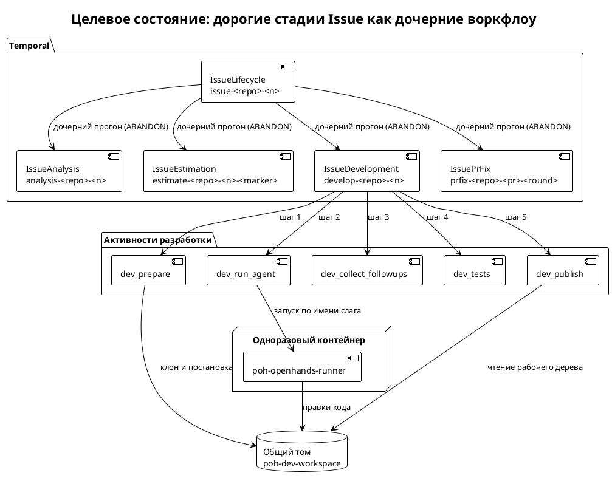
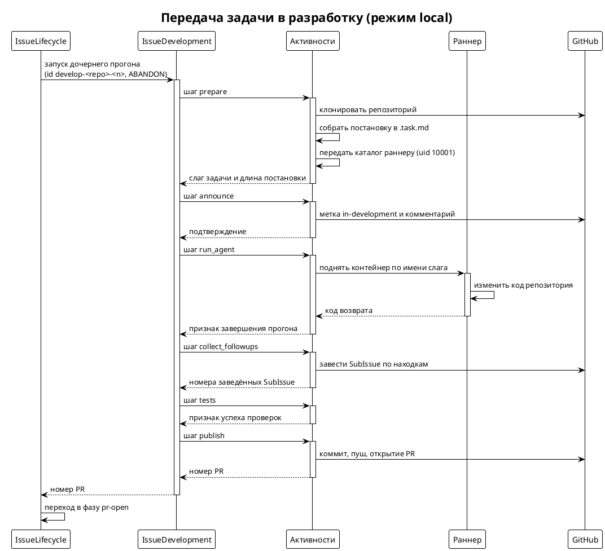
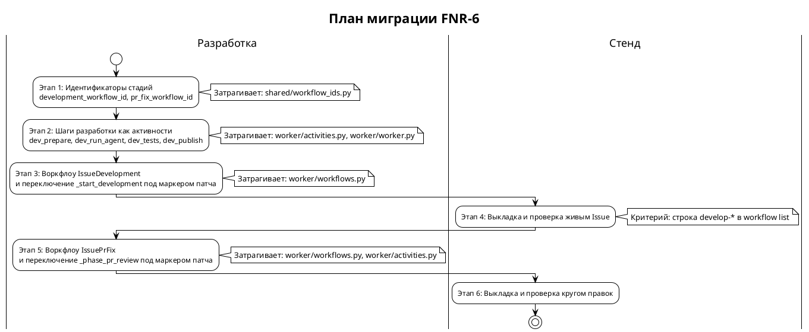

# [СТ] IAS-006 Дорогие стадии Issue как дочерние воркфлоу — восстановимая операционная история в Temporal

> **Пространство:** Issue Agent Service
> **Родительская страница:** Обработка Issue — наблюдаемость контура

---

## Содержание

1. Введение
   1.1 Общая информация
   1.2 Термины и определения
   1.3 Ссылки
   1.4 История изменений
2. Общее описание
   2.1 Описание текущего поведения (As-Is)
   2.2 Архитектурное решение
   2.3 Диаграмма компонентов
   2.4 Схема последовательности
3. План миграции
   3.1 Этапы внедрения
   3.2 Таблица этапов
   3.3 Критерии готовности
4. Функциональные требования (Backend / фоновые процессы)
   4.1 Идентификаторы и контракт стадии
   4.2 Разработка как дочерний воркфлоу (`IssueDevelopment`)
   4.3 Круг правок как дочерний воркфлоу (`IssuePrFix`)
   4.4 Восстановление истории оператором
5. Требования к интерфейсам (Frontend / UI)
6. Нефункциональные требования
7. Ревью требований
8. Риски и ограничения
9. Якоря истины

---

## 1 Введение

### 1.1 Общая информация

| Поле | Значение |
|------|----------|
| Наименование продукта | Issue Agent Service (self-hosted, docker-compose, GLM) |
| Ответственный за продукт | [УТОЧНИТЬ — PO] |
| Ответственный за тех. реализацию продукта | [УТОЧНИТЬ] |
| Ответственный за документ | Системный аналитик (SA-helper) |
| Тип продукта и операционная система | Backend-сервис, Linux/Docker |
| Epic | [УТОЧНИТЬ Jira] — Наблюдаемость контура производства |
| БФТ | Issue `po-helper-org/poh-issue-agents#73` (раздел HowToDemo) |
| Аналитика | `sa_documentation/FNR/FNR_6/` (task.md, concept.md) |
| Статус | Ревью |

### 1.2 Термины и определения

| Термин | Определение |
|--------|-------------|
| Дорогая стадия | Шаг пути Issue, идущий минутами, недетерминированный, требующий вызовов модели и порождающий видимые человеку побочные эффекты |
| Дочерний воркфлоу | Child Workflow Execution Temporal: самостоятельный прогон со своим WorkflowId, запущенный из родительского воркфлоу |
| WorkflowId стадии | Детерминированный идентификатор вида `<стадия>-<repo>-<issue>`, собираемый в `shared/workflow_ids.py` |
| `ParentClosePolicy.ABANDON` | Политика, при которой завершение или continue-as-new родителя не прекращает дочерний прогон |
| continue-as-new | Перезапуск воркфлоу с новым RunId и урезанной историей; в сервисе срабатывает по порогу длины истории |
| Маркер патча | `workflow.patched("<имя>")` — способ изменить решения воркфлоу, не сломав реплей идущих прогонов |
| Раннер | Одноразовый контейнер агента разработки, образ `poh-openhands-runner:local`, имя `dev-<owner>__<repo>-<n>` |
| Операционная история | Последовательность стадий и их шагов по одному Issue, восстанавливаемая средствами Temporal без чтения логов контейнеров |
| Прочие термины | См. `sa_documentation/naming_conventions.md` |

### 1.3 Ссылки

| Документ | Путь / URL |
|----------|------------|
| Постановка задачи | `sa_documentation/FNR/FNR_6/task.md` |
| Концепты + вердикт дебатов | `sa_documentation/FNR/FNR_6/concept.md` |
| Issue-постановка (HowToDemo) | `https://github.com/po-helper-org/poh-issue-agents/issues/73` |
| Словарь терминов | `sa_documentation/naming_conventions.md` |
| Обзор архитектуры | `docs/ARCHITECTURE.md` |
| Диагностика контура | `README.md` (раздел «Диагностика: почему issue не доехал») |
| Идентификаторы воркфлоу | `shared/workflow_ids.py` |
| Контракт активности Develop | `shared/develop.py` |

### 1.4 История изменений

| Дата | Автор | Суть изменений |
|------|-------|---------------|
| 19.08.2026 | SA-helper (System Analyst) | Создано на основе вердикта дебатов FNR-6 (Концепт A с модификациями) |

---

## 2 Общее описание

### 2.1 Описание текущего поведения (As-Is)

`IssueLifecycle` — один долгоживущий воркфлоу на Issue, идентификатор
`issue-<repo>-<n>` (`shared/workflow_ids.py:12-16`). Стадии пути вызываются из
него двумя разными способами, и способ не следует ни из какого правила.

Дочерними воркфлоу исполняются две стадии:

- аналитика — `IssueAnalysis`, id `analysis-<repo>-<n>`
  (`worker/workflows.py:1767`, `shared/workflow_ids.py:36-39`), запуск через
  `execute_child_workflow` с `ParentClosePolicy.ABANDON` и
  `maximum_attempts=1` (`worker/workflows.py:767-777`);
- оценка — `IssueEstimation`, id `estimate-<repo>-<n>-<marker>`
  (`worker/workflows.py:1799`, `shared/workflow_ids.py:19-26`), запуск через
  `start_child_workflow` (`worker/workflows.py:526-533`).

Активностями внутри родителя исполняются две другие дорогие стадии:

- разработка — `execute_activity(trigger_openhands_resolver, …)` с
  `start_to_close_timeout=3600`, `heartbeat_timeout=300`,
  `maximum_attempts=1` (`worker/workflows.py:1347-1368`);
- круг правок по ревью — `execute_activity(run_pr_fix_round, …)` с теми же
  таймаутами и той же политикой (`worker/workflows.py:1414-1425`).

**Ключевые компоненты:**

| Компонент | Роль | Файл:строка |
|-----------|------|-------------|
| `IssueLifecycle` | Родительский воркфлоу Issue, владелец фазы и состояния | `worker/workflows.py:286` |
| `_start_development` | Единственная точка входа в разработку (решение `build-me` и автостарт) | `worker/workflows.py:1347` |
| `trigger_openhands_resolver` | Активность разработки: четыре шага в одном вызове | `worker/activities.py:1214` |
| `_dev_prepare` | Шаг 1: клон репозитория и сборка постановки в `.task.md` | `worker/activities.py:1056` |
| `_dev_run_agent` | Шаг 2: прогон одноразового контейнера агента | `worker/activities.py:1142` |
| `_dev_tests` | Шаг 3: прогон проверок проекта до пуша | `worker/activities.py:1172` |
| `_dev_publish` | Шаг 4: коммит, пуш и открытие PR токеном воркера | `worker/activities.py:1191` |
| `collect_dev_followups` | Заведение SubIssue по находкам агента из `.followups.md` | `worker/activities.py:1263` |
| `_run_with_heartbeat` | Обёртка, дающая шагам текстовые метки heartbeat | `worker/activities.py:846` |
| `_phase_pr_review` | Цикл кругов правок по замечаниям ревью | `worker/workflows.py:1399` |
| `run_pr_fix_round` | Активность одного круга правок, поднимает тот же образ раннера | `worker/activities.py:1464` |
| `IssueAnalysis` | Эталон: аналитика как дочерний воркфлоу | `worker/workflows.py:1767` |
| `_run_analysis_child` | Запуск аналитики дочерним прогоном | `worker/workflows.py:745` |
| `shared/workflow_ids.py` | Единственный источник форматов id воркфлоу | `shared/workflow_ids.py:1-39` |
| `HISTORY_EVENT_THRESHOLD` | Порог continue-as-new родителя (800 событий истории) | `worker/workflows.py:74` |
| `worker/worker.py` | Регистрация воркфлоу и активностей, `max_concurrent_activities=3` | `worker/worker.py:38,106` |

**Ограничения текущего решения:**

1. Дорогая стадия разработки не имеет собственного WorkflowId, поэтому не
   отображается в `temporal workflow list` — доказательство:
   `worker/workflows.py:1349-1368` (вызов через `execute_activity`, а не
   `execute_child_workflow`).
2. Внутренние шаги разработки не являются активностями и не порождают событий
   `ActivityTaskScheduled/Started/Completed` — доказательство:
   `worker/activities.py:1056,1142,1172,1191` (обычные функции без
   `@activity.defn`).
3. Различимость шагов существует только как текстовая метка heartbeat, видимая
   в `describe` во время выполнения и исчезающая после — доказательство:
   `worker/activities.py:846-860` (`activity.heartbeat(label)`).
4. Ретрай активности повторяет все четыре шага, включая прогон агента; из-за
   этого политика снижена до одной попытки, что отменяет ретраи и там, где они
   уместны (сетевой сбой при публикации PR) — доказательство:
   `worker/workflows.py:1357-1367`.
5. Отсутствие ключа идемпотентности на уровне прогона компенсируется ручными
   гвардами: флаг `_analysis_running` для аналитики
   (`worker/workflows.py:752-765`) и проверка метки `in-development` для
   разработки (`worker/activities.py:1318-1340`).
6. Круг правок обладает теми же свойствами, что и разработка (тот же образ
   раннера, тот же таймаут `develop.run_timeout()`), но также исполняется
   активностью — доказательство: `worker/activities.py:1464-1500`,
   `shared/develop.py:67`.

### 2.2 Архитектурное решение

Принято по вердикту дебатов FNR-6 — **Концепт A с модификациями**
(`sa_documentation/FNR/FNR_6/concept.md`, раздел «Вердикт модератора»).

Вводится правило: стадия, обладающая всеми тремя свойствами — длительность в
минутах, недетерминизм, денежная стоимость — исполняется дочерним воркфлоу с
детерминированным идентификатором из `shared/workflow_ids.py`, а её внутренние
шаги оформляются самостоятельными активностями со своими таймаутами и
политиками ретраев.

Модификации, вошедшие в решение:

1. Между шагами передаются пути, слаги и номера, но не содержимое: тексты
   (постановка, вывод агента, вывод тестов) остаются в общем томе и в логе.
2. Все форматы идентификаторов — только в `shared/workflow_ids.py`.
3. Выкладка двумя этапами: сначала `IssueDevelopment` и проверка живым Issue,
   затем `IssuePrFix`; каждое изменённое решение воркфлоу — под своим маркером
   патча.
4. `ParentClosePolicy.ABANDON` обязателен для обеих новых стадий.
5. Ручные гварды (`_dev_announce`, `_analysis_running`) в этой работе не
   снимаются.

Стадии, которые остаются активностями родителя без изменений: постановка меток,
публикация комментариев, чтение состояния протокола, декомпозиция. Основание —
они исполняются секундами, детерминированы по входу и уже видны в истории
родителя отдельными событиями.

Ревью PR ведёт соседний сервис `pr-agent` со своим релизным циклом; в контур
дочерних воркфлоу он не входит, связь остаётся сигналом `agent_event`
(`worker/workflows.py:486`).

### 2.3 Диаграмма компонентов

### 2.4 Схема последовательности

---

## 3 План миграции

### 3.1 Этапы внедрения

### 3.2 Таблица этапов

| Этап | Действие | Затрагиваемые объекты | Откат |
|------|----------|----------------------|-------|
| 1 | Добавить форматы id стадий | `shared/workflow_ids.py` | Удалить функции; они ещё никем не вызываются |
| 2 | Оформить шаги разработки активностями и зарегистрировать их | `worker/activities.py:1056-1211`, `worker/worker.py:40-90` | Вернуть функции в прежний вид; регистрация лишних активностей безвредна |
| 3 | Ввести `IssueDevelopment`, переключить `_start_development` под маркером `issue-lifecycle-develop-child` | `worker/workflows.py:1347`, `worker/worker.py:38` | Ветка маркера патча содержит прежний путь через `execute_activity`; откат — возврат кода без снятия маркера |
| 4 | Выложить на стенд пином на полный SHA, прогнать живой Issue | `.env` стенда (`ISSUE_AGENT_CONTEXT`), образы `issue-webhook`, `issue-worker` | Вернуть прежний SHA в `ISSUE_AGENT_CONTEXT`, пересобрать |
| 5 | Ввести `IssuePrFix`, переключить `_phase_pr_review` под маркером `issue-lifecycle-prfix-child` | `worker/workflows.py:1399`, `worker/activities.py:1464` | Аналогично этапу 3 |
| 6 | Выложить и проверить кругом правок на живом PR | Стенд | Аналогично этапу 4 |

### 3.3 Критерии готовности

**Этап 1:** `python -c "from shared.workflow_ids import development_workflow_id, pr_fix_workflow_id"` выполняется без ошибок; модульные тесты форматов id зелёные.

**Этап 2:** Воркер стартует и печатает `Worker started, listening on task queue 'issue-lifecycle'`; в списке зарегистрированных активностей присутствуют `dev_prepare`, `dev_run_agent`, `dev_tests`, `dev_publish`.

**Этап 3:** Модульные тесты пути разработки зелёные; `pytest tests/` без падений.

**Этап 4:** По живому Issue в `temporal workflow list` присутствует строка с id `develop-<repo>-<n>`; в `temporal workflow show --workflow-id develop-<repo>-<n>` видны события `ActivityTaskScheduled` с именами четырёх шагов; в логе воркера отсутствуют строки `nondetermin`.

**Этап 5:** Модульные тесты круга правок зелёные.

**Этап 6:** По живому PR в `workflow list` присутствует строка `prfix-<repo>-<pr>-<round>`; прогоны, начатые до выкладки, продолжают реагировать на метки и команды.

---

## 4 Функциональные требования (Backend / фоновые процессы)

### 4.1 Идентификаторы и контракт стадии

#### 4.1.1 Ввести форматы идентификаторов дорогих стадий

| Поле | Значение |
|------|----------|
| Ответственный за тех. реализацию | [УТОЧНИТЬ] |
| Задача на разработку | [УТОЧНИТЬ Jira] — feat(workflow-ids): id дорогих стадий [BACKLOG] |

##### 4.1.1.1 Общее описание функционала

1. Добавить в `shared/workflow_ids.py` функцию `development_workflow_id(repo_full_name, issue_number)`.
   a. Возвращает строку `develop-<repo_full_name>-<issue_number>`.
   b. Идентификатор фиксирован и не содержит номера попытки: повторный запуск разработки при идущем прогоне обязан упереться в `WorkflowAlreadyStartedError`.
2. Добавить функцию `pr_fix_workflow_id(repo_full_name, pr_number, round_number)`.
   a. Возвращает строку `prfix-<repo_full_name>-<pr_number>-<round_number>`.
   b. Номер круга входит в идентификатор: круги — честно разные прогоны со своей историей, и второй круг не должен упираться в занятый идентификатор первого.
3. Снабдить обе функции комментарием о причине выбранного состава ключа — по образцу существующих функций модуля (`shared/workflow_ids.py:13-14,20-25,30-32,37-38`).

##### 4.1.1.2 Обоснование

Модуль объявлен единственным местом сборки идентификаторов: «Формат собирают и
вебхук, и скрипты прямого запуска; разъехавшись, они молча потеряли бы именно
эту идемпотентность — поэтому строка живёт здесь одна»
(`shared/workflow_ids.py:4-8`). Восстановление истории по префиксу идентификатора
работает только при едином источнике формата — это отдельно зафиксировано
вердиктом дебатов (модификация 2).

##### 4.1.1.3 Затрагиваемые компоненты

| Компонент | Тип изменения | Файл:строка |
|-----------|--------------|-------------|
| `shared/workflow_ids.py` | ADD | `shared/workflow_ids.py:36-39` |

##### 4.1.1.4 Критерии приёмки

1. `development_workflow_id("po-helper-org/poh-demo-checkout", 39)` возвращает строку `develop-po-helper-org/poh-demo-checkout-39`.
2. `pr_fix_workflow_id("po-helper-org/poh-demo-checkout", 41, 2)` возвращает строку `prfix-po-helper-org/poh-demo-checkout-41-2`.
3. Поиск по репозиторию (`grep -rn "develop-" --include="*.py"`) не находит сборки этого идентификатора нигде, кроме `shared/workflow_ids.py`.

##### 4.1.1.5 Зависимости

нет

---

### 4.2 Разработка как дочерний воркфлоу (`IssueDevelopment`)

#### 4.2.1 Оформить шаги разработки самостоятельными активностями

| Поле | Значение |
|------|----------|
| Ответственный за тех. реализацию | [УТОЧНИТЬ] |
| Задача на разработку | [УТОЧНИТЬ Jira] — refactor(develop): шаги разработки как activity [BACKLOG] |

##### 4.2.1.1 Общее описание функционала

1. Преобразовать четыре внутренние функции в активности с декоратором `@activity.defn`.
   a. `dev_prepare(issue, branch)` — из `_dev_prepare` (`worker/activities.py:1056`); возвращает не текст постановки, а её длину в символах и слаг задачи.
   b. `dev_run_agent(issue)` — из `_dev_run_agent` (`worker/activities.py:1142`); возвращает код завершения прогона, хвост вывода пишется в лог воркера как сейчас (`worker/activities.py:1167-1169`).
   c. `dev_tests(issue)` — из `_dev_tests` (`worker/activities.py:1172`); возвращает признак «проверки заданы и пройдены».
   d. `dev_publish(issue, branch)` — из `_dev_publish` (`worker/activities.py:1191`); возвращает номер PR либо `None`.
2. Сохранить внутри каждой активности обёртку `_run_with_heartbeat` (`worker/activities.py:846`) — прогон агента и тесты идут дольше `heartbeat_timeout`.
3. Зарегистрировать все четыре активности в `worker/worker.py` в списке `activities=[…]` (`worker/worker.py:40-90`).
4. Оставить `trigger_openhands_resolver` (`worker/activities.py:1214`) в репозитории исключительно для режима `dispatch`: в нём прогон уходит в GitHub Actions, шагов на своей стороне нет (`worker/activities.py:1233-1241`).

##### 4.2.1.2 Обоснование

Разделение возвращает осмысленные ретраи: срыв публикации PR (случай прогона
`poh-demo-checkout#39`) повторяет публикацию, а не двадцатиминутный прогон
агента. Сейчас это невозможно, и политика снижена до одной попытки на всю стадию
(`worker/workflows.py:1357-1367`). Возврат длины постановки вместо текста —
модификация 1 вердикта: постановка уже лежит файлом в общем томе
(`worker/activities.py:1063`), дублировать её в payload Temporal не требуется.

##### 4.2.1.3 Затрагиваемые компоненты

| Компонент | Тип изменения | Файл:строка |
|-----------|--------------|-------------|
| `_dev_prepare` → `dev_prepare` | MODIFY | `worker/activities.py:1056` |
| `_dev_run_agent` → `dev_run_agent` | MODIFY | `worker/activities.py:1142` |
| `_dev_tests` → `dev_tests` | MODIFY | `worker/activities.py:1172` |
| `_dev_publish` → `dev_publish` | MODIFY | `worker/activities.py:1191` |
| `worker/worker.py` (регистрация активностей) | ADD | `worker/worker.py:40-90` |

##### 4.2.1.4 Критерии приёмки

1. Воркер стартует; в логе присутствует строка `Worker started, listening on task queue 'issue-lifecycle'`.
2. Каждая из четырёх активностей вызывается по имени и возвращает значение объявленного типа; полезная нагрузка любого возврата не превышает 4 КБ.
3. Обёртка heartbeat сохранена: при прогоне агента длительностью более 300 с активность не завершается по `heartbeat_timeout`.
4. Существующие модульные тесты разработки (`tests/test_develop.py`, `tests/test_develop_autostart.py`) зелёные.

##### 4.2.1.5 Зависимости

нет

---

#### 4.2.2 Ввести воркфлоу `IssueDevelopment`

| Поле | Значение |
|------|----------|
| Ответственный за тех. реализацию | [УТОЧНИТЬ] |
| Задача на разработку | [УТОЧНИТЬ Jira] — feat(develop): IssueDevelopment как child workflow [BACKLOG] |

##### 4.2.2.1 Общее описание функционала

1. Добавить `@workflow.defn(name="IssueDevelopment")` в `worker/workflows.py` рядом с `IssueAnalysis` (`worker/workflows.py:1767`).
2. Метод `run(issue: IssueInput, branch: str) -> int | None` последовательно исполняет активности:
   a. `dev_prepare` — `start_to_close_timeout=600`, `maximum_attempts=3` (клон и запись файлов детерминированы по входу и безопасны для повтора);
   b. объявление о передаче (`_dev_announce`, `worker/activities.py:1318`) — `start_to_close_timeout=60`, `maximum_attempts=3`, исход не влияет на продолжение;
   c. `dev_run_agent` — `start_to_close_timeout=3600`, `heartbeat_timeout=300`, `maximum_attempts=1`;
   d. `collect_dev_followups` (`worker/activities.py:1263`) — `start_to_close_timeout=300`, `maximum_attempts=3`;
   e. `dev_tests` — `start_to_close_timeout=1800`, `heartbeat_timeout=300`, `maximum_attempts=1`;
   f. `dev_publish` — `start_to_close_timeout=600`, `maximum_attempts=3`.
3. Сохранить порядок «находки собираются до тестов и публикации»: файл находок обязан исчезнуть из рабочего дерева раньше коммита (`worker/activities.py:1250-1253`).
4. Возвращать номер PR; отсутствие изменений от агента — исключение с текстом «агент не изменил ни одного файла — открывать нечего» (`worker/activities.py:1258-1259`).
5. Зарегистрировать воркфлоу в `worker/worker.py` в списке `workflows=[…]` (`worker/worker.py:38`).

##### 4.2.2.2 Обоснование

Форма скопирована с работающего `IssueAnalysis` (`worker/workflows.py:1767-1795`):
дочерний прогон с фиксированным идентификатором уже доказал в этом коде, что
даёт видимость в списке и идемпотентность через `WorkflowAlreadyStartedError`.
Раздельные политики ретраев — прямое устранение причины дефекта прогона #39;
`maximum_attempts=1` остаётся ровно на двух шагах, которые недетерминированы и
стоят денег.

##### 4.2.2.3 Затрагиваемые компоненты

| Компонент | Тип изменения | Файл:строка |
|-----------|--------------|-------------|
| `IssueDevelopment` | ADD | `worker/workflows.py` (рядом с `1767`) |
| `worker/worker.py` (список воркфлоу) | MODIFY | `worker/worker.py:38` |

##### 4.2.2.4 Критерии приёмки

1. `temporal workflow list` после прогона содержит строку с идентификатором `develop-<repo>-<n>` и типом `IssueDevelopment`.
2. `temporal workflow show --workflow-id develop-<repo>-<n>` содержит события `ActivityTaskScheduled` для `dev_prepare`, `dev_run_agent`, `collect_dev_followups`, `dev_tests`, `dev_publish` в указанном порядке.
3. При искусственном срыве шага `dev_publish` (недоступный remote) в истории присутствуют три события `ActivityTaskStarted` для `dev_publish` и ровно одно для `dev_run_agent`.
4. Повторный запуск разработки по тому же Issue при идущем прогоне завершается `WorkflowAlreadyStartedError` и не поднимает второй контейнер раннера.

##### 4.2.2.5 Зависимости

после 4.1.1, 4.2.1

---

#### 4.2.3 Переключить `_start_development` на дочерний прогон под маркером патча

| Поле | Значение |
|------|----------|
| Ответственный за тех. реализацию | [УТОЧНИТЬ] |
| Задача на разработку | [УТОЧНИТЬ Jira] — feat(lifecycle): развилка на IssueDevelopment [BACKLOG] |

##### 4.2.3.1 Общее описание функционала

1. В `_start_development` (`worker/workflows.py:1347`) ввести развилку по `workflow.patched("issue-lifecycle-develop-child")`.
   a. Ветка патча: `execute_child_workflow(IssueDevelopment.run, args=[issue, branch], id=development_workflow_id(issue.repo, issue.issue_number), parent_close_policy=ParentClosePolicy.ABANDON, retry_policy=RetryPolicy(maximum_attempts=1))`.
   b. Ветка без патча: прежний `execute_activity(trigger_openhands_resolver, …)` без изменений.
2. Сохранить существующую обработку исходов без изменений.
   a. Исключение — комментарий человеку через `post_error_label` и переход в `failed` (`worker/workflows.py:1369-1383`).
   b. `None` — режим `dispatch`, ожидание доклада в фазе `in-development` (`worker/workflows.py:1384-1387`).
   c. Номер PR — переход в фазу `pr-open` (`worker/workflows.py:1388-1391`).
3. Обработать `WorkflowAlreadyStartedError` отдельно от прочих исключений: прогон уже идёт, фазу двигать не следует — по образцу `_run_analysis_child` (`worker/workflows.py:778-784`).
4. Развилку НЕ дублировать в прежнем линейном сценарии `_run_linear` (`worker/workflows.py:1493`), где разработка также вызывается активностью (`worker/workflows.py:1755-1762`).
   a. Метод объявлен неизменяемым: он живёт ради прогонов, запущенных до перехода на фазовый цикл, чья история не знает маркеров патча (`worker/workflows.py:1494-1500`).
   b. Оба входа основного пути — автостарт (`worker/workflows.py:1310`) и решение человека `build-me` (`worker/workflows.py:1345`) — уже сходятся в `_start_development`, поэтому одной развилки достаточно.

##### 4.2.3.2 Обоснование

Маркер патча обязателен: на стенде одновременно живут восемь прогонов
`IssueLifecycle`, и изменение решений воркфлоу без маркера ломает их реплей.
Механизм в проекте отработан — в `TemporalChangeVersion` живого прогона видны
четыре ранее применённых маркера (`issue-lifecycle-absolute-park-deadline`,
`issue-lifecycle-awaiting`, `issue-lifecycle-clear-queue-on-work`,
`issue-lifecycle-phase-loop`). Отдельная обработка `WorkflowAlreadyStartedError`
повторяет решение, принятое для аналитики: результат чужого прогона отсюда не
виден, поэтому фазу двигает тот, кто прогон и запускал.

##### 4.2.3.3 Затрагиваемые компоненты

| Компонент | Тип изменения | Файл:строка |
|-----------|--------------|-------------|
| `_start_development` | MODIFY | `worker/workflows.py:1347-1391` |
| `_run_linear` (прежний линейный сценарий) | НЕ ИЗМЕНЯТЬ | `worker/workflows.py:1493-1762` |

##### 4.2.3.4 Критерии приёмки

1. Прогон `IssueLifecycle`, начатый до выкладки, после выкладки продолжает реагировать на метки и команды; в логе воркера отсутствуют строки, содержащие `nondetermin`.
2. Прогон, начатый после выкладки, содержит в `TemporalChangeVersion` значение `issue-lifecycle-develop-child`.
3. Срыв дочернего прогона приводит к комментарию в Issue с причиной и метке фазы `failed` — как до изменения.
4. Режим `DEVELOP_MODE=dispatch` продолжает работать: дочерний прогон возвращает `None`, фаза остаётся `in-development`.

##### 4.2.3.5 Зависимости

после 4.2.2

---

### 4.3 Круг правок как дочерний воркфлоу (`IssuePrFix`)

#### 4.3.1 Ввести воркфлоу `IssuePrFix` и переключить `_phase_pr_review`

| Поле | Значение |
|------|----------|
| Ответственный за тех. реализацию | [УТОЧНИТЬ] |
| Задача на разработку | [УТОЧНИТЬ Jira] — feat(pr-closer): IssuePrFix как child workflow [BACKLOG] |

##### 4.3.1.1 Общее описание функционала

1. Добавить `@workflow.defn(name="IssuePrFix")`, исполняющий один круг правок.
   a. Метод `run(repo: str, pr_number: int, round_number: int)` вызывает существующую активность `run_pr_fix_round` (`worker/activities.py:1464`) с прежними таймаутами (`start_to_close_timeout=3600`, `heartbeat_timeout=300`, `maximum_attempts=1`).
   b. Возвращает результат активности без изменения типа: `True` — правки внесены, строка — правок не потребовалось (`worker/activities.py:1466-1476`).
2. В `_phase_pr_review` (`worker/workflows.py:1399`) ввести развилку по `workflow.patched("issue-lifecycle-prfix-child")`.
   a. Ветка патча: `execute_child_workflow(IssuePrFix.run, args=[issue.repo, self._pr_number, rounds], id=pr_fix_workflow_id(issue.repo, self._pr_number, rounds), parent_close_policy=ParentClosePolicy.ABANDON, retry_policy=RetryPolicy(maximum_attempts=1))`.
   b. Ветка без патча: прежний `execute_activity(run_pr_fix_round, …)`.
3. Сохранить логику цикла кругов без изменений: потолок кругов, ожидание доклада ревью 30 минут, завершение через `finish_pr_fixing` (`worker/workflows.py:1409-1456`).
4. Зарегистрировать воркфлоу в `worker/worker.py` (`worker/worker.py:38`).

##### 4.3.1.2 Обоснование

Круг правок обладает всеми тремя признаками дорогой стадии: поднимает тот же
образ раннера тем же `develop.runner_command` (`worker/activities.py:1486-1489`),
идёт до `develop.run_timeout()` — 2700 с (`shared/develop.py:67`) — и
недетерминирован. Оставить его активностью означало бы сохранить ровно ту
неоднородность, которая породила исходную проблему. Отдельный воркфлоу на КАЖДЫЙ
круг, а не на цикл целиком: круги разделены ожиданием внешнего доклада ревью
(`worker/workflows.py:1440-1452`), и объединение их в один прогон означало бы
воркфлоу, большую часть жизни простаивающий в ожидании чужого сигнала.

##### 4.3.1.3 Затрагиваемые компоненты

| Компонент | Тип изменения | Файл:строка |
|-----------|--------------|-------------|
| `IssuePrFix` | ADD | `worker/workflows.py` (рядом с `1799`) |
| `_phase_pr_review` | MODIFY | `worker/workflows.py:1409-1425` |
| `worker/worker.py` (список воркфлоу) | MODIFY | `worker/worker.py:38` |

##### 4.3.1.4 Критерии приёмки

1. После двух кругов правок по одному PR в `workflow list` присутствуют две строки: `prfix-<repo>-<pr>-1` и `prfix-<repo>-<pr>-2`.
2. Исход «правок не потребовалось» возвращается строкой и приводит к вызову `finish_pr_fixing` с признаком успеха — как до изменения.
3. Прогоны `IssueLifecycle`, начатые до выкладки, продолжают вести круги правок прежним путём без ошибок реплея.

##### 4.3.1.5 Зависимости

после 4.1.1, 4.2.3 (выкладка вторым этапом)

---

### 4.4 Восстановление истории оператором

#### 4.4.1 Задокументировать процедуру восстановления операционной истории Issue

| Поле | Значение |
|------|----------|
| Ответственный за тех. реализацию | [УТОЧНИТЬ] |
| Задача на разработку | [УТОЧНИТЬ Jira] — docs: восстановление истории Issue из Temporal [BACKLOG] |

##### 4.4.1.1 Общее описание функционала

1. Дополнить раздел «Отслеживание прогона OpenHands (Develop)» в `README.md` описанием восстановления истории по идентификаторам.
   a. Родитель: `issue-<repo>-<n>` — фаза, решения человека, сигналы.
   b. Стадии: `analysis-<repo>-<n>`, `estimate-<repo>-<n>-<marker>`, `develop-<repo>-<n>`, `prfix-<repo>-<pr>-<round>`.
   c. Команда выборки всех прогонов по одному Issue через фильтр по идентификатору.
2. Зафиксировать ограничение дерева дочерних прогонов.
   a. Родитель делает continue-as-new при 800 событиях истории (`worker/workflows.py:74`), после чего RunId меняется.
   b. Дочерние прогоны остаются привязаны к тому RunId, при котором были запущены; полнота восстановления обеспечивается идентификатором, а не деревом в UI.
3. Обновить `sa_documentation/naming_conventions.md`: строки о `trigger_openhands_resolver` и Research/Bug-пайплайнах содержат отметку «Не реализовано», не соответствующую текущему коду (`worker/activities.py:1214` — активность реализована).

##### 4.4.1.2 Обоснование

Требование заказчика сформулировано как сценарий демонстрации: оператор
восстанавливает историю работ по Issue средствами Temporal. Без записанной
процедуры и без явно зафиксированного ограничения continue-as-new сценарий
воспроизводится только автором изменений. Ограничение выявлено в дебатах
(раунд 1, контраргумент 1) и признано обеими сторонами.

##### 4.4.1.3 Затрагиваемые компоненты

| Компонент | Тип изменения | Файл:строка |
|-----------|--------------|-------------|
| `README.md` (раздел диагностики) | MODIFY | `README.md` (подраздел «Отслеживание прогона OpenHands (Develop)») |
| `sa_documentation/naming_conventions.md` | MODIFY | `sa_documentation/naming_conventions.md` |

##### 4.4.1.4 Критерии приёмки

1. `README.md` содержит перечень идентификаторов всех стадий с указанием, какая строка какой стадии соответствует.
2. `README.md` содержит явное предупреждение о смене RunId при continue-as-new и о том, что полнота восстановления обеспечивается идентификатором.
3. `naming_conventions.md` не содержит отметки «Не реализовано» для `trigger_openhands_resolver`.

##### 4.4.1.5 Зависимости

после 4.2.3

---

## 5 Требования к интерфейсам (Frontend / UI)

**Не применимо.** Изменения затрагивают только серверную часть: воркфлоу,
активности и их регистрацию. Собственного веб-интерфейса сервис не имеет;
пользовательские поверхности — GitHub Issue (метки и комментарии) и Temporal UI
(готовый образ `temporalio/ui:2.31.2`), обе не меняются.

---

## 6 Нефункциональные требования

| ID | Требование | Критерий проверки |
|----|-----------|-------------------|
| NFR-01 | Полезная нагрузка возврата любой активности разработки не превышает 4 КБ | Тест на длину сериализованного возврата `dev_prepare`, `dev_run_agent`, `dev_tests`, `dev_publish` |
| NFR-02 | Число одновременно исполняемых активностей воркера остаётся равным 3 | `max_concurrent_activities=3` в `worker/worker.py:106` не изменён |
| NFR-03 | Одновременно по одному Issue исполняется не более одного контейнера раннера | Имя контейнера детерминировано (`shared/develop.py:131`); повторный запуск даёт `WorkflowAlreadyStartedError` |
| NFR-04 | Прогоны `IssueLifecycle`, начатые до выкладки, переживают её без ошибок реплея | `docker logs <worker> \| grep -ci nondetermin` возвращает 0 в течение 24 часов после выкладки |
| NFR-05 | Прирост длины истории родительского воркфлоу от перехода не превышает 20 событий на одну стадию | Сравнение `HistoryLength` в `temporal workflow describe` до и после на сопоставимых Issue |
| NFR-06 | Дочерний прогон переживает continue-as-new и завершение родителя | `ParentClosePolicy.ABANDON` задан для `IssueDevelopment` и `IssuePrFix`; проверка терминированием родителя во время прогона агента |
| NFR-07 | Таймаут прогона агента остаётся равным `DEVELOP_TIMEOUT_SEC` (по умолчанию 2700 с) | `shared/develop.py:67` не изменён; активность `dev_run_agent` использует `develop.run_timeout()` |

---

## 7 Ревью требований

| Роль | Ответственный | Статус | Дата |
|------|--------------|--------|------|
| Системный аналитик | SA-helper | Подготовлено | 19.08.2026 |
| Разработка | [УТОЧНИТЬ] | Ожидает | — |
| Тестирование | [УТОЧНИТЬ] | Ожидает | — |

---

## 8 Риски и ограничения

### 8.1 Риски

| ID | Риск | Вероятность | Влияние | Митигация |
|----|------|------------|---------|-----------|
| R-01 | Недетерминизм реплея на прогонах, начатых до выкладки | Высокая | Высокое | Оба изменённых решения воркфлоу — под маркерами патча; выкладка двумя этапами; проверка `grep -i nondetermin` в течение 24 часов |
| R-02 | Порядок «находки собираются до тестов и публикации» нарушен при переносе шагов | Средняя | Высокое | Порядок закреплён явными шагами воркфлоу (4.2.2.1) и покрыт модульным тестом; нарушение даёт файл находок в PR и повторное чтение прошлых находок агентом |
| R-03 | Исчерпание памяти стенда при одновременных прогонах | Средняя | Среднее | `max_concurrent_activities=3` не меняется (NFR-02); дочерний воркфлоу переупаковывает существующую работу, не добавляя параллелизма |
| R-04 | Рост истории в Postgres стенда | Низкая | Низкое | Прирост ограничен NFR-05; события воркфлоу измеряются сотнями байт |
| R-05 | Дочерний прогон остаётся сиротой после завершения родителя | Средняя | Низкое | Идентификатор детерминирован и выводится из номера Issue; прогон находится поиском без ссылки от родителя |
| R-06 | Второй формат идентификатора появляется вне `shared/workflow_ids.py` | Низкая | Среднее | Критерий приёмки 4.1.1.4 п.3 — проверка поиском по репозиторию |

### 8.2 Ограничения

1. Решение не даёт единого дерева всех прогонов по Issue в Temporal UI: при
   continue-as-new родителя меняется RunId, а дочерние прогоны остаются
   привязаны к прежнему. Полнота восстановления обеспечивается идентификатором.
2. Решение не покрывает ревью PR: его ведёт соседний сервис `pr-agent` со своим
   релизным циклом, Temporal он не использует. Связь остаётся сигналом
   `agent_event`.
3. Решение не переводит в дочерние воркфлоу короткие детерминированные операции
   (метки, комментарии, чтение состояния протокола, декомпозиция) — они уже
   видны событиями в истории родителя.
4. Ручные гварды от повторного запуска (`_dev_announce`,
   `_analysis_running`) сохраняются: их снятие — отдельное решение после
   подтверждения дедупа живым прогоном.
5. Изоляция раннера не меняется: контейнер по-прежнему не получает GitHub-токена
   и работает от uid 10001 (`shared/develop.py:62-63`).
6. Требования верны при допущении, что режим `DEVELOP_MODE=local` остаётся
   основным; в режиме `dispatch` прогон идёт на стороне GitHub Actions, и его
   шаги в Temporal невидимы принципиально.

---

## 9 Якоря истины

| Утверждение | Доказательство (файл:строка) |
|-------------|------------------------------|
| Разработка вызывается активностью, а не дочерним воркфлоу | `worker/workflows.py:1347-1368` |
| Внутренние шаги разработки — обычные функции без `@activity.defn` | `worker/activities.py:1056,1142,1172,1191` |
| Различимость шагов существует только как метка heartbeat | `worker/activities.py:846-860` |
| Политика ретраев снижена до одной попытки из-за повтора всей стадии | `worker/workflows.py:1357-1367` |
| Аналитика уже работает дочерним воркфлоу с `ParentClosePolicy.ABANDON` | `worker/workflows.py:767-777` |
| Оценка уже работает дочерним воркфлоу | `worker/workflows.py:526-533` |
| Форматы идентификаторов собираются в одном модуле | `shared/workflow_ids.py:1-39` |
| Родитель делает continue-as-new при 800 событиях истории | `worker/workflows.py:74,915` |
| Круг правок поднимает тот же образ раннера теми же параметрами | `worker/activities.py:1486-1489`, `shared/develop.py:141` |
| Таймаут прогона раннера — 2700 с по умолчанию | `shared/develop.py:67` |
| Число одновременных активностей воркера ограничено тремя | `worker/worker.py:106` |
| Находки агента собираются до тестов и публикации | `worker/activities.py:1250-1253` |
| Имя контейнера раннера детерминировано и выводится из репозитория и номера Issue | `shared/develop.py:131-134` |
| Ручной гвард от повторного объявления опирается на метку `in-development` | `worker/activities.py:1318-1340` |
| Механизм маркеров патча в проекте уже применялся | `worker/workflows.py:452,664,700,732` |
| Прежний линейный сценарий объявлен неизменяемым ради прогонов старого поколения | `worker/workflows.py:1493-1500` |
| Оба входа основного пути в разработку сходятся в `_start_development` | `worker/workflows.py:1310,1345` |
